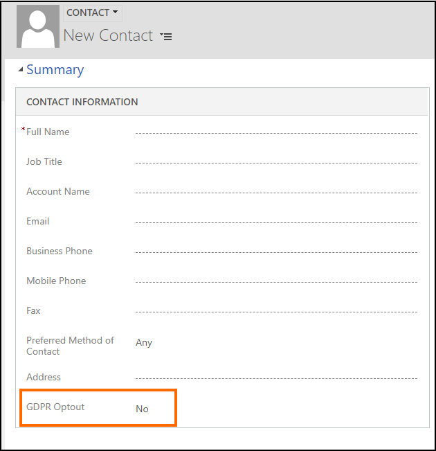

# Opt out of data analytics (GDPR)

Applies to Dynamics 365 (online), version 9.0.2

A new boolean field or attribute called **msdyn_gdproptout** (display name: **GDPR Optout**) is added to the Contact, Lead, and SystemUser entities that enables you to specify whether analytics will be performed on the entity record's data.

- Setting the **GDPR Optout** field to "yes/true" will prohibit any analytics to be performed on the entity record's data.
- Setting the **GDPR Optout** field to "no/false" will allow analytics to be performed on the entity record's data.

## Updating the GDPR Optout field in entity forms

By default, the **GDPR Optout** field is not available on the Contact, Lead and SystemUser forms. You can customize the form to display the **GDPR Optout** field for these entities so that one can easily set an appropriate value in this field for a record. By default, the value is set to **No** (false) for this field when you create a new record.

For information about adding field to a form, see [Add a field to a form](../customize/add-field-form.md)

## Programmatically updating the msdyn_gdproptout attribute 

You can also programmatically update the value of the **msdyn_gdproptout** field by using Web API or Organization service. For information about updating using:
- Web API, see [Update a single property value](../developer/webapi/update-delete-entities-using-web-api.md#update-a-single-property-value)
- Organization service, see [Use the early-bound entity classes for create, update, and delete](../developer/org-service/use-early-bound-entity-classes-create-update-delete.md) or [Use the Entity class for create, update and delete](../developer/org-service/use-entity-class-create-update-delete.md)

### See also

[Embedded Intelligence and GDPR](embedded-intelligence-gdpr.md)