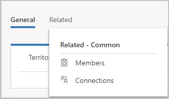
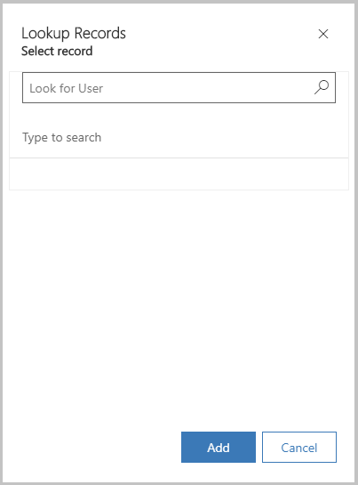

# Set up sales territories to organize business markets by geographical area

[!INCLUDE[cc-applies-to-update-9-0-0](../includes/cc_applies_to_update_9_0_0.md)] [!INCLUDE[cc_applies_to_on-prem-9_0_0](../includes/cc_applies_to_on-prem-9_0_0.md)]

Improve sales potential and revenues by creating territories for customer and market segments in [!INCLUDE[pn_microsoftcrm](../includes/pn-dynamics-crm.md)] apps. Then assign appropriate sales people to handle the sales and revenue opportunities for those territories.  
  
 Sales territories improve the sales potential because the members of a territory are focused on the services or sales within that territory. You can associate the financials directly with a territory and its members, which simplify business analysis. Also, based on the sales territory type and size, you can define sales methodologies and the training required for those locations.  

## Create a sales territory (Sales Hub app)

1.	Make sure that you have the Manager, Vice President, CEO-Business Manager, System Administrator, or System Customizer security role or equivalent permissions.

2.	Select the Site map icon , then select ellipsis , and then select **Sales Territories**.
 
3.	To create a new sales territory, on the command bar, select **New**.

4.	In the sales territory form, hill in your information.

      a.	**Name**. Enter the geographical name for the territory such as the name of a city, country/region, or a state.

      b.	**Manager**. Enter the name of the user who is the manager for this territory. This person would typically assign leads to salespeople.

      > [!Important]
      > You can’t allocate the same user to multiple territories. If you need to assign a user to a larger area (more than one existing territory), create a new territory that includes the existing territories, and then assign the user to that new territory.
      
      c.	**Description**. Enter any details that you’d like to include for this territory, for example, “Sales territory created for education and training.”

5.	When you’re done, on the command bar, select **Save**.

6.	Select the **Related** tab, and then select **Members**.

      
 
7.	On the **Members** tab, select **Add members**.

8.	In the **Lookup Records** pane, select the search icon  , select a user record, and then select **Add**.

      
 
9.	Select **Save**. 

## Create a sales territory (Sales app)

1. [!INCLUDE[proc_permissions_system_admin](../includes/proc-permissions-system-admin.md)]  
  
    Check your security role  
  
   - [!INCLUDE[proc_follow_steps_in_link](../includes/proc-follow-steps-in-link.md)]  
  
   - [!INCLUDE[proc_dont_have_correct_permissions](../includes/proc-dont-have-correct-permissions.md)]  
  
2. [!INCLUDE[proc_settings_bus_management](../includes/proc-settings-bus-management.md)]  
  
3. Choose **Sales Territories**.  
  
4. On the command bar, choose **New**.  
  
5. Fill in your information.  
  
   - **Name**. Enter the geographical name for the territory such as the name of a city, country/region, or a state.  
  
   - **Manager**. Enter the name of the user who is the manager for this territory. This person would typically assign leads to salespeople.  
  
       > [!IMPORTANT]
       >  You can’t allocate the same user to multiple territories. If you need to assign a user to a larger area (more than one existing territory), create a new territory that includes the existing territories, and then assign the user to that new territory.  
  
   - **Description**. Enter any details that you’d like to include for this territory, for example, “Sales territory created for education and training.”  
  
6. When you’re done, on the command bar, choose **Save** or **Save and Close**.  
  
7. To assign members to a sales territory, open the territory, and then in the left pane, under **Common**, choose **Members**.  
  
8. On the **Users** tab, in the **Records** group, choose **Add Members**.  
  
9. In the **Look Up Records** dialog box, select a user, and then choose **Add**.  
  
> [!TIP]
>  To make your salesperson’s job easier, you can also set a default price list for a territory. [!INCLUDE[proc_more_information](../includes/proc-more-information.md)] [Create price lists and price list items to define pricing of products](../sales-enterprise/create-price-lists-price-list-items-define-pricing-products.md)  
  
### See also  
 [Administrator and sales manager guide](../sales-enterprise/admin-guide.md)   
 [Nurture sales from lead to order (Sales)](../sales-enterprise/nurture-sales-from-lead-order-sales.md)
