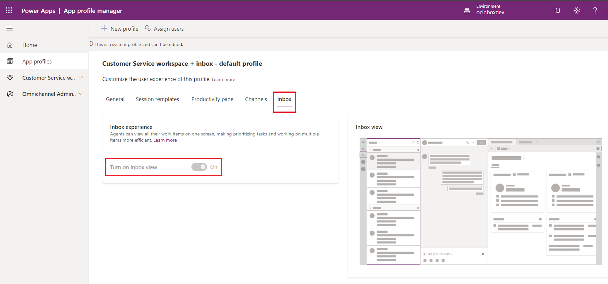
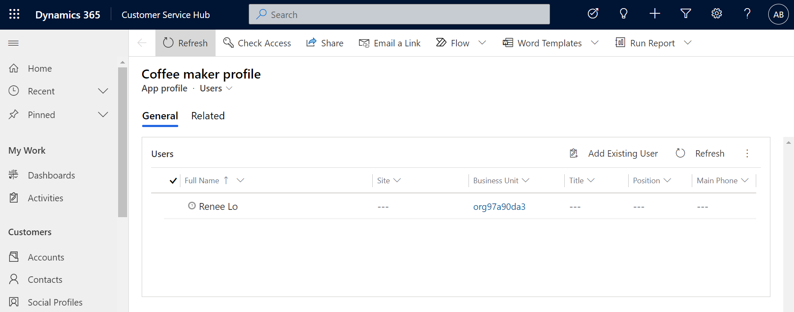

# Create an app profile

Perform the following actions to create an app profile:
1. Sign in to [Power Apps](https://go.microsoft.com/fwlink/p/?linkid=2142083).
2. Select the environment in which you want to create the app profiles.
3. Do one of the following:
   - On the **Home** page, go to **Your apps** section.
   - In the left pane, select **Apps**.
4. On the **Home** page, go to **Your apps** section. In the left pane, select **Apps**.
5. Select **More commands** in **Omnichannel for Customer Service** or **Customer Service workspace**, and then select **App profile manager** on the menu that appears.
6. In the left pane, select **App profiles**.
7. On the **App profile manager** page, select **New profile**.
8. On the **New profile** pane, specify the following:
   - **Name:** The app profile name.
   - **Unique name:** A unique identifier in the <*prefix*>_<*name*> format.
     > [!IMPORTANT]
     > The following are required for the unique name:
     > - The prefix can only be alphanumeric and its length must be between 3 to 8 characters.
     > - An underscore must be used between the prefix and name.
   - **Description:** A description for the profile.
  
### Assign templates and enable productivity pane and channels

For an app profile, you can add only one session template for each entity type. Typically, you'll add one session template for each entity type, such as one each session template for accounts, contacts, and cases.

The settings that you enable for the app profile will be available for agents and supervisor only when you configure the corresponding templates and settings in the Customer Service Hub app or Omnichannel Administration app. For example, channels must be provisioned in Omnichannel for Customer Service and channel instances must be configured.

1. In the **App profiles** section, select the app profile to which you want to assign templates.
2. On the **Session templates**, select **Add entity session template**.
3. Search for the template you want to add and select it. Make sure that the selected template is based on **Entity** type. More information: [Manage session templates](session-templates.md)
   > [!div class=mx-imgBorder]
   > 

4. Do the following on the **Productivity pane** tab:
   1. If you want to enable productivity tools, set the toggle to on for **Turn on productivity pane**.
   2. Select the default mode as collapsed or expanded.
   3. In the **Productivity tools** section, set the toggle to on for the following:
      - **Smart assist tool configuration**
      - **Knowledge search tool configuration**
      - **Agent scripts** to allow access to smart assist configuration and agent scripts.
5. On the **Channels** tab, set the toggle to on for **All active channels**. The channels configured in Omnichannel for Customer Service will be available for the user to whom the profile is assigned.

   > [!NOTE]
   > The toggle for channels will be enabled in the out-of-the-box app profile for Omnichannel for Customer Service.

6. To add a third-party channel provider, in the **Voice channels** section, select **Add channel providers**, search for the configured channel, and select it.
7. If a channel doesn't exist, select **Create a new channel provider in Unified Interface**. The channel configuration page opens on a new tab. More information: [Configure channel provider using app profile manager](../customer-service/channel-integration-framework/v2/configure-channel-provider-app-profile-manager.md)

   > [!NOTE]
   > - Only telephony or voice channels are supported.
   > - A number of voice channel providers can be configured at a time.
  
### Configure the inbox view

For an app profile, you can enable the inbox view in the Customer Service workspace or Omnichannel for Customer Service apps. From the inbox, users can view their conversations and cases.

1. On the **App profiles** page, select the profile for which you want to enable the inbox. 
   > [!div class=mx-imgBorder]
   > 
2. Select the **Inbox** tab, and then toggle **Turn on inbox view** to **On**.
   > [!div class=mx-imgBorder]
   > 

### Assign profiles to users

1. On the **App profiles** page, select the profile that you want to assign to a user.
2. On the ***<profile_name>*** page, select **Assign users** on the command bar, and select **OK** on the message dialog box. The profile opens on a new tab.
   > [!div class=mx-imgBorder]
   > 
3. On the **General** tab, select **Add Existing User**.
4. On the **Lookup Records** pane, search and select the user.

> [!NOTE]
> You can select **Assign users** on the ***<profile_name>*** page to view the list of users who have been assigned to the profile.

### Default profile assignment

When users are assigned roles corresponding to Customer Service workspace or Omnichannel for Customer Service, the default app profiles are assigned as follows.

- **Customer Service workspace:** The out-of-the-box app profile is assigned to users with the following roles:
  - CSR Manager
  - Customer Service Representative
- **Omnichannel for Customer Service:** The out-of-the-box app profile is assigned to users with the following roles:
  - Omnichannel administrator
  - Omnichannel supervisor
  - Omnichannel agent

More information: [Roles and privileges associated with app profile manager](security-roles.md)

### See also

[Get started with Customer Service admin center](../customer-service/cs-admin-center.md)  
[Manage session templates](session-templates.md)  
[Configure channels](../customer-service/channels.md)  
[Manage agent scripts](agent-scripts.md)  

[!INCLUDE[footer-include](../includes/footer-banner.md)]
