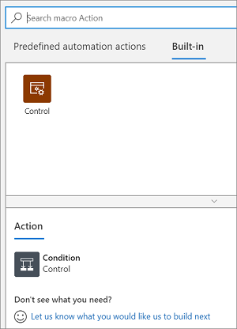
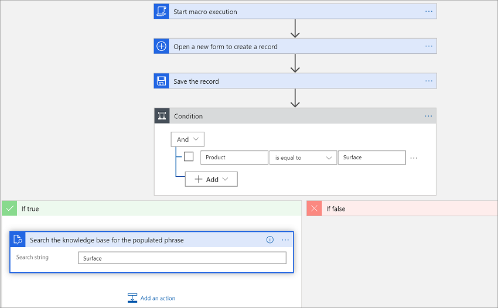
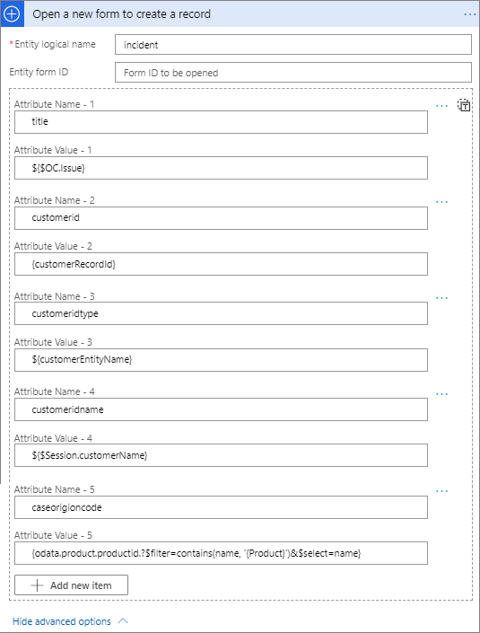
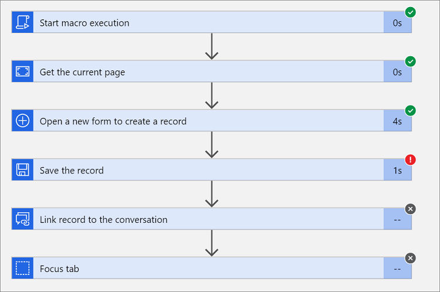
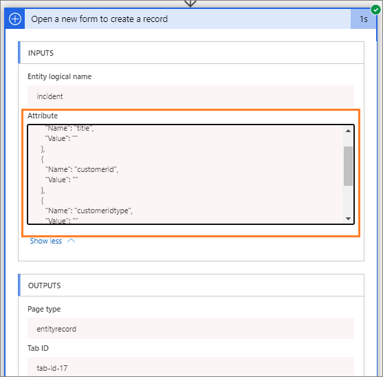

# Automate tasks with macros 

[!INCLUDE[cc-use-with-omnichannel](../includes/cc-use-with-omnichannel.md)]

## Overview of macros

In the customer service industry, agents have to click often to perform simple tasks, such as open a form, fill, and save it, and many repetitive and monotonous actions, such as greet a customer, verify a customer, send acknowledgment mail, and take notes. These clicks and repetitive tasks can lead to human errors while agents copy and paste the data across different operations.

Macros help address these challenges by helping users perform daily operations in a faster, more efficient, and process-compliant manner. Macros are a set of sequential actions that are performed by a user. You can reuse macros with different sessions based on the context parameters that are specific to the session.

The value propositions of the macros are as follows:

- Automate repetitive and monotonous tasks with a single click.

- Minimize human errors.

- Adhere to business processes.

- Lower average handling time.

- Improve customer satisfaction.

- Create contextual and reusable macros.

The macros in Omnichannel for Customer Service have the following:

- [Predefined automation actions](#predefined-automation-actions)
- [Built-in](#built-in)

## Prerequisites

- Install Dynamics 365 Productivity Tools solution.

- Ensure that you have the **Productivity tools administrator** security role. To learn more, see [Assign roles and enable users](../customer-service/add-users-assign-roles.md).

- Ensure that agents and supervisors are assigned the **Productivity tools user** security role. To learn more, see [Assign roles and enable users](../customer-service/add-users-assign-roles.md).

## Predefined automation actions

In Omnichannel for Customer Service, macros provide three connectors:

- [Productivity automation](#productivity-automation): Provides actions to perform model-driven app operations.

- [Session connector](#session-connector): Provides actions to perform session-related operations.

- [Omnichannel connector](#omnichannel-connector): Provides actions to perform Omnichannel for Customer Service&ndash;related operations.

### Productivity automation

As an administrator, you can use the actions any number of times across different macros to automate and perform model-driven app operations.

The following screenshot shows the actions that are explained in the subsequent sections.

   > [!div class=mx-imgBorder] 
   > 

#### Open a new form to create a record

This action is used to open a new form to create a record. The action contains the following fields.

   | Field | Description | Parameter |
   |-----------------|-----------------------------|--------------------------|
   | Entity logical name |  Specify the logical name of the entity that you want to open.  This is a mandatory field. | incident |
   | Entity form ID | Specify the form ID.  This is an optional field. |
   | Attribute Name | Specify the attribute logical name. You need to provide the attribute name to prepopulate the field with a value.| |
   | Attribute Value | Specify the attribute value. You need to provide the attribute value to prepopulate the attribute field. | |
   |||

#### Open an existing record

This action is used to open an existing record form. The action contains the following fields.

   | Field | Description | Parameter |
   |-----------------|-----------------------------|--------------------------|
   | Entity logical name |  Specify the logical name of the entity that you want to open.   This is a mandatory field. | incident |
   | Entity record ID| Specify the entity record ID.  This is a mandatory field.| |
   | Entity form ID | Specify the form ID.  This is an optional field. | |
   |||

#### Open a record grid

This action is used to open a record grid. The action contains the following fields.

   | Field | Description | Parameter |
   |-----------------|-----------------------------|--------------------------|
   | Entity logical name |  Specify the logical name of the entity for which you want to open the grid.   This is a mandatory field. | incident |
   | View ID| Specify the ID of the view that you want to open.  This is a mandatory field. | |
   | View type | Specify the view type.  This is a mandatory field. | |
   |||

#### Search the knowledge base for the populated phrase

This action is used for searching knowledge articles based on the populated phrase. The action contains the following field.

   | Field | Description | Parameter |
   |-----------------|-----------------------------|--------------------------|
   | Search string |  Provide the phrase based on which you want to search for knowledge articles. You can provide the context data. For example, the context data parameter can be a case title. |  |
   ||

#### Do a relevance search based on the phrase

This action is used for searching knowledge articles based on the populated phrase. The action contains the following field.

   | Field | Description | Parameter |
   |-----------------|-----------------------------|--------------------------|
   | Search string |  Provide the phrase based on which you want to do a relevance search. You can provide the context data. For example, the context data parameter can be a case title.   This is a mandatory field.  |  |
   ||

#### Update an existing record

This action is used to update an existing record. The action contains the following fields.

   | Field | Description | Parameter |
   |-----------------|-----------------------------|--------------------------|
   | Entity logical name |  Specify the logical name of the entity that you want to update.   This is a mandatory field. | incident |
   | Entity record ID| Specify the entity record ID.  This is a mandatory field.| |
   | Attribute Name | Specify the attribute logical name you want to update.| |
   | Attribute Value | Specify the attribute value that will be updated for the above-mentioned attribute. | |
   |||

#### Open an email form with predefined template

This action is used to open an email with a predefined template. The action contains the following fields.

   | Field | Description | Parameter |
   |-----------------|-----------------------------|--------------------------|
   | Entity logical name |  Specify the logical name of the entity.   This is a mandatory field. | incident |
   | Entity record ID| Specify the entity record ID.  This is a mandatory field.| |
   | Email recipients | Specify the recipients to whom you want the mail to be sent.   This is a mandatory field. | |
   | Template ID | Specify the ID of the template that must displayed in the email.   This is a mandatory field. | |
   |||

#### Resolve a case

This action is used to resolve a case. The action contains the following fields.

   | Field | Description | Parameter |
   |-----------------|-----------------------------|--------------------------|
   | Billable time |  Specify the time that is billable.   This is a mandatory field. | incident |
   | Incident ID| Specify the ID of the case that you want to close.  This is a mandatory field.| |
   | Resolution | Specify the reason to resolve the case.   This is a mandatory field. | |
   |||

#### Autofill form fields

This action is used for updating the form attribute (field). The action updates the attribute of a form if that form is currently in focus and has the same entity type as mentioned in action. If the action is run for any other entity, then the action will fail. Also, the action only updates the field and doesn't save the record. The action contains the following field.

   | Field | Description | Parameter |
   |-----------------|-----------------------------|--------------------------|
   | Entity logical name | Specify the logical name of the entity that you want to update.   This is a mandatory field. | incident |
   |||

#### Clone current record

This action is used for cloning an existing record that is open in the current tab. The action only copies the fields and does not save the record. The action contains the following field.

   | Field | Description | Parameter |
   |-----------------|-----------------------------|--------------------------|
   | Record title | Specify the title of the record that you want to clone.   This is a mandatory field. | |
   |||

#### Open knowledge base article

This action is used to open the knowledge base article. The action contains the following field.

   | Field | Description | Parameter |
   |-----------------|-----------------------------|--------------------------|
   | Entity record ID  | Specify the entity ID of the knowledge base article that you want to open.   This is a mandatory field.|  |
   |||

#### Save the record

This action is used for saving the record after you've entered data in all the mandatory fields. The action fails if the mandatory fields aren't entered or are left blank.

#### Clone input record

This action is used for cloning an existing record. The action only copies the fields and does not save the record. The action contains the following fields.

   | Field | Description | Parameter |
   |-----------------|-----------------------------|--------------------------|
   | Entity logical name | Specify the logical name of the entity that you want to clone.   This is a mandatory field. |
   | Entity record ID | Specify the ID of the entity record.   This is a mandatory field.|
   |Record title| Specify the record title.
   |||

### Session connector

As an administrator, you can use the actions any number of times across different macros to automate and perform operations related to a session in Omnichannel for Customer Service.

   > [!div class=mx-imgBorder] 
   > 

#### Open application tab

This action is used to open the specified application in a new tab with the attributes that you define. The action contains the following fields.

   | Field | Description | Parameter |
   |-----------------|-----------------------------|--------------------------|
   | Page type | Specify  the application type to be opened. More information: [Application types](application-tab-templates.md#application-types)   This is a mandatory field.  |
   | Application Template ID  | Specify the ID of the application template.   This is a mandatory field. |
   | Attribute Name | Specify the attribute logical name you want to update.| |
   | Attribute Value | Specify the attribute value that will be updated for the above-mentioned attribute. | |
   |||

#### Refresh the tab

This action is used to refresh a tab in the Omnichannel for Customer Service session. This action contains the following field.

   | Field | Description | Parameter |
   |-----------------|-----------------------------|--------------------------|
   | Tab ID | Specify the ID of the tab that you want to refresh.   This is a mandatory field.| 
   |||

#### Focus on the tab

This action is used to focus on a tab in the Omnichannel for Customer Service session. This action contains the following field.

   | Field | Description | Parameter |
   |-----------------|-----------------------------|--------------------------|
   | Tab ID | Specify the ID of the tab that you want to give focus to.   This is a mandatory field.|
   |||

#### Get the current tab

This action is used to get the details of the current tab in Omnichannel for Customer Service. The get current tab action retrieves the Tab ID that could be used in the **Refresh tab** and **Focus tab** actions.

### Omnichannel connector

As an administrator, you can use the actions any number of times across different macros to automate and perform operations related to Omnichannel for Customer Service.

   > [!div class=mx-imgBorder] 
   > 

#### Send KB article in chat

This action is used to paste a knowledge base article in the conversation chat window. It must be used with the **Search knowledge base for the populated phrase** action. The action contains the following field.

   | Field | Description | Parameter |
   |-----------------|-----------------------------|--------------------------|
   | Entity record ID  | Specify the ID of the entity record.   This is a mandatory field. |
   |||

#### Link record to the conversation

This action is used to link a record to the conversation when the customer is communicating with the agent in the Omnichannel for Customer Service session. This action contains the following fields.

   | Field | Description | Parameter |
   |-----------------|-----------------------------|--------------------------|
   | Entity Logical Name |  Specify the logical name of the entity that you want to link.   This is a mandatory field. | incident |
   | Entity record id| Specify the entity record ID of the entity that you want to link.  This is a mandatory field.| |
   | Entity primary Name | Specify the primary name of the entity that you want to link.  This is a mandatory field.| |
   |||

#### Unlink record from the conversation

This action is used to unlink a record from the conversation when the customer is communicating with the agent in the Omnichannel for Customer Service session. This action contains the following fields.

   | Field | Description | Parameter |
   |-----------------|-----------------------------|--------------------------|
   | Entity Logical Name |  Specify the logical name of the entity that you want to unlink.   This is a mandatory field. | incident |
   | Entity record id| Specify the entity record ID of the entity that you want to unlink.  This is a mandatory field.| |
   | Entity primary Name | Specify the primary name of the entity that you want to unlink.  This is a mandatory field.| |
   |||

## Built-in

The Built-in control allows you to execute a macro action step based on the conditions. The **Built-in** category connector has a **Condition** action.

   > [!div class=mx-imgBorder] 
   > 

To use the **Built-in** category, you first need to have a trigger (predefined automation actions). That is, select a predefined automation action first, and before or after a step, you can define the condition. You can also create nested conditions as per your requirements.

Using the **View run history** option for a particular macro, you can see the condition that was executed and whether it succeeded.

For example, you want to open a new form and save it after entering the fields. If the **Product** field in the form has **Surface** as the value, evaluate it as true and then perform the knowledge base article search with the search phrase as **Surface**. If it is evaluated as false, don't perform any further actions.

   > [!div class=mx-imgBorder] 
   > 

## Use the automation dictionary to pass macro context data parameters

Macros are a set of configured actions that are executed on demand by users. As an administrator, you need to configure the actions that a macro must perform. To configure the actions, you need to provide certain data parameters keys. When an agent runs the macro, these data parameters keys are replaced by contextual values.

To learn about the slugs for productivity tools, see [Slugs](automation-dictionary-keys.md#slugs-for-productivity-tools-macros-and-agent-scripts).

To learn more, see [Use automation dictionary to pass data parameter keys](automation-dictionary-keys.md#pass-data-parameter-in-macros-and-agent-scripts).

## Create a macro

1. Sign in to [Power Apps](https://go.microsoft.com/fwlink/p/?linkid=2142083), and go to the app profile manager page.
2. In the left pane, under **Productivity**, select **Agent scripts**. The Unified Interface page opens on a new tab.

3. On the page that appears, select **New**.

4. On the **Create macros** page, specify the following.

    | Field | Description | Example value |
    |-------------|-----------------------------------|------------------------------------|
    | Name | Provide a name to the macro. The name is displayed to the agent at runtime. | Create case |
    | Description | Describe the purpose of the macro. The description is displayed to the agent at runtime. | This macro action is used to create a case. |
    |||

5. Select **Start macro execution**, and then select **New step**.

   > [!div class=mx-imgBorder] 
   > 

6. Select a connector from the list. The following connectors are available:

   - [Productivity Automation](#productivity-automation)
   - [Session Connector](#session-connector)
   - [Omnichannel Connector](#omnichannel-connector)

7. Select an action from the list of actions. You can add as many actions as you need, based on your business requirements.

   If you select **Productivity Automation**, you'll see the following actions.

    | Purpose | Action name |
    |-----------------------------|---------------------------------------------|
    | Open a new form to create a record | Create new |
    | Open an existing form | Open form |
    | Open a record grid | Open grid |
    | Search the knowledge base for the populated phrase | Search knowledge articles |
    | Do a relevance search based on the phrase | Search |
    | Update an existing record | Update record |
    | Open an email form with predefined template | Open email |
    | Resolve a case | Resolve case |
    |||

   > [!div class=mx-imgBorder] 
   >     

   For example, select **Open a new form to create a record**, and the step appears. To learn more, see [Productivity automation](#productivity-automation).

   If you select **Session connector**, you'll see the following actions.

    | Purpose | Action name |
    |-----------------------------|---------------------------------------------|
    | Refresh the application tab | Refresh tab |
    | Focus on a particular application tab from another application tab| Focus tab |
    | Get the details of the current application tab | Get current tab |
    |||

   > [!div class=mx-imgBorder] 
   >     

   To learn more, see [Session connector](#session-connector).

   If you select **Omnichannel connector**, you'll see the following actions.

    | Purpose | Action name |
    |-----------------------------|---------------------------------------------|
    | Link a record to the conversation while interacting with the customer | Link record to the conversation |
    | Unlink a record from the conversation while interacting with the customer | Unlink record from the conversation |
    |||

   > [!div class=mx-imgBorder] 
   >  

   To learn more, see [Omnichannel connector](#omnichannel-connector).
   
   > [!Note]
   > Omnichannel connector is not available in Customer Service workspace.

8. Specify the values in the fields. To learn how to specify the values, see [Use automation dictionary to pass data parameters keys](automation-dictionary-keys.md).

   If you selected **Open a new form to create a record**, you can select **Show advanced options** to add the attributes and values you want. If required, you can select **+ Add new item** to add more attributes.

   > [!div class=mx-imgBorder] 
   >  

9. After you add an action step, to define conditions, select the **Built-in** tab, and select **Control**.

10. Select **Condition** to define the conditions. The condition has **If true** or **If false**. Define the condition as per your requirement.

11. To add another action step, repeat step 7 and optionally step 8.

12. Select **Save and close**.

Now, when the agent executes the macro, the actions will be executed by fetching the data parameter keys according to the context available from the sources. To learn more, see [Use automation dictionary to pass data parameters keys](automation-dictionary-keys.md).

## View macro run history

As an administrator, you can view the macro run history, which shows how many times a macro has been run, along with the success or fail status. When you select a macro that failed, you can view the exact action step at which the failure occurred.

1. Sign in to Omnichannel Administration.

2. Under **Agent Experience**, select **Macros**.

3. Select the macro for which you want to view the history.

4. Select **View run history**.

   > [!div class=mx-imgBorder] 
   > 

5. Select the macro that failed from the list.

   > [!div class=mx-imgBorder] 
   > 

6. See the macro action step that caused the failure. Review the previous step for any issue in the slug data parameters that might have been passed incorrectly or slug data parameters that were updated incorrectly.

   > [!div class=mx-imgBorder] 
   > 

   For example, when you select on the **Open a new form to create a record** step, select **Show more**, and you can view that the mandatory fields don't have values, which are mandatory to save the record. Due to this reason, the macro run failed at the **Save the record** step.

   > [!div class=mx-imgBorder] 
   > 

7. Fix the macro step action that you think might have caused the failure, and then try running it again. For example, since the values are not resolved, go to the macro designer and then check on the slugs, and then try running the macro again.

> [!Note]
> If the issue persists, contact Microsoft support.

### See also

[Use automation dictionary to pass data parameters keys](automation-dictionary-keys.md)  
[Agent scripts](agent-scripts.md)  
