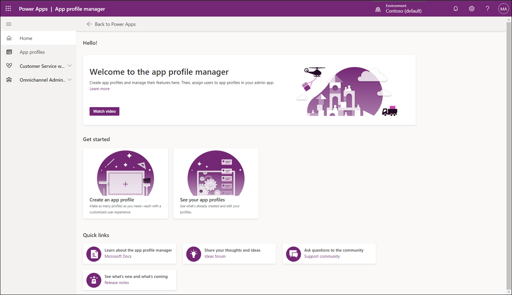

# Preview: App profile manager

[!include[cc-beta-prerelease-disclaimer](../includes/cc-beta-prerelease-disclaimer.md)]

> [!IMPORTANT]
>
> - This feature is a preview, which means that it is made available to you before general availability so you can test and evaluate the preview and provide feedback to Microsoft.
> - This preview may employ reduced or different privacy, security, or compliance commitments than a commercial version. As such, this preview is not meant to be used with any "live" or production Customer Data, Personal Data, or other data that is subject to heightened compliance requirements. Any use of "live" data is at your sole risk and it is your sole responsibility to notify your end users that they should not include sensitive information with their use of the Preview.
> - This preview, and any support Microsoft may elect to provide, is provided "as-is," "with all faults," "as available," and without warranty. This preview is subject to the [Preview Terms](../legal/supp-dynamics365-preview.md).

## Introduction

The app profile manager lets organizations create targeted app experiences for agents and supervisors as an alternative to building and maintaining custom apps. With the app profile manager, administrators can create custom profiles with specific session templates, conversation channels, and productivity tools. These profiles can then be assigned to users.

The profiles are available for agents and supervisors who use the Customer Service workspace or Omnichannel for Customer Service apps.

The system requirements for the app profile manager are same as those for Customer Service workspace (preview). More information: [System requirements for Customer Service workspace](../customer-service/customer-service-workspace-system-requirements.md)

## Sign up for the insider preview

To use Omnichannel for Customer Service (preview) with app profile manager, you need to do the following:
- Register at [Insider preview](https://experience.dynamics.com/Account/Login/Register?returnUrl=%2Finsider%2F).
- Submit the form [Sign-up - Survey](https://customervoice.microsoft.com/Pages/ResponsePage.aspx?id=v4j5cvGGr0GRqy180BHbR5mjjZ3rRrtBn7meF_Sg_vlURFBMM0g4T1ZIUUIzNFRJSU0yTkhNMlJWWC4u).
-	Use a sandbox environment and tenant or Org ID to sign-up for the preview program. We do not recommend using the production environment for signing up for preview.

After you sign up, the participation goes through an approval process. It may take up to 48 hours for you to be onboarded to the preview program.

After your participation is approved, you will be able to see the program listed in **My Programs** at [**My Insider Programs**](https://experience.dynamics.com/insider/).

> [!IMPORTANT]
> Upgrade of the preview environment to the production environment is not supported.

## How the app profile experience works

Managing the app profiles is as follows. The tasks in every step will be done by administrators who have different roles. It could be one administrator or a set of administrators.

1. Create users in Microsoft Dynamics 365 admin center.
2. Assign security roles, such as Customer Service Representative or Omnichannel agent.
3. Create business processes, such as work streams, queues, sessions, and productivity tools.
4. Create app profiles.
5. Assign app profiles to users.

For existing orgs, only steps 4 and 5 are required.

Thereafter, users with the required agent or supervisor role will be able to see and use the settings that are made available through the assigned app profile. If you do not assign an app profile, by default, the out-of-the-box app profile will be assigned.

## Experience for accessing templates and productivity tools

The Power Apps home page for app profiles is an easy-to-use interface that helps you get started with what you can do on the page.

  > [!div class=mx-imgBorder]
  > 

> [!IMPORTANT]
> [!INCLUDE[cc-use-with-omnichannel](../includes/cc-use-with-omnichannel.md)]

The options to access and manage the following entities are available on the left pane of the app profile manager:

- Settings
- Templates
  - Session templates
  - Application tabs
  - Notifications
- Productivity
  - Smart assist
  - Agent scripts
- Macros

All these options are available in the Unified Interface and open on a new tab when you select any to access it.

> 

Irrespective of the path from where you navigate to any of the components, such as session templates or application tab templates, the templates that you have defined for Customer Service workspace and Omnichannel for Customer Service will be displayed because they are stored in a common library.

### Settings

The **Settings** option in **Customer Service workspace** opens the **Queues** page on a new tab.

The **Settings** option in **Omnichannel Administration** opens the **Entity Records** page on a new tab.

### Templates

The following template types can be accessed:

- **Session templates:** Opens the Session templates page where the out-of-the-box templates and custom templates created by you are listed.
- **Application tabs:** Opens the application tab templates page to create and manage application tab templates.
- **Notifications:** Opens the notifications templates page to manage the templates.

### Productivity

You can access the following options in the **Productivity** area:

- **Smart assist:** Opens the settings for AI-based suggestions for similar cases, knowledge articles, and ongoing conversations.
- **Agent scripts:** Opens the agent scripts page for you to create and manage scripts.
- **Macros:** Opens the macros page for you to create and manage macros.

## Upgrade experience for existing Omnichannel for Customer Service

When you upgrade your existing environments, the settings for templates, productivity tools, and channels configuration in the out-of-the-box app profile will reflect the existing state of your environment. For example, if productivity pane is enabled and smart assist is configured, the settings will be retained in the out-of-the-box app profile.

### See also

[Create app profiles](app-profile-manager.md)  
[System requirements](../customer-service/customer-service-workspace-system-requirements.md)  
