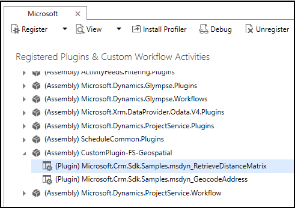
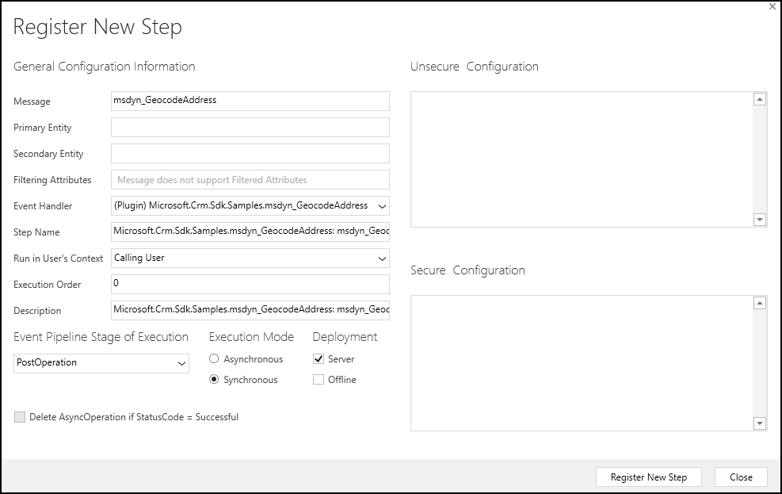
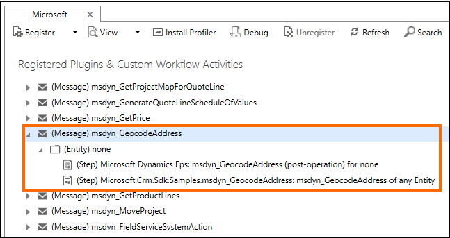

# Register and deploy custom plug-in to use your preferred geospatial data provider

Before a plug-in can be used, it must be registered and deployed on the server.

Building your plug-in project will result in a plug-in assembly (.dll). This article provides information on how you can register and deploy the plug-in assembly for the two geospatial actions to use your preferred geospatial data provider. For information about writing a plugin, see [Create custom plug-in to use your preferred geospatial data provider](create-custom-plugin-preferred-geospatial-data-provider.md)

## Execution order considerations while registering your custom plug-in

When you register multiple plug-ins for the same entity and message, the execution sequence of plug-ins is defined by the **Execution Order** of individual plug-ins. The one with a lower execution order value executes first followed by the one with a higher execution order value.

The execution order value of the default plug-in in Field Service and Project Service that uses Bing Maps for the geocode and distance matrix actions is set to **1**. You can set the execution order of your custom plug-in to execute before (less than 1) or after (greater than 1) the default plug-in.

The following table depicts how you may want your custom plug-in to be treated depending on the execution order specified while plug-in registration and parameter conditions.

|||
|--|--|
|**Primary**| If you want to treat your custom plug-in as *primary* and the default Bing plug-in as secondary, set the execution order of your plug-in to **0**. This will result in your plug-in getting executed prior to the Bing plug-in. The Bing plug-in will examine the "latitude" and "longitude" values that your custom plug-in returns, and only proceeds to geocode with Bing if both the returned values are 0. This would be the preferred way if your custom plug-in is expected to provide the majority of your geocoding needs.|
|**Secondary**|If you want to treat your custom plug-in as *secondary* to Bing plug-in by providing the geocoding service only when Bing fails to geocode, set the execution order of your plugin to **2**. You would also write your custom plug-in code such that it first examines the "latitude" and "longitude" values that Bing plug-in returns, and proceeds only if both the returned values are 0. This would be the preferred execution way if Bing is expected to provide the majority of your geocoding needs.|
|**Completely override**| If you always want your custom plug-in to be the source of geocoding and completely override Bing from geocoding even when your custom plug-in fails to geocode, you will need to always return something other than 0,0 for "latitude" and "longitude" values. You may want to decide which exception conditions throw a .NET exception and which ones simply do not return a result. To not return a result and not allow any subsequent plug-in to return a result, your custom plug-in needs to return something like 0.0001, 0.0001.

## Register and deploy your custom plug-in

You can register and deploy plug-ins using the Plug-in Registration Tool or programmatically by writing registration code using certain SDK classes. More information: [Register and Deploy Plug-ins](../../customerengagement/on-premises/developer/register-deploy-plugins.md).

For this section, we will use the Plug-in Registration tool, which provides a graphical user interface to easily register and deploy plug-ins. Also, this section contains information based on the assumption that you are working with the [sample custom plug-in](sample-custom-plugin-google-geospatial-data-provider.md), and have built the sample project to generate the **CustomPlugin-FS-Geospatial.dll** assembly. If you have developed your own custom plug-in, the name of the assembly and plug-ins will differ, but the overall instructions to register the plug-in will remain the same.

> [!TIP]
> For detailed information about how to use Plug-in Registration Tool in general, see [Walkthrough: Register a plug-in using the plug-in registration tool](../../developer/walkthrough-register-plugin-using-plugin-registration-tool.md)

1. Get the Plug-in Registration Tool. [!INCLUDE[proc-download-plugin-registration-tool](../../includes/proc-download-plugin-registration-tool.md)]
2. Navigate to the `[Your folder]\Tools\PluginRegistration` folder, and double-click the **PluginRegistration.exe** file to run the tool.
3. Click **CREATE NEW CONNECTION**.
4. In the **Login** dialog, specify the credentials to connect to your Dynamics 365 instance, and click **Login**.
5. If you have access to multiple organizations in the Dynamics 365 instance, you are presented with a list of organizations to choose to connect to. Otherwise, your default organization is used.
6. You should see a collapsed list of registered plug-in or custom workflow activity assemblies. Select **Register** > **Register New Assembly**.
7. In the **Register New Assembly** dialog box:
    
   - Under the **Step 1** section, click the ellipses […] button to select the **CustomPlugin-FS-Geospatial.dll** assembly.
   - Under the **Step 2** section, select both the plug-ins.
   - Under the **Step 3** section, select the **Sandbox** option.
   - Under the **Step 4** section, select the **Database** option.
   - Select **Register Selected Plugins**.

     

     The **CustomPlugin-FS-Geospatial.dll** assembly and the two plug-ins for the msdyn_GeocodeAddress and msdyn_RetrieveDistanceMatrix are now registered and deployed to the server.

8. The next step is to register a step for each action. A *step* refers to the SDK message processing step entity that is used to configure when and how the plug-in is to be executed.

    In the **Registered Plug-ins & Custom Workflow Activities** tree view, expand the **(Assembly) CustomPlugin-FS-Geospatial** node, and select a registered plug-in, say **Microsoft.Crm.Sdk.Samples.msdyn_RetrieveDistanceMatrix**.

    

9. Right-click **Microsoft.Crm.Sdk.Samples.msdyn_RetrieveDistanceMatrix**, and select **Register New Step**.

10. In the **Register New Step** dialog box, specify the following:
    - **Message**: msdyn_RetrieveDistanceMatrix
    - **Execution Order**: As required. See [Execution order considerations while registering your custom plug-in](#execution-order-considerations-while-registering-your-custom-plug-in) earlier in this article.
    - **Event Pipeline Stage of Execution**: PostOperation
    - **Execution Mode**: Synchronous
    - Leave the rest of the fields with their default values. Click **Register New Step**. 

    

11. Next, right-click the **Microsoft.Crm.Sdk.Samples.msdyn_GeocodeAddress** plug-in, and select **Register New Step**.

12. In the **Register New Step** dialog box, specify the following:
    - **Message**: msdyn_GeocodeAddress
    - **Execution Order**: As required. See [Execution order considerations while registering your custom plug-in](#execution-order-considerations-while-registering-your-custom-plug-in) earlier in this topic.  
    - **Event Pipeline Stage of Execution**: PostOperation
    - **Execution Mode**: Synchronous
    - Leave the rest of the fields with their default values. Click **Register New Step**. 

    

You are now done with registering steps to call your custom plug-in for both the geospatial actions. 

If you view any of the Universal Resource Scheduling geospatial actions in the Plug-in Registration tool, you will see both the default and your custom plug-in registered for the action. For example, see the plug-ins for the **mdyn_GeocodeAddress** action.

### See also  

[Sample: Custom plug-in to use Google Maps API as geospatial data provider](sample-custom-plugin-google-geospatial-data-provider.md)    

[!INCLUDE[footer-include](../../includes/footer-banner.md)]