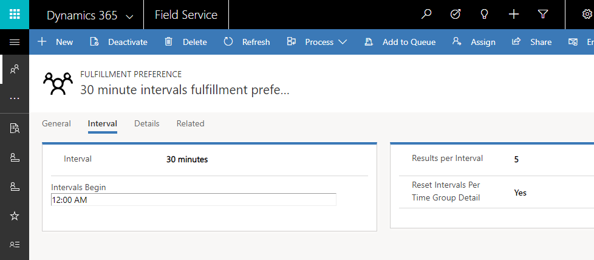
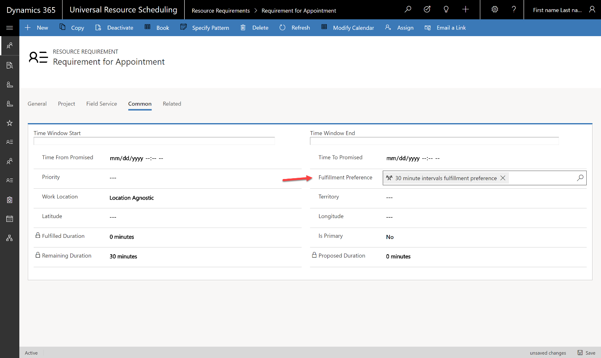
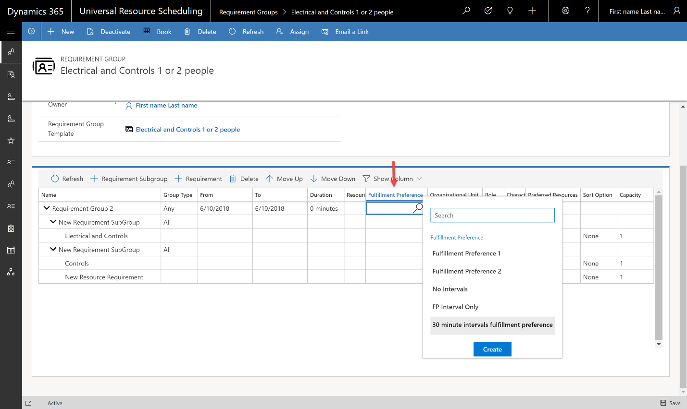
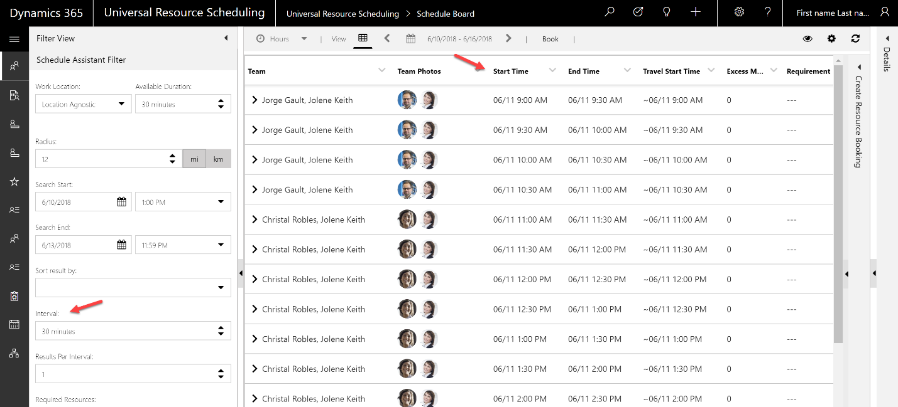
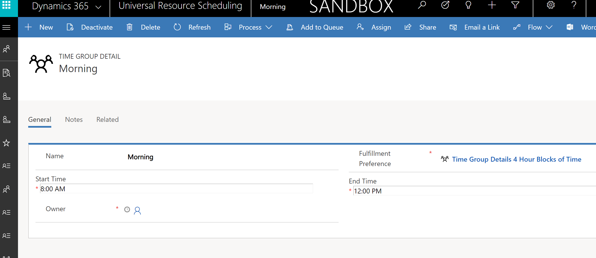
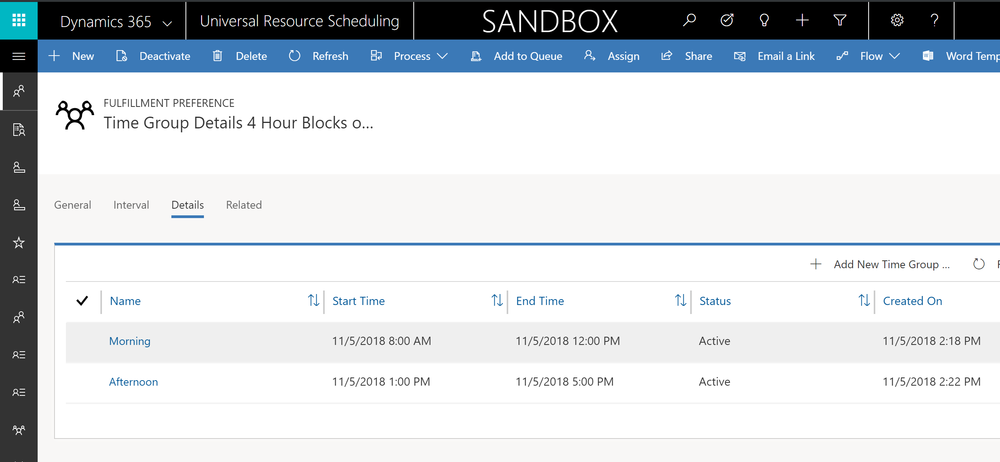
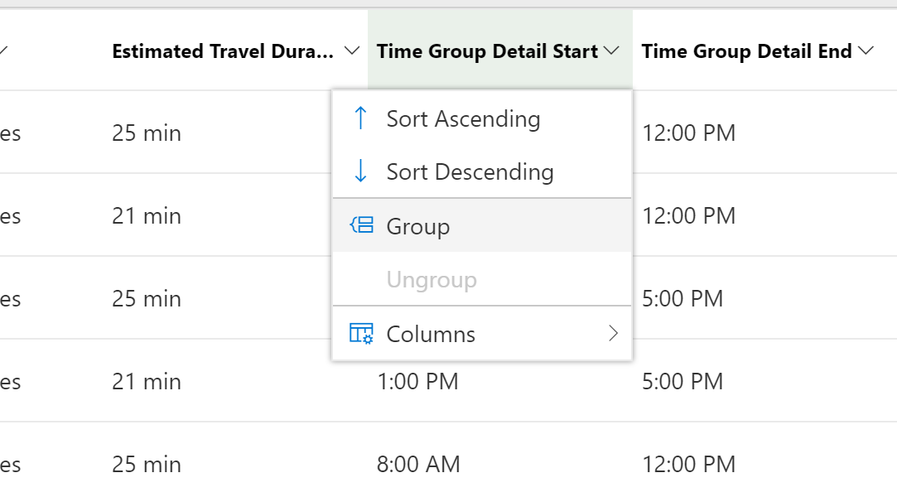
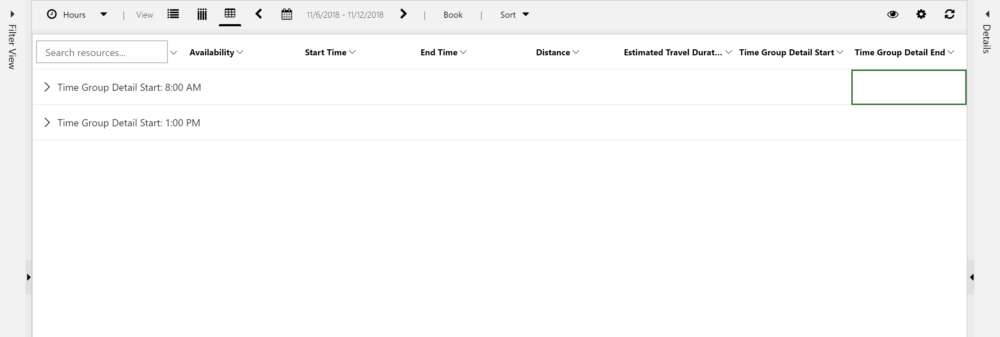
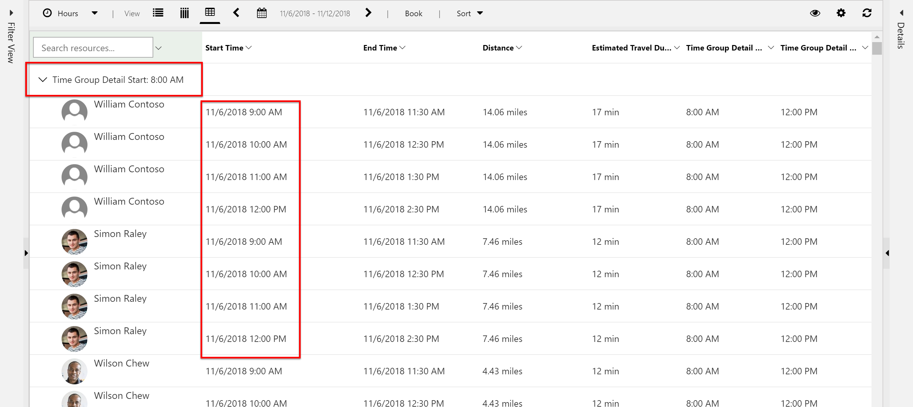

# Fulfillment preferences

Fulfillment preferences are customizable entities that let you choose how schedule assistant results are displayed, like with neat hourly appointments or morning / afternoon time windows.

By default, the schedule assistant displays results based entirely on resource schedules and the earliest available time,  such as 10:39am. **With fulfillment preferences** set to hourly, the same resource's availability shows as **11:00am**. This makes it simpler for the scheduler to view and understand availability and communicate it to the customer.

## Overview

Fulfillment preferences break down into two features: **intervals** and **time groups**. Note that both are designed for intra-day work, not multi-day work.

### Intervals

Intervals display schedule assistant results in neat time slots **that dictate start time of subsequent bookings**. When configured as 30 minutes intervals, the schedule assistant will display a 9:27am available resource as 9:30am, and will book the start time (arrival time) for 9:30am. This includes travel time for onsite requirements and work orders, meaning travel time will begin before 9:30am and a field resource will arrive and start work at 9:30am. 

For example, a hair salon may want to offer appointments every hour because 1-hour intervals are a good time estimate for their work, which is mostly consistent and predictable. It's also easier to communicate 1-hour appointments to customers when scheduling.

### Time groups

Time groups enable schedulers to search and view results as blocks of time when using the schedule assistant. Typical examples include mornings, afternoon, nights, 2-hour windows. Unlike intervals, time groups **do not dictate the start time of subsequent bookings**. Time groups organize results, but leave the start time/arrival time as-is, based on the particular resource's schedule. 

When a time group is created for morning (8am-12pm) the schedule assistant will display a resource's earliest availability within the defined morning bucket. Results will show a list of possible resources to start at 8:32am, 9:07am, and 11:23am, and all results will appear within the "morning" time group because the start times fall within the 8am-12pm time group.

For example, a heating and cooling company wants to group air conditioning installations into morning (8am-12pm) and afternoon (1pm-5pm) windows, with a 1-hour break for lunch in between. Because installations are dependent on many variables, schedulers aren't comfortable committing to an exact time; they would rather communicate to customers a morning or afternoon time range when installation resources will arrive to begin working.

**Intervals** and **time groups** can be combined to offer predefined intervals within a predefined time block, such as grouping 1-hour appointments within morning and afternoon groups. This allows a scheduler to first identify if morning or afternoon works better for the customer, and then offer an appointment. This further simplifies the scheduler experience and communication to the customer.

Below find instructions to set up intervals and time groups, and finally how to set them up to work together. Note that Universal Resource Scheduling version 3.1+ is required.

## Interval setup

To set up intervals, you need to: 

- Create a fulfillment prefence
- Associate the fulfillment preference to a requirement
- Book the requirement with the schedule assistan

### Create a fulfillment preference

1. Navigate to **Universal Resource Scheduling > Fulfillment preferences > +New**. Enter a **name** and save.

> [!div class="mx-imgBorder"]
>

2. Navigate to the **Interval** tab.

> [!div class="mx-imgBorder"]
>

3. Enter a duration for **Interval**. This is the duration between available time slots. Typical examples include 30 min, 45 min, 1 hour, 2 hours.

4. Enter a time for **Interval Begins**, which defines when to begin counting the interval. So if this is set to 12:00 AM, the available options are 12:00am, 12:30am, 1:00am, etc; however, results will also depend on resource availability and working hours. If left blank, the interval will begin at the time of booking. For example, if your interval is 30 min and Interval Begins is blank, when you attempt to book at 11:13am, your time slot options are 11:13am, 11:43am, 12:13pm, etc. 

5. Enter a number for **Results per interval**. This dictates how many options a scheduler will receive for each interval. If left blank, the system defaults to 1.

    Results per interval decides how many options for a given time slot will appear in schedule assistant results. So if you have 85 resources all available at 9:30AM and results per interval is set to 85, then all resources will show. If results per interval is set to 5, then only the 5 best will show. 

6. Save and close.

### Associate fulfillment preference to a requirement

Navigate to the requirement you want to schedule and specify the fulfillment preference.

> [!div class="mx-imgBorder"]
> 

You can also associate the fulfillment preference from the requirement group entity, as seen in the following screenshot.

> [!div class="mx-imgBorder"]
> 

### Book the requirement with the schedule assistant

Select **Book** from the requirement ribbon. Note that the start times in the scheduling assistant appear in 30-minute intervals.

> [!div class="mx-imgBorder"]
> 

> [!Note]
> The **estimated arrival time** is the attribute that is dictated by the interval. When scheduling requirements where the “work location” is **location agnostic** or **facility**, the **travel start time** and the **estimated arrival time** are identical, since there is no travel. When work location is “onsite”, the travel can begin anytime, but the estimated arrival time, being the time when resources are expected to arrive at the customers site, is the time that needs to coincide with the interval.

For field service examples where resources perform multiple appointments each day, a shorter 15-minute interval is recommended. This balances keeping utilization high with simplified start times.

## Time group setup

To set up time groups, you need to: 

- Add time group details to a new fulfillment preference
- Specify fulfillment preference on the resource requirement
- Book the requirement with the schedule assistant

### Add time group details to a new fulfillment preference

1. Navigate to **Universal Resource Scheduling > Fulfillment preferences > +New**. Enter a **name** and save.

> [!div class="mx-imgBorder"]
> 

2. Navigate to the **Details** tab on the fulfillment preference record.

> [!div class="mx-imgBorder"]
> 

3. Select **+Add New Time Group**.

4. Add the following information to the fields:
    - **Name** - "Morning," for example 
    - **Start Time** - 8:00 AM
    - **End Time** - 12:00 PM

> [!div class="mx-imgBorder"]
> 

   Another time group might be "afternoon," between 1:00 PM and 5:00 PM (this leaves 12:00 PM - 1:00 PM unavailable, allowing for lunch)

> [!div class="mx-imgBorder"]
> 

### Specify fulfillment preference on the resource requirement

Navigate to the resource requirement you want to schedule, and specify the fulfillment preference.

> [!div class="mx-imgBorder"]
> 

### Book the requirement with the schedule assistant

Navigate to a resource requirement. Select **Book** from the ribbon menu to initiate the schedule assistant. 

The schedule assistant results show a column detailing the start and end times of the associated time group. These results can be sorted.

> [!div class="mx-imgBorder"]
> 

Right-clicking on the column header allows schedulers to group by time group details (by selecting "Group"). This comes in handy when focusing on a specific time block that a customer prefers. 

> [!div class="mx-imgBorder"]
> 

> [!div class="mx-imgBorder"]
> 

> [!Note]
> Time group details ensure the start time of the booking falls within the time group, however the end time can fall beyond. In the preceeding example screenshot, a resource available at 11:59 AM appears in the "morning" time group, and the duration of the booking will spill over into lunch/afternoon time group. 

## Using intervals and time groups together

You can add both an interval and a time group to a single fulfillment preference, but this requires a few important considerations.

> [!div class="mx-imgBorder"]
> 

- Using both an interval and time group means that you cannot add a value for **Interval Begins**. The interval will begin at the time of the earliest time group.

- If the **Reset Interval per Time Group Detail** option is set to yes, the intervals will reset once a new time group detail overlaps with an interval. 

    Consider the following scenario:

    A traditional brick and mortar business offers appointments every 90 minutes, so intervals are set to 90 minutes. Additionally, they separate into morning and afternoon time groups of 8AM - 12PM and 1PM - 5PM, with a 1 hour lunch in between. Therefore, both intervals and time groups are useful for this business.

    - If the **Reset Interval per Time Group Detail** is set to **No**, the appointments would be:

         8:00AM, 9:30AM, 11:00AM, (not 12:30 because this is blocked for lunch), 2:00PM, 3:30PM

    - If the **Reset Interval per Time Group Detail** is set to **Yes**, the appointments would be:

         8:00AM, 9:30AM, 11:00AM, (not 12:30 because this is blocked for lunch), **1:00PM** (resetting for next time group detail), 2:30PM, 4:00PM

## Configuration notes

- Intervals can also be set for requirement groups. All requirements within that requirement group will inherit the same fulfillment preferences. The fulfillment preferences entity was originally named "time groups," and therefore, the actual schema name for this entity is “msdyn_timegroup,” although the display name is “Fulfillment Preferences”.

- Time group details are only compatible for individual requirements

- Fulfillment preferences apply to location-agnostic and onsite requirements 

- There is an attribute on the booking entity called “Time Group Detail Selected” (msdyn_timegroupdetailselected), which points to the time group detail entity. This value is automatically populated when a booking is created through the schedule assistant. For example, if a requirement is scheduled and the results fall into the time group “9 to 12,” the booking created through the schedule assistant will have the value “9 to 12” in the “time group detail selected” field.

- The **Intervals Begin** time is dependent on the time zone of the requirement calendar when triggered from the requirement; however, when triggered from the schedule board, it depends on the user's time zone.

### Supported vs not supported functionality
In v3.1 of Universal Resource Scheduling (URS), some features will work when scheduling both individual requirements and groups of requirements and some features will not work for both. Please use the table below for guidance.

| Fulfillment Preference Feature  |  Compatible with scheduling a single requirement  |  Compatible with scheduling a requirement group | 
|---|---|---|---|---|
| View results by interval  |  Yes |  Yes |
| Change interval on schedule board  |  Yes |  Yes |
| Change results per interval on schedule board |  Yes |  Yes |  
|  Results per interval |  Yes |  Yes |  
| Intervals begin |  Yes | Yes  |   
| Show results by time group detail  | Yes  | No  |  
| Reset intervals per time group detail  | Yes |  N/A | 
| Display top X results per time group detail  | Yes  |  N/A |
| Hide Booking Time  | Yes (Time Group Detail) |  N/A |
