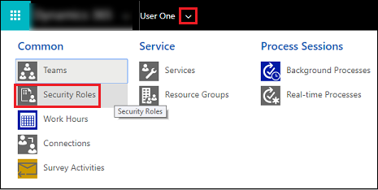

# View your user profile  

Your user profile displays useful information about you to your entire organization; for example, your contact information, your organization, and your security role. Depending on your security role, you may be able to make changes to your user profile.  
  
1. Go to **Options**.  
  
   In Customer Engagement (on-premises), in the upper-right corner of the screen, choose the **Settings** button  > **Options**.  
 
<!-- In Dynamics 365 for Outlook: Choose **File** > **Dynamics 365 Customer Engagement (on-premises)** > **Options**.  -->   
2.  Scroll down to the very bottom of the **Set Personal Options** dialog box, and then choose **View your user information**.  
  
3.  To check your security role, on the nav bar, choose the down arrow  next to your name, and then choose **Security Roles**.  

    
  
4.  To view other profile information, such as Work Hours, Connections, and Services, on the nav bar, choose the down arrow  next to your name.  
  
### See also  
 [Set personal options](../basics/set-personal-options.md)
