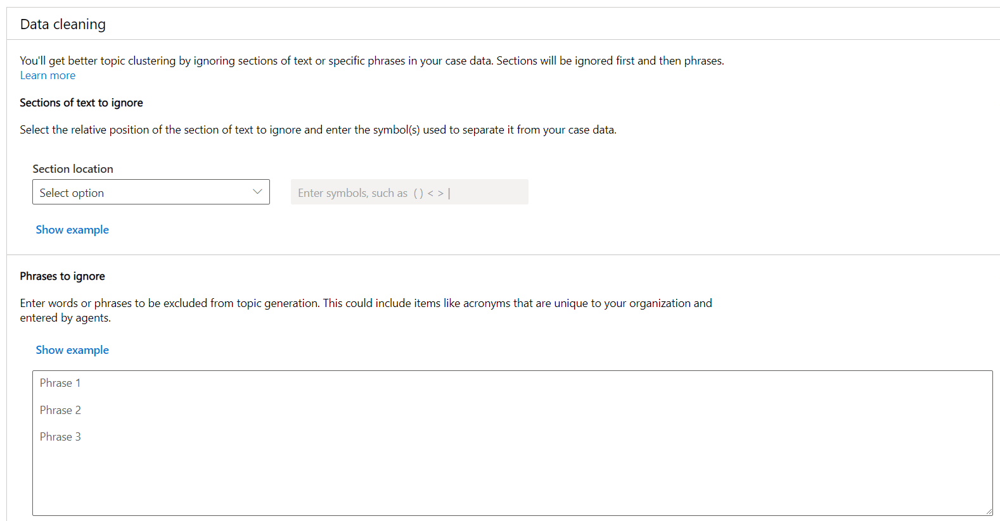

# Configure AI topic clustering for cases

Customer Service Insights uses AI to give you insights into your customer service data by grouping semantically related cases and generating a topic. New cases that match this topic will be automatically added to the topic group. This can help you identify areas for improvement that can have the greatest impact on system performance. 

The AI-driven technology empowers informed decision-making about how to improve resolution rates, reduce wait times, and decrease customer service costs. You can use case resolution insights, backlog trends, and historical comparisons to evaluate agent performance and business impact, and address inefficiencies in your system.

## Enable topic clustering for cases

Topic clustering is enabled by default when you enable historical analytics. To enable historical analytics, see [Configure Customer Service historical analytics](configure-historical-analytics-csh.md).

## Summary and Model Run Summary views

   > [!div class=ms-imgBorder]
   > 

The Summary and Model Run Summary views provide key information about how the topic model is operating.

| View | Description |
|--------|-------------|
| Status | Whether the feature is enabled or disabled.|
| Data attributes used | Which text field from the Case entity is used for topic generation. |
| Topics generated | The total number of topics generated by the model. |
| Cases associated to a topic | The percentage of cases that were considered for topic generation and classified to a topic.|
| Last successful run | Timestamp of the last time new cases were processed. |
| Run frequency | The cadence in which new cases are processed and tagged with topics. |

## Data mapping

   > [!div class=ms-imgBorder]
   > 

Data mapping enables you to choose which text field where agents in your organization are most likely to describe the reason why a customer reached out to support. By default, the Case Title attribute is used, but this setting enables you to select and string attribute in the Case entity.

### Automate topics to Power Virtual Agents bots

AI discovered topics in Customer Service Historical Analytics are often prime candidates as topics for automation in Power Virtual Agents bots. If Power Virtual Agents is available in the region that your Customer Service organization is in, then the feature can be enabled by selecting the **Enable** toggle and selecting **Save**.

> [!NOTE]
> Topic automation to PVA bot is currently not supported in Government Community Cloud.

#### Improve data quality by cleaning support case data

   > [!div class=ms-imgBorder]
   > 

Customer Service Insights uses artificial intelligence technology to give you insights into your customer service data by grouping support cases as topics that are a collection of related cases. This can help you identify areas for improvement that can have the greatest impact on system performance. 

The AI Insights charts displayed on the Customer Service Insights dashboards are generated by applying language understanding technology to the titles of support cases. However, the results can be misleading if the titles include extraneous information such as product name, case status, or ticket number tags. You can improve the quality of the results displayed in AI Insights charts by specifying Data Cleaning settings to disregard tags in titles when they are grouped into topics, as well as specific phrases that should be ignored. Note that when you choose to apply both options, sections are ignored first, followed by phrases. 

## Language availability for topics 

The topics capability in the Customer Service historical analytics reports comes with a natural language understanding model that can understand the text semantics and intent in the following languages: 

- English 
- French 
- German 
- Italian 
- Japanese 
- Portuguese 
- Simplified Chinese 
- Spanish 

### See also

[Introduction to Customer Service analytics and insights](introduction-customer-service-analytics.md)   
[Dashboard overview](customer-service-analytics-insights-csh.md)    

  

[!INCLUDE[footer-include](../includes/footer-banner.md)]