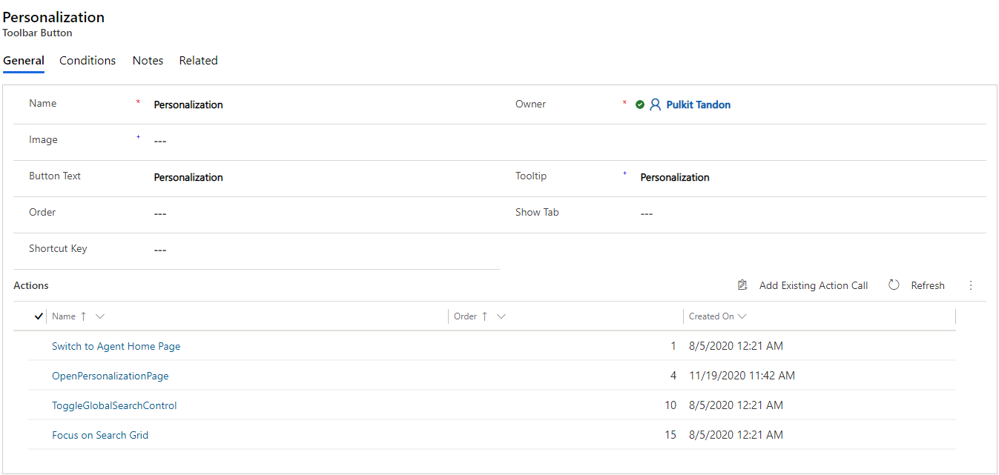

# Enable personal quick replies

[!INCLUDE[cc-use-with-omnichannel](../includes/cc-use-with-omnichannel.md)]

You can enable personal quick replies by adding a personalization tab to your Unified Service Desk configuration. After you add the personalization tab, you can view the tab depending on where it was added. More information on quick replies: [Create a record in Ominchannel for Customer Service](create-record.md).

**To add the personalization tab**

1. Open the **Unified Service Desk Administrator** app. In the left pane, go to **Basic Settings** > **Action Calls**.

2. To create an action call record, select **New** and then provide the following information:

    * **Name**: OpenPersonalizationPage
    
    * **Order**: 4
    
    * **Hosted Control**: Search Page HC
    
    * **Action**: Navigate

    * **Data**: `url=/main.aspx?pagetype=entityrecord&etn=msdyn_usersetting&id=b5c6b1bb-47ad-ea11-a812-000d3a8c9c8c   HideNavigationBar=True`

3. Select **Save**.

    > [!div class=mx-imgBorder]
    > 

4. In the left pane, under **Basic Settings**, go to **Toolbars** > **Omnichannel ToolbarStrip**.

5. In the **Buttons** area, select the button under which you want the personalization button to appear, and then in the **Related** tab, select **Toolbar Buttons**.

    > [!div class=mx-imgBorder]
    > 

6. Select **New Toolbar Button** and create a toolbar button record with the following parameters:

    * **Name**: Personalization
    
    * **Button** Text: Personalization
    
    * **Tooltip**: Personalization

7. Select **Save**.

8. Select **Add Existing Action Call**, and add the following action calls in this order:

    i. Switch to Agent Home Page
    
    ii. OpenPersonalizationPage
    
    iii. ToggleGlobalSearchControl
    
    iv. Focus on Search Grid

    > [!div class=mx-imgBorder]
    > 

9. Under **Advanced Settings** in the left pane, go to **Configurations** > **Agent Configuration** > **Hosted Controls, Events and Action Calls** tab.

10. In the **Action Calls** area, go to **Add Existing Action Call**, and then add the created Action Call **OpenPersonalizationPage**.

    > [!div class=mx-imgBorder]
    > 

