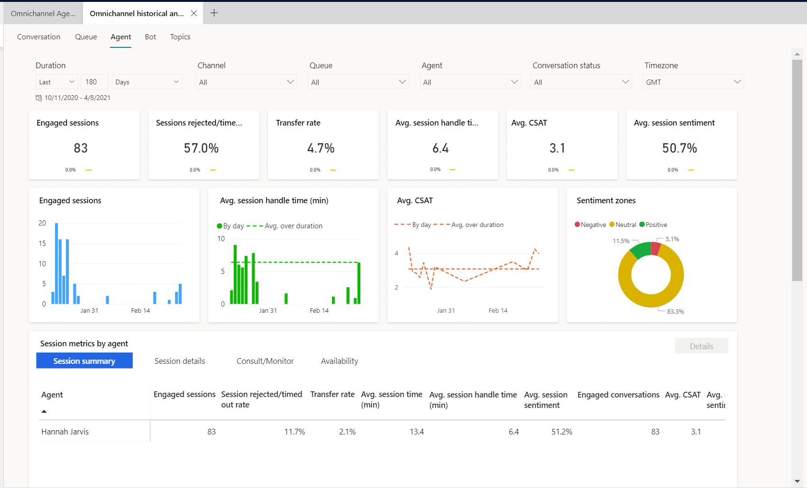
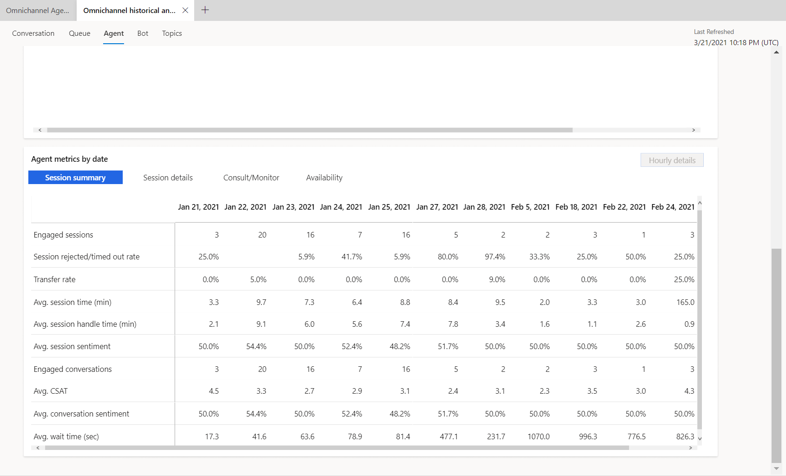
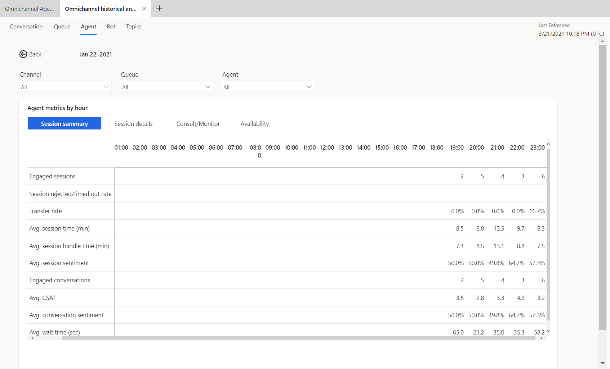

# Agent dashboard

> [!IMPORTANT]
>
> This feature is intended to help customer service managers or supervisors enhance their team's performance and improve customer satisfaction. This feature is not intended for use in making, and should not be used to make, decisions that affect the employment of an employee or group of employees, including compensation, rewards, seniority, or other rights or entitlements. Customers are solely responsible for using Dynamics 365 Customer Service, this feature, and any associated feature or service in compliance with all applicable laws, including laws relating to accessing individual employee analytics and monitoring, recording, and storing communications with end users. This also includes adequately notifying end users that their communications with agents may be monitored, recorded, or stored and, as required by applicable laws, obtaining consent from end users before using the feature with them. Customers are also encouraged to have a mechanism in place to inform their agents that their communications with end users may be monitored, recorded, or stored.

The Agent dashboard shows charts and KPIs that you can use to guide agents and understand overall agent performance.

> [!div class="mx-imgBorder"]
> 

You can view the Agent dashboard in the Omnichannel for Customer Service app. On the **Home** tab, select the plus (**+**) icon, and then select **Omnichannel historical analytics**. On the page that appears, select the **Agent** tab.

## Report details

The reports summarize the KPIs for the specified time period and percentage change over a period of time. You can filter these areas by duration, channel, queue, agent, conversation status, and time zone.

| KPI | Description |
| ------------------------ | ----------------- |
| Engaged sessions | The number of sessions accepted by an agent. |
| Rejected/ timed-out sessions rate | The number of sessions presented to an agent and not accepted. |
| Transfer rate | The percentage of conversations that are transferred to another agent/queue. |
| Avg. session handle time | The average total session active time across engaged sessions.  |
| Avg. CSAT | The average of customer satisfaction ratings provided by customers. Only available if Dynamics 365 Customer Voice has been configured as a post conversation survey tool. |
| Avg session sentiment | The average predicted sentiment of a customer based on the conversation transcript from the session. |

The charts display the following metrics.

| Title | Description |
| ---------------- | ---------------- |
| Engaged sessions | The number of sessions accepted by an agent, by day |
| Avg. session handle time | The average amount of time an agent actively spends on a session, by day. |
| Avg. CSAT | The customer CSAT trend, based on Dynamics 365 Customer Voice survey responses. |
| Sentiment zones | The breakdown of customer sentiment across sessions by level.  |

> [!div class="mx-imgBorder"]
> 

| Session summary | Description 
| ------------------ | --------------- |
| Engaged sessions | The number of sessions presented to an agent and accepted. |
| Session rejected/timed out rate | The number of sessions presented to an agent and not accepted.  |
| Transfer rate | The number of sessions transferred by an agent. |
| Avg. session time (min) | The average time of the total session duration across engaged sessions. |
| Avg. session handle time (min) | The average of the total session active time across engaged sessions. |
| Avg. session sentiment | The average predicted sentiment of the customer across engaged sessions.  |
| Engaged conversations | The number of conversations presented to an agent and accepted. |
| Avg. CSAT | The average CSAT score provided by customers from Customer Voice survey responses. |
| Avg. conversation sentiment | The average predicted sentiment of the customer across engaged conversations. |
| Avg. wait time (sec)  | The average time customers waited before connecting to agents. This is similar to “speed to answer” but it includes wait time from each session within a conversation. |

| Session details | Description |
| --------------------- | ---------------- |
| Avg. session active time (min) | The average total session active time across engaged conversations. |
| Avg. session inactive time (min) | The average total session inactive time across engaged sessions. |
| Avg. incoming messages | The average total number of incoming messages from a customer per session. |
| Avg. outgoing messages | The average total number of outgoing messages from an agent per session. |
| Incoming messages | Total incoming messages from the customer, per session.|
| Outgoing messages | Total outgoing messages from an agent, per session. |

| Consult/Monitor | Description |
| --------------- | --------------- |
| Consult sessions | The number of sessions where the agent has participated in consult mode. |
| Avg. consult time (min) | The average time an agent spent during a session in consult mode. |
| Monitor sessions | The number of sessions where the agent has participated in monitor mode. |
| Avg. monitor time (min) | The average time an agent spent on a session in monitoring mode. |

| Availability | Description |
| --------------- | ---------------- |
| Agent total login time (hrs) | The time an agent is logged into Omnichannel for Customer Service. |
| Agent available duration (hrs) | The time an agent is in the available state in Omnichannel for Customer Service. |
| Agent busy duration (hrs) | The time an agent is in the busy state in  Omnichannel for Customer Service. |
| Agent busy (DND) duration (hrs) | The time an agent is in the busy do not disturb (DND) state in Omnichannel for Customer Service. |
| Agent away duration (hrs) | The time an agent is in the away state in Omnichannel for Customer Service. |
| Agent offline duration (hrs) | The time an agent is signed out of Omnichannel for Customer Service. |

## Agent drill-down view

The Agent drill-down view provides supervisors with a holistic look into individual agent performance on metrics and can be valuable in training or coaching scenarios for agents.  

To access the drill down, select any metric value for the agent you're interested in, and then select **Details**.  

> [!div class="mx-imgBorder"]
> 

## Drill-down view of agent hourly details

The Agent hourly details drill-down view provides granular insight into the hour-by-hour breakdown of key conversation metrics within the contact center. The metrics for Session summary, Session details, Consult/Monitor, and Availability are the same as in the day-by-day view, ensuring that supervisors can consistently analyze their contact center operation regardless of duration granularity. 
To view the drill down, select any single metric value on the desired day, then select **Hourly details**. 

> [!div class="mx-imgBorder"]
> 

## Drill-down view of agent presence statuses

The agent presence status drill-down view shows the start time and end time of all the presence statuses for agents during their work hours. This data helps you derive the duration of each presence status for the agent.

Select the **Availability** tab. In **Aggregated view**, the duration of the presence status is displayed for each hour. In **Detailed view**, the start and end times of the presence status is displayed for each agent, over a month.

:::image type="content" source="media/agent-presence-drill-down.png" alt-text="Agent presence drill down":::

## Drill-down view of agent custom presence

The agent custom presence drill-down view provides you an insight into the out-of-the-box presence status metrics and custom presence metrics.

Select the **Availability** tab and then select the **Aggregated view** to view the hourly details of the various statuses. The **Presence status** column shows metrics for both out of the box and custom state metrics. For example, on April 05, 2022, the specific agent spent 0.7hrs in the custom state of **Inactive** and 0.6hrs in the out of the box status of **Busy - DND**.

:::image type="content" source="media/agent-custom-presence-drill-down.png" alt-text="Agent custom presence drill-down view":::

### See also

[Conversation dashboard](oc-conversation-dashboard.md)  
[Dashboard overview](customer-service-analytics-insights-csh.md)  
[Queue dashboard](oc-queue-dashboard.md)  
[Bot dashboard](oc-bot-dashboard.md)  
[Conversation Topics dashboard](oc-conversation-topics-dashboard.md)  
[Manage report bookmarks](manage-bookmarks.md)  
