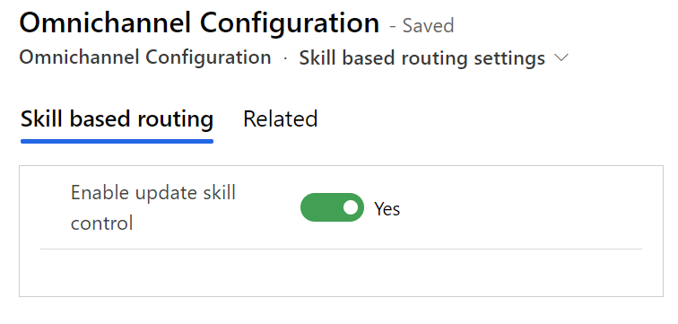

# Enable agents to update skills

[!INCLUDE[cc-use-with-omnichannel](../includes/cc-use-with-omnichannel.md)]

By default, skill-based routing is enabled. You can create skills to attach to agents and define proficiency levels by using a rating model. You can also enable your agents to add or remove skills for their assigned work items (conversations) at runtime.

> [!Note]
> The skill control is available only for messaging channels. For the records channel, you'll need to customize the form to add the skill control. More information: [Add a skill control for routed records](add-skill-control.md)

**To enable your agents to update skills for their work items**

1. Sign in to Dynamics 365.

2. In Omnichannel admin center or in Customer Service Hub, in the site map, select **User attributes**, and then select **Manage** next to **Skill-based routing** on the **User attributes** page.

3. On the **Skill based routing** tab, set the **Enable update skill control** toggle to **Yes**.

    > [!div class=mx-imgBorder]
    > 

By enabling your agents to evaluate and update skills required for their work items, you make use of your agents' experience to identify actual skills required for the work items. This, in turn, helps with retraining the skill finder model, and improves model accuracy and prediction. More information: [Retrain skill finder model](set-up-skill-based-routing.md#retrain-the-model-iteratively)

### See also

[Overview of skill-based routing](overview-skill-work-distribution.md)  
[Set up skills and assign agents](setup-skills-assign-agents.md)  

[!INCLUDE[footer-include](../includes/footer-banner.md)]