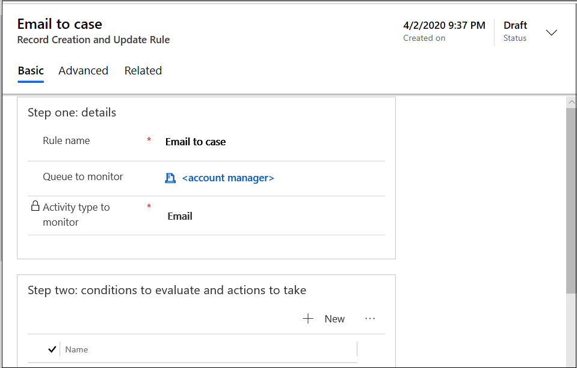
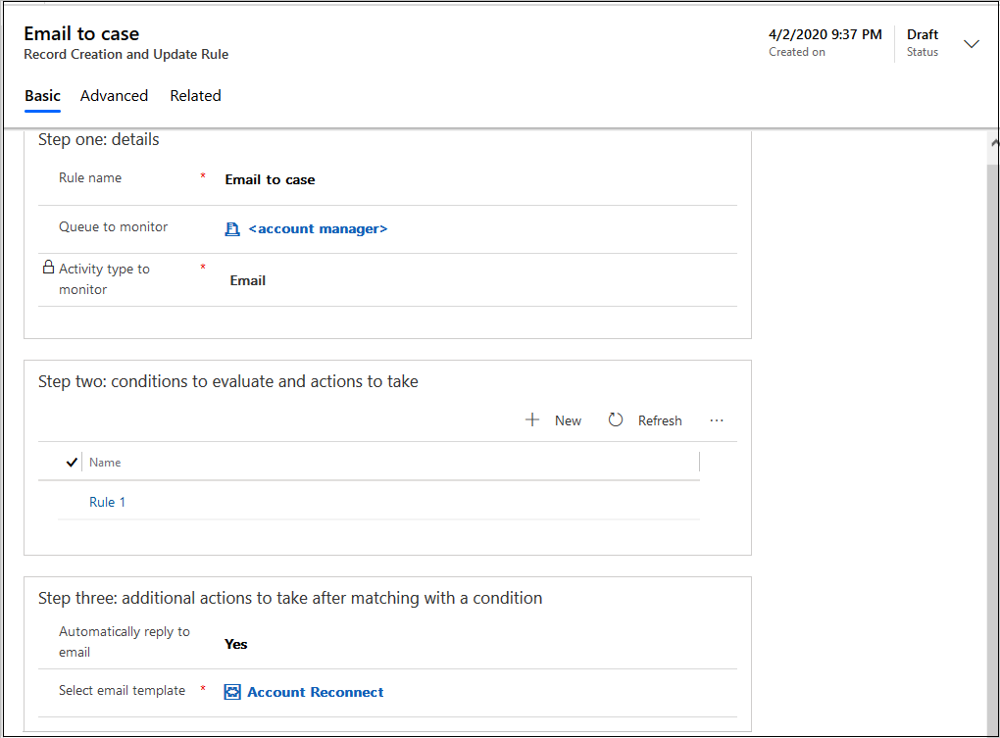
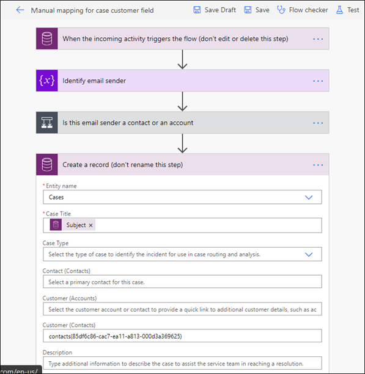

# Automatically create or update records in Customer Service Hub

## Introduction

In Dynamics 365 Customer Service Hub, you can automatically create or update system or custom records from incoming activities, such as emails, social activities, and custom activities. In this section, you'll learn about creating rules for automatically creating records for cases from incoming emails.

## Set up rules for creating or updating records automatically

Every organization has multiple applications to capture customer interactions. The ability to channel external data into Microsoft Dataverse records can significantly improve the efficiency of your sales, marketing, and service teams, and increase the quality of your data. You can now direct this data from various applications and external sources into Dataverse with the help of *record creation and update rules*.

A record creation and update rule consist of rule items. The rule items define the conditions for creating or updating records, and also define the actions or steps to be taken on the records.

When a case record is created through an automatic record creation rule, and the rule owner is a team, the owner of the case record will be the team's administrator user.

## Activities and entities supported by rules for creating or updating records automatically

 By default, Dynamics 365 Customer Service supports creating records from the following activities:  

- Email
- Social activity
- Task
- Phone call
- Appointment
- Service activity
- Custom activity

These activities can be converted to any default (system) entity records or custom entity records. For example, you could create a lead, opportunity (system record), or incident (custom record) from an incoming email.

## Prerequisites

Make sure that the following prerequisites are met:

- Permission or role to create rules
- Information on the queues for which you want to create the rules

## Configure rules for creating or updating records automatically

You can configure a rule that when active will be run for incoming emails. By using the feature to create rules, you can define the conditions for when a rule can be run.

You can configure the rules in the Customer Service admin center or Customer Service Hub app.

1. Go to one of the apps, and perform the following steps.
   
   ### [Customer Service admin center](#tab/customerserviceadmincenter)
   
     1. In the site map, select **Case Settings** in **Customer Support**. The **Case Settings** page appears.
     1. In the **Automatic record creation and update rules** section, select **Manage**.

     The **All Record Creation and Update Rules** page is displayed.

   ### [Customer Service Hub](#tab/customerservicehub)
    
     1. In the site map, select **Service Management**.
     2. Select **Automatic record creation and update rules** in **Case Settings**. 
  
      The **Record Creation and Update Rules** page is displayed. 

2. Select **New**. The **New Record Creation and Update Rule** page is displayed.

3. On the **Basic** tab, in **Step one details**, enter the following details:
  
   - **Rule name**: Enter a name for the rule.
   - **Queue to monitor**: Select a queue on which the rule will be activated. For email activity, you must select a queue to be able to activate the rule.
   - **Activity type to monitor**: Select **Email** in the list.

4. Select **Save**. The **Step two: conditions to evaluate and actions to take** area is enabled.

   > [!div class=mx-imgBorder]
   > 

5. In **Step two: conditions to evaluate and actions to take**, select **New**. The **Condition builder** page is displayed.
   
   > [!NOTE]
   > You must add a minimum of one condition for the rule to run successfully.

6. Perform the following steps:

   a. In **Condition** > **Condition name**, enter an intuitive name.

   b. In **Condition that must pass to continue (pass if blank)**, select **Add**.
   
   c. Use the following options to define the criteria for the rule to be evaluated:

      i. Add row

      ii. Add group

      iii. Add related entity

7. In **Actions to take** > **Record to create**, make sure the value is **Case**. A case will be created if the conditions specified are met for the email activity.

8. In **Configure in Microsoft Power Automate**, select **Save and open in Power Automate**. The Power Automate application opens in a new tab where you can configure criteria that must be evaluated for the email activity. To learn more about using Power Automate, see the [documentation for Power Automate](/power-automate/getting-started).

9. Select **Save & Close**. The condition builder is closed.

10. In **Step three: additional actions to take after matching with a condition**, select an option based on your requirement for **Automatically reply to email**.

11. If you select **Yes**, select an email template in the **Select email template** list box.

   > [!div class=mx-imgBorder]
   > 

  > [!NOTE]
  > The rule will be in the draft status until you activate it.

## How do record creation and update rules work with queues

 In a record creation and update rule, when you specify a queue for a source type, any incoming activity from that source is added as a queue item for that specified queue. That is, if a rule for a particular source activity and queue combination is active, the rule processes the incoming activity on that queue to create or update records. When an email is processed by an automatic record creation rule, a queue item is created. If the email has the queue's email in the blind carbon copy (Bcc) or carbon copy (Cc), a queue item is created from server-side sync. By default, two queue items are created if the email has the queue's mail in both the "To" and "Bcc" or "Cc" fields. To control the creation of the queue items, you can set the **CreateQueueItemForSynchronizingMailbox** toggle in your organization's configuration settings. More information: [Create queue items from synchronized email messages](/power-platform/admin/create-queue-items-from-synchronized-email-messages)

 For an email source type, you must specify a queue. For all other source types including custom activities, it is optional.  

> [!NOTE]
> When an automatic record creation rule is applied to an Email queue item, it gets deactivated.

## Configure advanced settings for rules

On the **Advanced** tab of the **Record creation and update rule** page for a rule, you can configure actions that can be automatically performed before the conditions for the rule are evaluated.

1. On the **Automatic record creation and update rules** page, select the rule in the list that you want to update. The *<rule_name>* page appears.

2. Select the **Advanced** tab, and do the following in **Before evaluating conditions**:

   - **Allow emails from unknown senders:** Set it to yes if you want records to be created when email messages arrive from senders whose email addresses aren't present in any contact or account records.

        This option, with the Automatically create records in Dynamics 365 for Customer Engagement option in the rule owner's Personal Options, determines whether a case and contact record is created. To learn more, see [Set personal options](../customerengagement/on-premises/basics/set-personal-options.md).

   - **Manage unknown senders by:** Select one of the following options:
     - **Creating a new contact automatically:** Specify if you want a contact to be created automatically.
     - **Mapping in Power Automate manually:** Specify if you want to evaluate and set up the resolution for the contact in Power Automate.
        > [!IMPORTANT]
        > If you select to map the contact manually, make sure that you create a mapping in Power Automate for the customer field. More information: [Manually map a contact in Power Automate](#configure-in-power-automate)
   - **Require a valid entitlement on the connected case:** If you select **Yes**, a case is created only if an active entitlement exists for the customer.

        If the sender of the email is a contact with a parent account, a record is created if the contact’s parent account has a valid entitlement, and the contact is listed in the **Contacts** section of the entitlement or if the **Contacts** section is empty (which means the entitlement is applicable to all contacts for the customer).

   - **Wait for a specific amount of time after the connected case has been resolved:** Select **Yes**, and then select a time value in the **Select the amount of time** box that appears. No new case will be created until the specified period of time lapses after a related case is resolved. For example, if you have set the value to yes and specify one hour, and a case exists for a printer issue, when a mail comes for the same printer issue, another case won't be created until one hour lapses after the existing printer issue case is resolved.

      If set to **No**, a case will be created even if a related case exists and only if the email isn't already associated with a resolved case.

      > [!NOTE]
      > If you want a case to be created without any time lapse, then set **Wait for a specific amount of time after the connected case has been resolved** to **Yes** and don't select any time duration in the **Select the amount of time** box.

3. In **Advanced settings**, by default the user who is creating the rule is listed in the **Owner whose permissions the rule uses to run** box. You can add more users or change the default value.

4. Select **Save** or **Save & Close**.

## Change the order of rule items to be evaluated

The rules are run in the order they're listed in the rule items list. If the incoming activity matches the condition specified in the rule item one, the case is created and the rest of the rule items aren't evaluated. You can reorder the rule items when more than one rule item exists for a rule.

## Manually map a contact in Power Automate

Perform the following steps to manually map a contact in Power Automate:

1. In the app in Customer Service, go to the automatic record creation and update rule feature, and then select the rule that you want to edit.
2. In the **Step two: conditions to evaluate and actions to take** area, select the rule item for which you want to manually map the contact in Power Automate.
3. On the page that appears, on the **Condition builder** tab, select **Save and open Power Automate**. The Power Automate workflow opens on a new tab.
   1. Accept the default connection settings, and select **Continue**.
   2. On the page that's displayed, in the **Is this email sender a contact or an account** step, for the **If no** option, select the ellipses for **Terminate when no valid customer found**, and select **Delete**.
   3. Select **OK** on the confirmation dialog.
   4. In the **Create a record (don't rename this step)** step of the workflow, specify the required value in the **Customer (Contacts)** box.
   5. Make sure that you remove the default mappings from **Contact (Contacts)** and **Customer (Accounts)**.
      > [!div class=mx-imgBorder]
      > 

      > [!IMPORTANT]
      > If you want to map an account, make sure that you remove the default mappings from the **Contact (Contacts)** and **Customer (Contacts)** boxes and specify only an account in the **Customer (Accounts)** box for the workflow to run without errors.

   6. Save and close.

### Process emails from known senders only

To process emails from known senders only, do the following steps in Power Automate for the associated rule item:

1. On the Power Automate workflow page, accept the default connection settings, and select **Continue**.

1. On the page that's displayed, in the **Is this email sender a contact or an account** step, for the **If no** option, make sure that the **Terminate when no valid customer found** option is available.

1. Save the changes.

The mails from known senders only will be processed.

### Create contacts for unknown senders

The steps in this section are applicable only when you select the option to manually map in Power Automate in the **Manage unknown senders by** field on the **Advanced** tab of the record creation and update rule.

To create a contact for unknown senders of mail, configure the following options in Power Automate for the associated rule item:

1. In the **Is this email sender a contact or an account** step, for the **If no** option, delete the **Terminate when no valid customer found** action.

1. Select **Add an action**, and in the **Choose an operation** box, search for "Add a new row", and select it.

1. In **Table name**, select **Contacts**.

1. In **Email**, search for "From" in **Dynamic content**, and select it.

1. Select **Add an action** again, and in **Choose an operation** search for "Set variable", and select it.

1. In **Name**, select **Customer from email sender**.

1. In **Value**, search for "OData Id" in **Dynamic content**, and select it. "OData Id" is derived when you create a new contact record.

1. In the **Create a record (don't rename this step)** option, search for **Contact (Contacts)**, and use the following expression:

   if(equals(triggerOutputs()?['body/_emailsender_type'], 'contacts'), if(contains(variables('Customer from email sender'), triggerOutputs()?['body/_emailsender_value']) , string(''), concat('contacts(',triggerOutputs()?['body/_emailsender_value'], ')')), string(''))

1. Save the changes.

## Activate a rule for creating or updating records automatically

 For any record creation and update rule to apply to a matching incoming activity, after you add the rule items, you must activate the rule.

## Manage automatic record creation and update rule from a queue form

 You can create or manage an automatic record creation and update rule from a queue form. To learn more, see [!INCLUDE[proc_more_information](../includes/proc-more-information.md)] [Create or change a queue](set-up-queues-manage-activities-cases.md)

## Use activity monitor to review and track rules

You can review and track the health of the automatic record creation rules and resolve issues around them. By default, the activity monitor captures failed events. You can customize the events that you want to monitor by using the monitor options in the application.

> [!IMPORTANT]
> The activity monitor tracks the rules only till they are evaluated in Customer Service Hub before the rule is run in Power Automate.

> 

The following details are available for the rules:

- **Current state:** Displays the state, such as, Failed, Skipped, or Ready for Power Automate.
- **Rule name:** Name of the record creation rule.
- **Monitored activity type:** Activity type, such as email, task, or appointment.
- **Monitored activity item:** Displays the subject of the activity type.
- **Condition name:** The name of the condition in which the issue occurred.
- **Reason:** Displays information on how the rule was handled. For example, if the value in Current state for a rule is Skipped, no action would have been taken because the rule condition, such as **Allow email from unknown senders** was set to No. Therefore, no further action was required for the rule.
- **Evaluated on:** Displays the date and time of the issue.

Perform the following steps to use the activity monitor for the rules:

1. On the **Record creation and update rules** page, select **View activity monitor** on the command bar. The **Activity monitor for record creation and update rules** page displays the list of rules with their statuses.

2. Use the **Advanced filters** option to narrow down the view to list rules, such as list only those rules that match a specified condition.

3. Double-click a rule or activity to view the activity monitoring summary that is displayed on the **Activity monitor** *<rule_name>* page.
  
    > [!NOTE]
    >
    > - Use the browser navigation option to go back to the previous page.
    > - If you navigate to an active rule from the activity monitor page, a message appears stating that the rule is active and therefore is read-only.
    > - The legacy rules will also be monitored and listed on the activity monitor view.

4. Perform the following steps to turn on or off monitoring for the states:
   1. Select **Monitor options** on the command bar. The **Monitor options** dialog appears.
   2. Select any or all the following states:
      - Ready for Power Automate / workflow
      - Failed
      - Skipped

### Troubleshoot cases

[Issue converting an email to a case](troubleshoot-case-email-issue.md)

### See also

[Create and manage queues](set-up-queues-manage-activities-cases.md)  
[Create rules to automatically route cases](create-rules-automatically-route-cases.md)  
[FAQs on activity monitor](arc-faqs.md)

[!INCLUDE[footer-include](../includes/footer-banner.md)]
