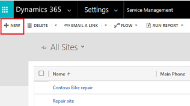
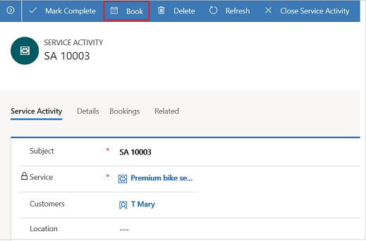
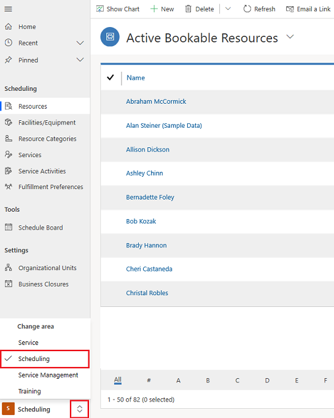

# Service Scheduling Guide

[!INCLUDE[cc-applies-to-update-9-0-0](../includes/cc_applies_to_update_9_0_0.md)]

Avoid disruptions in service by making sure that your resources are scheduled optimally and efficiently. Using Scheduling in Customer Service Hub, you can plan and schedule service activities for your customers by bringing together all your resources.

## Understand the new scheduling experience

Scheduling, now built atop **Universal Resource Scheduling (URS)**, provides an efficient way to schedule resources for service activity. It considers the availability of employees, facilities, and equipment to plan schedules accordingly. It also helps customer service organizations with improved service quality by preventing over-scheduling.

With the Customer Engagement apps version 9.1 release, the new scheduling experience can be enabled from the Customer Service Hub sitemap.

[!INCLUDE[proc_more_information](../includes/proc-more-information.md)] [Set up the new scheduling experience](#set-up-the-new-scheduling-experience)

The new experience lists the entities as follows, as compared to the legacy experience:

|Legacy Scheduling    |New Scheduling    |
|---------|---------|
|Facilities/Equipment     | Facilities/Equipment, Resources      |
|Service     |   Service,  Requirement Groups    |
|Resource Groups     |      Resource Categories      |
|Sites     |      Organizational Units   |
|Business Closure     |      Business Closure    |
|Service Calendar    |      Schedule Board       |
|Service Activity     |     Service Activity     |
|   |           |

  > [!IMPORTANT]
  > Once you have the new service scheduling available in your org, the legacy scheduling experience in Customer Service app (based on web application) and the new scheduling experience (built atop URS) in Customer Service Hub co-exist. However, the following limitations apply:  
	- Bookings data and configurations in these experiences do not sync with each other. For example, a service created in legacy experience can be scheduled in legacy scheduling while a service created in the new experience can be scheduled in the URS based scheduling.  
	- You can edit bookings data and configurations in the experience it is originally created in.
    Bookings created in the legacy experience don’t reflect in the new experience. Vice versa is also true.
    It is recommended that to effectively manage your bookings, you should migrate your data to the new experience using the migration tool. 

### Scheduling scenario

The following scenario helps to understand how the new scheduling experience lets you manage your service activities seamlessly: 

Contoso bike repair schedules repair services for their customers. To facilitate this process, Contoso needs to bring together the following information:

- Geographical locations where they need to offer their services.
- The personnel and equipment they need to perform those services. 
- The types of bike repair services they offer. 
- Work hours during which they perform their services. 
- Capacity and expert level for all personnel.

Contoso can benefit from the scheduling feature by quickly catering to their customers with their repair services. With the various scheduling entities, they can plan service activities for their customers by considering the availability of resources, facilities, and equipment. 

Let's see how Contoso accomplishes the task:

**Step 1: Create organizational units**   
   Organizational units are the locations where Contoso provides service to their customers. 

   > [!NOTE]
   > In the legacy experience the locations are referred as Sites, while in the new experience they are called Organizational units.

   In this example, Contoso bike repair is the site for service.

   |Legacy Scheduling  |New Scheduling  |
   |---------|---------|
   |  |     |
   |[!INCLUDE[proc_more_information](../includes/proc-more-information.md)] [Use sites to manage your service locations (Customer Service app)](use-sites-manage-service-locations.md)     |  [!INCLUDE[proc_more_information](../includes/proc-more-information.md)] [Create and manage organizational units](create-org-units-cs-scheduling.md) |
   |   |         | 

**Step 2: Create resources** 
  Contoso lists the resources required to perform the services. 

  > [!NOTE]
  > Unlike in the legacy experience, you can create all resource types from the resource entity in the new experience.

  In this example, two resources (contacts) Bert Hair and Gilda Moss are created. Similarly, two more resources (facility/equipment) are created as Bike repair workbench - 1 and Bike repair workbench - 2, which are required to perform the service.

  |Legacy Scheduling  |New Scheduling  |
  |---------|---------|
  |   |         |
  |[!INCLUDE[proc_more_information](../includes/proc-more-information.md)] [Create or change a resource group (Customer Service app)](create-edit-resource-group.md)     | [!INCLUDE[proc_more_information](../includes/proc-more-information.md)] [Create and set up bookable resources](resources-service-scheduling.md)    |
  |   |         |

**Step 3: Set work hours for the resource, resource group or facility/equipment**  
   The availability of the resources is defined in the work hours section. 

   |Scheduling  |
   |---------|---------|
   |        |
   | [!INCLUDE[proc_more_information](../includes/proc-more-information.md)] [Set work hours for the resources](resources-service-scheduling.md#set-work-hours-for-the-resources)|
   |   |         |
  
**Step 4: Create resource groups**  
   The resources are aligned in resource groups. 

   > [!NOTE]
   > Resource Groups are referred as Resource Categories in the new experience.

   In the example, Bert Hair and Gilda Moss are grouped as Technicians and Bike repair workbench - 1 and Bike repair workbench - 2 are grouped as Workbenches.

   |Legacy Scheduling  |New Scheduling  |
   |---------|---------|
   |  |        |
   |[!INCLUDE[proc_more_information](../includes/proc-more-information.md)] [Create or change a resource group (Customer Service app)](create-edit-resource-group.md)     |  [!INCLUDE[proc_more_information](../includes/proc-more-information.md)] [Create and manage resource categories](resource-categories-service-scheduling.md)|
   |   |         |

**Step 5: Create a service record**   
   Contoso now collates all the above inputs to create a bike repair service record for the customer. They also specify the resources/resource groups they will need for the service.

   |Legacy Scheduling  |New Scheduling  |
   |---------|---------|
   |  |     |
   |[!INCLUDE[proc_more_information](../includes/proc-more-information.md)] [Create or edit a service (Customer Service app)](create-edit-service-cs-app.md)    |  [!INCLUDE[proc_more_information](../includes/proc-more-information.md)] [Create or edit a service in Service Scheduling](create-edit-service-csh.md) |
   |   |         | 
 
**Step 6: Create a service activity**   
   A service activity is defined to look for the next available time slot to schedule the service and align resources as per requirement. 

   > [!NOTE]
   > In the service activity:   - In the new experience, select **Book** to access schedule board.   - In the legacy experience, select **Schedule** to access schedule board.

   |Legacy Scheduling  |New Scheduling  |
   |---------|---------|
   |  |    |
   |[!INCLUDE[proc_more_information](../includes/proc-more-information.md)] [Schedule a service activity (Customer Service app)](schedule-service-activity-cs-app.md)  |  [!INCLUDE[proc_more_information](../includes/proc-more-information.md)] [Schedule a service activity](schedule-service-activity-csh.md)|
   |   |         | 

**Step 7: Book the service in the schedule board**   
  The schedule board displays all the service configurations at one place to quickly schedule a service.

   |Legacy Scheduling  |New Scheduling  |
   |---------|---------|
   | |   |
   |[!INCLUDE[proc_more_information](../includes/proc-more-information.md)] [Navigate the service calendar (Customer Service app)](navigate-service-calendar-cs-app.md)   |         [!INCLUDE[proc_more_information](../includes/proc-more-information.md)] [Use the schedule board to configure service activity](use-schedule-board-configure-service-activity.md)  |
   |   |         | 

## Set up the new scheduling experience

Make sure that you have the required security role or equivalent permissions. 

[!INCLUDE[proc_more_information](../includes/proc-more-information.md)] [Manage security roles in service scheduling](manage-security-roles.md)

1. Check the Universal Resource Scheduling (URS) version.

   For the new scheduling experience, you should have the minimum specific version (3.2.0.405) of URS installed on your system. To check the URS version installed on your system, go to **Settings** and select **Solutions**.

   [!INCLUDE[proc_more_information](../includes/proc-more-information.md)] [Schedule anything with Universal Resource Scheduling (Sales, Customer Service, Field Service, Project Service Automation)](../common-scheduler/schedule-anything-with-universal-resource-scheduling.md).

      > [!NOTE]
      >  Consider that importing the scheduling package will upgrade URS to the required version. If Field Service or Project Service is already installed on your org with an older version of URS, then URS will also be upgraded.   The latest version of URS might not be compatible with the old versions of Field Service or Project Service.

2.  Get the scheduling package.

    a. Access the [Dynamics Insider Portal](http://experience.dynamics.com/insider) and log in with your Insider credentials.  
    b. On the Insider home page, go to [Dynamics 365 Service Scheduling](https://experience.dynamics.com/insider/campaign/?id=0faac2df-32db-e811-a96b-000d3a1bece3).  
    c. Select the program link and select **Join Now**. 
    This will add you as a participant to the program.  
    d. On the program page, sign up to enable Service Scheduling on URS. The link will open a simple questionnaire and one of the questions is the instance URL; provide the URL of the instance.  
    
    As we receive your details, we will enable the Service Scheduling package on your Dynamics 365 for Customer Engagement instance and you will recieve a confirmation email from Microsoft.

    > [!NOTE]
    > Ensure you have the required licenses to enable service scheduling on your org. More information: [What licenses do I need to enable service scheduling for my org?](service-scheduling-faq.md#what-licenses-do-i-need-to-enable-service-scheduling-for-my-org)

    Once you receive the email, you can access your Dynamics 365 for Customer Engagement Admin portal to install Dynamics 365 for Customer Engagement Service Scheduling on the enabled instance. 

      After successful installation, you can access scheduling in the Customer Service Hub sitemap.

## Access scheduling in the Customer Service Hub
With the Customer Engagement apps version 9.1 release, Scheduling is powered by Universal Resource Scheduling (URS), and is available from the Customer Service Hub sitemap.

- Select  to go to **Scheduling** and access the entity record types.

  > [!div class=mx-imgBorder]
  > 

## Configure entity records in the new scheduling experience

Configure all your entity records in the new experience manually from the user interface. 

Make sure that you have the correct security role or equivalent permissions. Know more about security roles: [Manage security roles in service scheduling](manage-security-roles.md).

> [!IMPORTANT]
> The admin must follow the order as given in the [Scheduling scenario](#scheduling-scenario) while configuring entity records in the new scheduling experience.

> [!NOTE]
> If you have been using the legacy scheduling, you would still need to configure entity records in the new experience.   All entity records can be configured from the user interface except Service Activity.

### Migrate Service Activity
To know how to migrate your service activity entity records from legacy to new experience by running SDK code samples, see [Migrate Service Activity entity](migrate-service-activity-entity.md).

## Understand scheduling entities

Scheduling entities are grouped under the following logical groups:

**Scheduling**

- **Resources**  
   Anything that needs to be scheduled can be termed as **Resources**. This can be personnel, crews, service centers, company assets (equipment), accounts, or contacts. 

  [!INCLUDE[proc_more_information](../includes/proc-more-information.md)] [Create and set up bookable resources](resources-service-scheduling.md)

- **Facilities/Equipment**   
   Facilities and equipment are resources you’d use to perform services for your customers. Facilities can be physical spaces like service bays or conference rooms and equipment could be tools or other assets. 

   [!INCLUDE[proc_more_information](../includes/proc-more-information.md)] [Add facilities and equipments to schedule service](add-facilities-equipment-ss-csh.md)

- **Resource Categories**  
   With Resource categories,  you can group your bookable resources by type. For example, you can create categories like technician, supervisor, subcontractor, vehicle, or equipment. 
 
   [!INCLUDE[proc_more_information](../includes/proc-more-information.md)] [Create and manage resource categories](resource-categories-service-scheduling.md)

- **Services**   
   To make scheduling services quick and easy, it’s helpful to predefine the specifics of the services you’d provide to customers. 

   [!INCLUDE[proc_more_information](../includes/proc-more-information.md)] [Create or edit a service](create-edit-service-csh.md)

- **Service Activities**  
   Create a service activity by finding the next time resources are available for a service. 

   [!INCLUDE[proc_more_information](../includes/proc-more-information.md)] [Schedule a service activity](schedule-service-activity-csh.md)

- **Fulfillment Preferences**  
    Choose and customize how to display schedule assistant results, like with neat hourly appointments or morning and afternoon time windows.

    [!INCLUDE[proc_more_information](../includes/proc-more-information.md)] [Fulfillment preferences](../common-scheduler/fulfillment-preferences.md)

**Tools**

- **Schedule Board**  
   The Dynamics 365 for Customer Engagement schedule board provides an overview of resource availability and bookings you can make. 

   [!INCLUDE[proc_more_information](../includes/proc-more-information.md)] [Use the schedule board to configure service activity](use-schedule-board-configure-service-activity.md)

**Settings**

- **Organizational Units**  
   Your company organizes its business by geography, function, or other areas. You can create organizational units that reflect your business. 

   [!INCLUDE[proc_more_information](../includes/proc-more-information.md)] [Create and manage organizational units](create-org-units-cs-scheduling.md)

- **Business Closure**  
   Prevent scheduling resources on holidays and other non-working days by defining business closures. 

   [!INCLUDE[proc_more_information](../includes/proc-more-information.md)] [Set when your business is closed](set-when-business-closed-csh.md)

### See also    
    
[Service Scheduling FAQ](service-scheduling-faq.md) 
