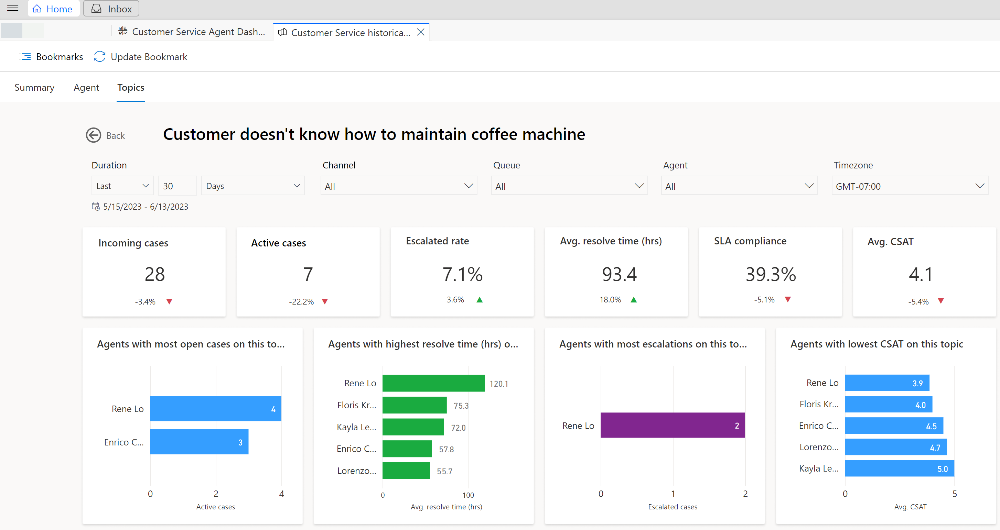

# Topics dashboard

The Topics dashboard shows a detailed breakdown of cases and their assigned topics. Customer Service Insights uses AI-generated topics and natural language understanding to automatically group your cases to help you better understand how different case types and topic areas are impacting your organization’s support performance.

To view the Topics dashboard, go to customer service historical analytics and select **Topics** at the top of the workspace. 

## Key insights card

The Key insights discovered card has three areas:

- Topics to watch
- Topics impacting CSAT
- Topics impacting resolution time

## Report details

The KPI summary charts summarize the key performance indicators for the specified time period and the percent change over the period. You can filter these areas by duration, channel, queue, and agent.

The topics dashboard report has the following KPIs.

| KPI     | Description     |
|------------|--------------|
| Total cases   |  The number of cases created to support customers.     |
| Active cases  |  The number of cases that are currently opened.      |
| Escalated cases   | The percentage of cases that have been escalated.     |
| Average handle time   | The average time taken by an agent to resolve the case.   |
| Average CSAT    | The average customer satisfaction score, based on written feedback submitted by the customer in the Customer Voice survey.   |
| Average sentiment    |  The average sentiment score, based on written feedback submitted by the customer in the Customer Voice survey.    |

The topic metrics chart has the following metrics displayed:

| Chart     | Description     |
|------------|--------------|
| Total cases |  The number of cases created to support customers.    |
| Occurrence by topic   | Percentage of cases classified to each given topic.   |
| Average resolution time  | Month over month trend of case resolution time in minutes.   |
| Average CSAT    | The average customer satisfaction score, based on Customer Voice survey submitted by the customer.   |
| CSAT impact     | The amount that the given topic is driving the overall CSAT trend for the organization.     |
| Average sentiment   | The average sentiment score, based on Customer Voice survey written feedback submitted by the customer.      |
| Sentiment impact    | The amount that the given topic is driving the overall sentiment trend for the organization.     |

### Case topics drill down view

The case topics drill down view provides supervisors with a holistic look into individual topics in reference to key business metrics and can be valuable in understanding why end customers are contacting support. 

To access the case topics drill down, select any metric value for the required topic and select **Details**.

> [!div class="mx-imgBorder"] 
> 

### Automation of case topics for Power Virtual Agents bots

AI-discovered topics in Customer Service historical analytics are often prime candidates as topics for automation in Power Virtual Agents bots. If Power Virtual Agents bot is available in the region in which your Customer Service organization is located, the feature can be enabled by the administrator for use. 

After a topic is identified as a good automation candidate, the automation workflow can be triggered by selecting **Power Virtual Agents** icon on the **Topic metrics** grid or select **Details** and then select **Automate to bot** within the drill down view. This will launch the topic editing form.  

The suggested trigger phases as well as the topic based on the case title is provided. The first step is to select the Power Virtual Agents bot that is ideal for adding the topic to. If no bot exists, selecting **Create Bot** will redirect to the Power Virtual Agents application for bot creation. Both the topic name and trigger phrases can be modified, and in the case of trigger phrases, additional ones can be added.

> [!NOTE]
> Any bots created through the Microsoft Teams channel will not be listed in the bot selection list. Users who create bots by using the drill down page for a topic in Customer Service workspace will be redirected to Customer Service Hub for form completion. 

## Language availability for topics 

The topics capability in the Customer Service historical analytics reports comes with a natural language understanding model that can understand the text semantics and intent in the following languages: 

- English 
- French 
- German 
- Italian 
- Japanese 
- Portuguese 
- Simplified Chinese 
- Spanish 

> [!NOTE]
> While topic discovery is not prevented and still possible in languages that are not listed above, there may be differences in experience for users who leverage topics in unsupported languages.

### See also

- [Dashboard overview](customer-service-analytics-insights-csh.md)  
- [Summary dashboard](summary-dashboard-cs.md)  
- [Agent dashboard](agent-dashboard-cs.md) 

[!INCLUDE[footer-include](../includes/footer-banner.md)]
