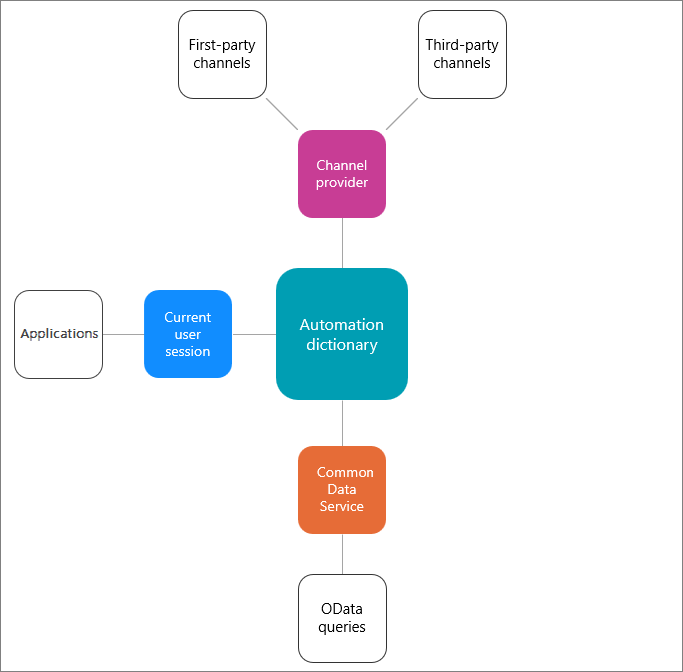

# Preview: Use automation dictionary to pass data parameter keys

[!include[cc-beta-prerelease-disclaimer](../../includes/cc-beta-prerelease-disclaimer.md)]

> [!IMPORTANT]
> - A preview is a feature that is not complete, as it may employ reduced privacy, security, and/or compliance commitments, but is made available before it is officially released for general availability so customers can get early access and provide feedback. Previews are provided “as-is,” “with all faults,” “as available,” and without warranty.​
> - This preview feature does not come with technical support and Microsoft Dynamics 365 Technical Support won’t be able to help you with issues or questions.  If Microsoft does elect to provide any type of support, such support is provided "as is," "with all faults," and without warranty, and may be discontinued at any time.​
> - Previews are not meant for production use, especially to process Personal Data or other data that is subject to heightened compliance requirements, and any use of "live" or production data is at your sole risk.  All previews are subject to separate [Terms and Conditions](../../legal/dynamics-insider-agreement.md).

## Overview

Automation dictionary maintains the contextual data for the sessions. You can use the keys from the automation dictionary to pass the parameter keys in the templates.

While creating templates in the Dynamics 365 Channel Integration Framework app, you can pass parameter keys such as title of a session, title of notification, title of an application tab template, and custom parameter values for application tab types. These keys are replaced based on the contextual information available at the time of execution.

## Pass data parameters in templates

Let's consider a scenario for templates with the notifications.

The notification shows certain fields and values, which are called **Field header** and **Value** respectively.

<!--from editor: Where is the name Kenny Smith from? I don't see it in the team's fictitious names list. -->

Kenny Smith, a customer, initiated a conversation. When the agent sees the notification, it displays **Customer Name** as **Kenny Smith**.

Here, **Field header** is **Customer Name** and the **Value** is **Kenny Smith**.

<!--from editor: Please review the small rewording in the following sentence to check accuracy. -->

For templates to identify the name of the customer as **Kenny Smith**, you as an administrator must set the configuration to pass the parameter as values.

Similarly, for session and notification titles, you can pass the data parameters. To learn more, see [Automation dictionary formats to data parameter keys](#automation-dictionary-formats-to-data-parameter-keys).

Dynamics 365 Channel Integration Framework replaces these parameter values with the actual value based on the context of the session, channel provider, Common Data Service, and user actions.

To learn more, see [Types context data parameters](#types-context-data-parameters).

<!--from editor: Should the following be Types "of" context data parameters ? -->

## Types context data parameters

The automation dictionary uses the context data parameters that are available from the following sources:

- [Context data from the channel provider](#context-data-from-the-channel-provider)
- [Context data from the user actions](#context-data-from-the-user-actions)
- [Context data from Common Data Service](#context-data-from-common-data-service)

<!--from editor: There's a typo in this image. It says "Commo" instead of "Common". -->

> [!div class=mx-imgBorder] 
> 

### Context data from the channel provider 

This context data is from a first-party channel provider such as Omnichannel for Customer Service or third-party channel provider that uses the widget exposed by Dynamics 365 Channel Integration Framework. The context data from Omnichannel for Customer Service are pre-chat survey, visitor portal navigation, and so on.

### Context data from the user actions 

This data is populated when agents perform activities in the session. An example is opening a new customer record or case.

### Context data from Common Data Service 

The organizational data is stored in Common Data Service, and you can fetch the data with the use of OData queries. To learn more, see [OData queries](#odata-queries).

## Automation dictionary formats to data parameter keys

Automation dictionary maintains the contextual data for the sessions. The keys in the automation dictionary can be passed as parameters to the action in macros. The system replaces these parameter keys with the actual value based on the context of the session, channel provider, Common Data Service, and user actions.

The supported formats are:

- [Slugs](#slugs)
- [OData queries](#odata-queries)
- [Static values](#static-values)

### Slugs

Slug is a replacement parameter that Dynamics 365 Channel Integration Framework populates at runtime based on the context. Some examples are:

| Slug | Description |
|------------|-----------------------------------|
| `{customerName}` | Name of the customer who initiated the conversation. |
| `{caseId}` | Unique ID of a case. The system displays the case ID only if a case is linked to the conversation. |
| `{caseTitle}` | Title of the case. The system displays the title of the case only if a case is linked to the conversation. |

#### Format

The `{Slug}` parameter format that retrieves the context from the channel provider, current user session, and/or the Common Data Service platform. 

**For example:**

   `{caseId}`

### OData queries

You can use the OData queries to get the context that is available from the Common Data Service platform.

The OData query format:

`{$Odata.<entityName>.<entityAttributeName>.<?options>}`

**For example:**

- `{$Odata.account.name.?$filter=id eq '{accountid}'}`

- `{$odata.incident.prioritycode.?$filter=incidentid eq '{caseId}'&$select=prioritycode}`

- `{$odata.incident.title.?$filter=incidentid eq '{caseId}'&$select=title}`

### Static values

These are hard-coded values that you update as per your business requirement. For every hard-coded attribute you choose, follow the format type for the particular attribute.

**For example:**

For an incoming chat request, you want to provide the static title to the session and notification template that agents see at runtime.

Notification title = `New chat request`

Session title = `Chat conversation`

## See also

- [Manage session templates](session-templates-cif.md)
- [Manage application tab templates](application-tab-templates-cif.md)
- [Manage notification templates](notification-templates-cif.md)
- [Associate templates with workstreams](associate-templates-cif.md)
