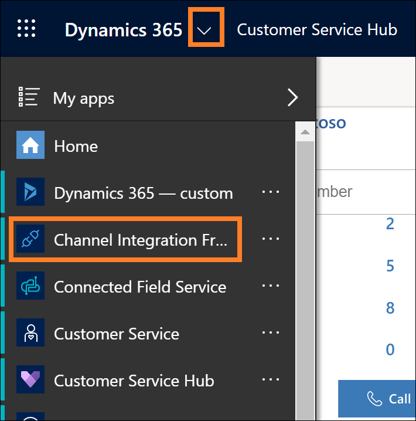

# How to configure a channel provider for your Dynamics 365 organization

Using the Dynamics 365 Channel Integration Framework solution, you can configure channel providers.
To configure channel providers:

1. Sign-in to Microsoft Dynamics 365.

2. Select the drop-down button on the Dynamics 365 and select **Channel Integration Framework**.

  

3.	Select **+ New** to add a new provider.

4.	In the **New Channel** page, specify the following:

  | Field | Description |
  |-------|-------|
  |Name|Name of the channel provider.|
  |Label|The label is displayed as the title on the widget.|
  |Channel URL|The URL of the provider to host in the widget. See the JavaScript APIs on how to develop communication widget with Dynamics 365 Channel Integration Framework.|
  |Enable Outbound Communication|Clicking on a phone number in the Dynamics 365 Unified Interface page, the widget initiates the call or outbound communication.|
  |Channel Order|The order precedence of the channel providers. That is, the priority to display the channel for the agents and unified Interface Apps.|
  |API Version|The version of the Channel Integration Framework APIs.|
  |Trusted Domain| An additional domain if the initial landing URL and the final domain from which the communication widget is hosted are different. Add the domain (URL) to access the Channel Integration Framework APIs. |
  |Select the Unified Interface Apps for the Channel| The list of Unified Interface Apps where the channel is displayed for the agents. |
  |Select Roles for the Channel|The security roles that are present in Dynamics 365. **Note:** If you do not assign any role, the channel provider is shown to all users assigned for the Dynamics 365 Unified Interface App.|
  |Custom Parameter|This takes a text blob as input and `Microsoft.CIFramework.getEnvironment` will return this as value of key `customParams`.|
  
  

  > [!Note]
  > The msdyn_ciprovider entity is accessible only for the administrator roles and hence the panel will not load for a non-administrator roles. To load the panel for the non-administrator roles, create a new role and provide read-access to the msdyn_ciprovider entity. Now, add the role to the users who will be accessing the Channel Integration Framework.

5. Launch the Unified Interface App to see the communication widget on the right side.  

**The communication widget in the minimized mode**  

  

**The communication widget in the expanded mode**  

## See also

[Enable outbound communication (ClickToAct)](enable-outbound-communication-clicktoact.md) 
[Microsoft.CIFramework.getEnvironment](reference/microsoft-ciframework/getEnvironment.md) 
[Configure channel provider in Channel Integration Framework version 2.0](/dynamics365/customer-service/channel-integration-framework/configure-channel-provider-app-profile-manager) 
[FAQs for Channel Integration Framework](faq-channel-integration-framework.md) 
[Bring your own channel](../bring-your-own-channel.md)

[!INCLUDE[footer-include](../../includes/footer-banner.md)]