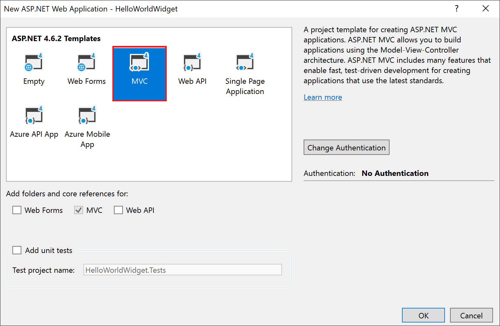
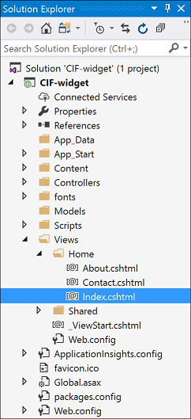
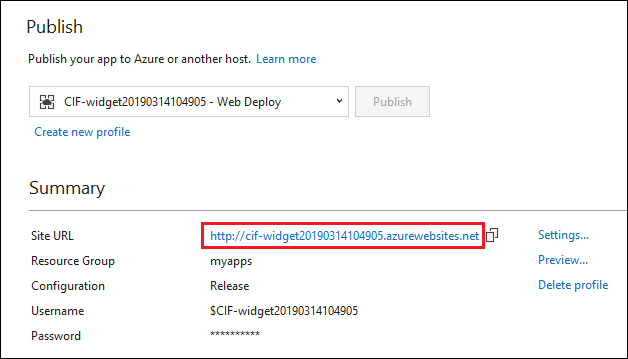
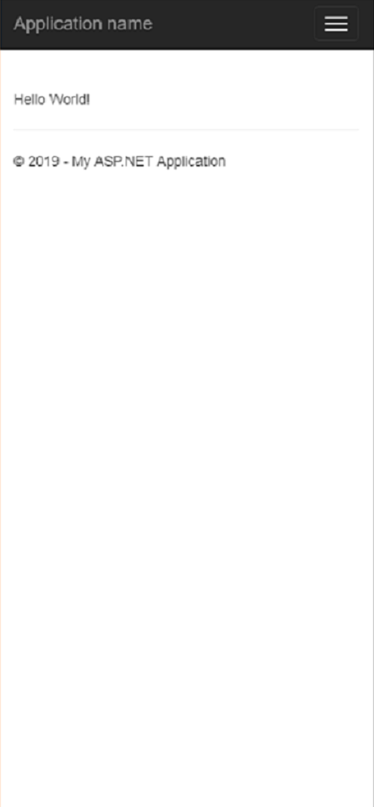

# Walkthrough: Get started with building a simple communication widget

In this tutorial, we demonstrate how to build a simple *Hello World!* communication widget that can be hosted on Dynamics 365 Channel Integration Framework.

## Prerequisites

- Visual Studio 2017.
- A valid Microsoft Azure subscription is required to publish the sample app to Azure.

> [!NOTE]
> If you don't have an Azure subscription, create a [free account](https://azure.microsoft.com/free/).
 
## Create a simple *Hello World!* application

1. Open Visual Studio 2017, and select **File** > **New** > **Project** to create a new project.

2. Select the **ASP.NET Web Application (.NET Framework)** template for your project, and add any name to it.<br />

  ")<br />

3. Select the **MVC** template for your application, and make sure that authentication is set to **No Authentication**.<br />

    <br />

    You can choose any other template for your ASP.NET application.

4. Now view the files in Solution Explorer. Expand **Views** > **Home**, and open the **Index.cshtml** file.<br />

    <br />

5. Replace the HTML code in the **Index.cshtml** file with the following code:

  ```HTML
 <!DOCTYPE html>
 <html>
 <body>
    <br /><br />
    <p>Hello World!</p>
</body>
</html>
```
6. Run this HTML file using Microsoft Edge or Google Chrome to test and debug.

    The webpage should look like this when you run it in your browser:

    <br />

<a name="BKMK_publish"></a>

## Publish and configure the widget 

1. To publish the sample widget you just created, follow the steps in [Publish sample app to Azure](sample-softphone-integration.md#bkmk_PublishToAzure). You might also want to read this Azure tutorial on how to create and publish an ASP.NET web app in Azure: [Create an ASP.NET Framework web app in Azure](/azure/app-service/app-service-web-get-started-dotnet-framework).
    Once the wizard has published the app on Azure, it provides a site URL that you can use to access your hosted web app.<br />

    <br />

    When you select the site URL, it opens the same web app that we saw earlier while debugging our web app in Visual Studio.

2. To configure the widget in your Dynamics 365 instance, follow the steps mentioned here: [Configure sample app in Dynamics 365](sample-softphone-integration.md#bkmk_Configure).

  Once the preceding steps are completed, open one of the Unified Interface apps that you selected while configuring the widget in Dynamics 365 Channel Integration Framework, and you will see the communication widget in the right-side panel. To open one of your selected Unified Interface apps, go to `https://[Organization URI]/apps`.

  The published widget should look like this.<br />

  <br />

Now, proceed to the next section of this walkthrough that shows how you can search and open a record in Dynamics 365  on an incoming call.<br />

## How to check if Channel Integration Framework 1.0 is ready for communication

You can check if Channel Integration Framework 1.0 is ready by invoking CIFInitDone event. CIFInitDone event is raised by Channel Integration Framework library after the Channel Integration Framework is loaded. This event determines if the Channel Integration Framework APIs are ready for communication. More information: [Events](reference/client-side-events.md#events)


### See also
[Search and open records on an incoming conversation](search-open-records-incoming-conversations.md)

[Sample code for softphone integration](sample-softphone-integration.md)

[Create an ASP.NET Framework web app in Azure](/azure/app-service/app-service-web-get-started-dotnet-framework)

[Frequently asked questions](faq-channel-integration-framework.md)


[!INCLUDE[footer-include](../../includes/footer-banner.md)]