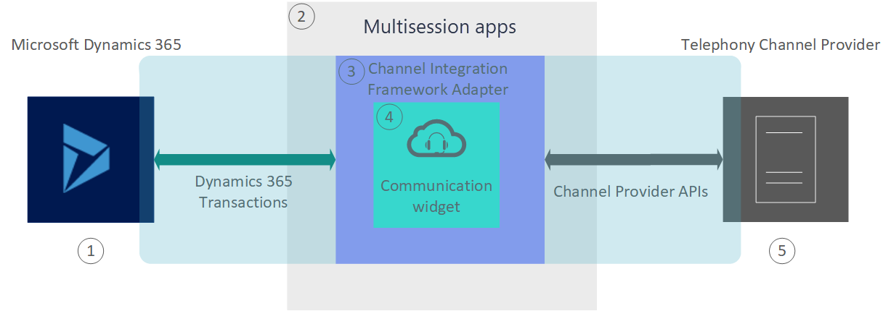

# Architecture overview of Dynamics 365 Channel Integration Framework 

Dynamics 365 Channel Integration Framework version 2.0 provides an extensible framework to integrate third-party Computer Telephony Integration (CTI) systems to serve your customers with more focus and agility.

> [!div class="mx-imgBorder"]
> 

**1 - Microsoft Dynamics 365** 
Dynamics 365 environment where the Dynamics 365 Channel Integration Framework app is present to create and manage the configurations required for a telephony channel to interact with the Dynamics 365 model-driven app.

**2 - Multisession apps** 
The Customer Service workspace and Omnichannel for Customer Service apps expose the Dynamics 365 Channel integration Framework panel to host the telephony channel.

**3 - Channel Integration Framework Adapter** 
The Channel Integration Framework Adapter enables the communication between Dynamics 365 model-driven app and the capabilities of the telephony channel.

**4 - Web-based Communication widget** 
The telephony channel is hosted in the widget that Dynamics 365 Channel Integration Framework provides. You can host your choice of telephony channel.

**5 - Telephony Channel Provider** 
The telephony channel is the service that you want to integrate and interact with Dynamics 365 environment using the Dynamics 365 Channel Integration Framework. The capabilities of a channel are specific to the channel provider, and Dynamics 365 Channel Integration Framework is agnostic on the working of the channel.

## See also

[System requirements of Dynamics 365 Channel Integration Framework](../system-requirements-channel-integration-framework.md)

[Overview of Dynamics 365 Channel Integration Framework](overview-channel-integration-framework.md)

[!INCLUDE[footer-include](../../../includes/footer-banner.md)]