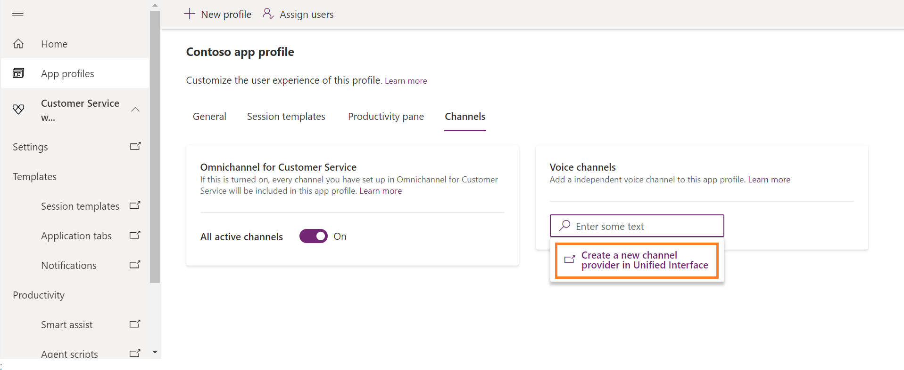

# Configure channel provider using app profile manager in Dynamics 365 Channel Integration Framework 2.0

The app profile manager is an out-of-the-box solution that lets you create targeted app experiences for agents and supervisors. More information: [App profile manager](../../../app-profile-manager/overview.md)

Channel Integration Framework 2.0 is intended for multisession applications such as Omnichannel for Customer Service and Customer Service workspace.

**To configure a third-party channel provider with a multisession application**

1. Sign in to the [Power Apps](https://make.powerapps.com) portal.

2. Under the available apps, select the ellipses next to **Omnichannel for Customer Service** or **Customer Service workspace**.

3. On the menu that appears, select **App profile manager**.

4. Select **App profiles** from the site map, and then select your app profile.

5. Select the **Channels** tab.

  > 

6. Select **Add channel providers**, and then select **Create a new channel provider in Unified Interface**. The **New Channel Provider** page opens in a new tab.

  > 

7. Enter the following details.

| Field | Description |
|-------|-------|
|Name|Name of the channel provider.|
|Unique Name|A unique identifier in the <*prefix*>_<*name*> format.  **IMPORTANT:** The following are required for the unique name:<ul><li> The prefix has to be alphanumeric with a length of 3-8 characters.</li><li>The prefix must include an underscore</li></ul>|
|Label|The label is displayed as the title on the widget.|
|Channel URL|The URL of the provider to host in the widget. See the JavaScript APIs on how to develop communication widget with Dynamics 365 Channel Integration Framework.|
|Enable Outbound Communication|Selecting a phone number in the Dynamics 365 Unified Interface page, the widget initiates the call or outbound communication.|
|Channel Order|The order of precedence of the channel providers. That is, the priority to display the channel for the agents and Unified Interface apps.|
|API Version|The version of the Channel Integration Framework APIs.|
|Trusted Domain| An additional domain if the initial landing URL and the final domain from which the communication widget is hosted are different. Add the domain (URL) to access the Channel Integration Framework APIs. |
|Custom Parameter|This takes a text blob as input and `Microsoft.CIFramework.getEnvironment` will return this as value of key `customParams`.|
|Enable Analytics|Select `Yes` if you wish to enable analytics for your channel provider.|

  > 

  > [!NOTE]
  > The `Api Version` field is set to `2` when you navigate from the app profile manager.

8. After you've configured the channel provider, go back to the app profile manager and add the channel provider to the app profile.
  
### See also

[App profile manager](../../../app-profile-manager/overview.md) 
[Enable outbound communication (ClickToAct)](enable-outbound-communication-clicktoact.md) 
[Microsoft.CIFramework.getEnvironment](../v2/reference/microsoft-ciframework/getEnvironment.md)

[!INCLUDE[footer-include](../../../includes/footer-banner.md)]
