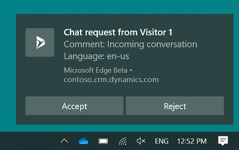

# Manage notification templates in Dynamics 365 Channel Integration Framework 2.0

## Overview

When agents get a notification, the notification displays certain information such as which customer the conversation request is coming from, the timeout period after which the notification disappears, and buttons such as Accept and Reject. Each organization has its own business requirements and wants to show agents relevant information in the notification.

The notification templates are introduced to show relevant information to agents. A notification template is a combination of notification-related information that is reusable. The template is used to configure what information is displayed to agents and supervisors for an incoming conversation, escalation, transfer, consult, and so on.

As an administrator, system integrator, or partner, you can use the templates or create new ones to show information that matters most to your business.

You must associate the notification templates with a session template.

### Desktop notifications when the app is in the background

Agents can receive desktop notifications when the model-driven app is not in focus. These notifications help ensure that agents won't miss any notification. Some scenarios where the app isn't in focus might include: 

- The agent has minimized the app.
- The agent is working in another browser window.
- The agent is working on another tab of the browser.

 > [!div class=mx-imgBorder]
 > 

Agents can accept or reject the notification by selecting a button on the desktop notification. When the agent accepts the notification, the model-driven app is made active and displayed to the agent, and a session is started.

If an agent selects the notification message body and not a button, the model-driven app is made active and the notification is displayed to the agent in the app. Then the agent can choose to accept or reject the notification by selecting the appropriate button.

You can configure the wait time and the notification is displayed for the agent according to this time, but wait time isn't displayed on the notification. The desktop notification theme is based on the Windows operating system theme and settings.

> [!Note]
> If the native browser notification option is disabled, the notification will be shown in a different user interface.

#### Allow a browser to show notifications

To get desktop notifications, agents need to allow their browser (Microsoft Edge or Google Chrome) to show them. When an agent gets a browser notification, they need to select **Allow**.

Also, as an administrator, you can set the browser notification permission by using group policy.

 > [!div class=mx-imgBorder]
 > 

## Create a notification template

To create or manage a notification template, go to the app profile manager. For more information, see [Manage templates](../../../app-profile-manager/notification-templates.md#manage-templates) in the app profile manager documentation.

## See also

[App profile manager overview](../../../app-profile-manager/overview.md)

[Manage session templates](session-templates-cif.md)

[Manage application tab templates](application-tab-templates-cif.md)

[Use automation dictionary to pass data parameter keys](automation-dictionary-keys-cif.md)

[Associate templates with workstreams](associate-templates-cif.md)

[!INCLUDE[footer-include](../../../includes/footer-banner.md)]
