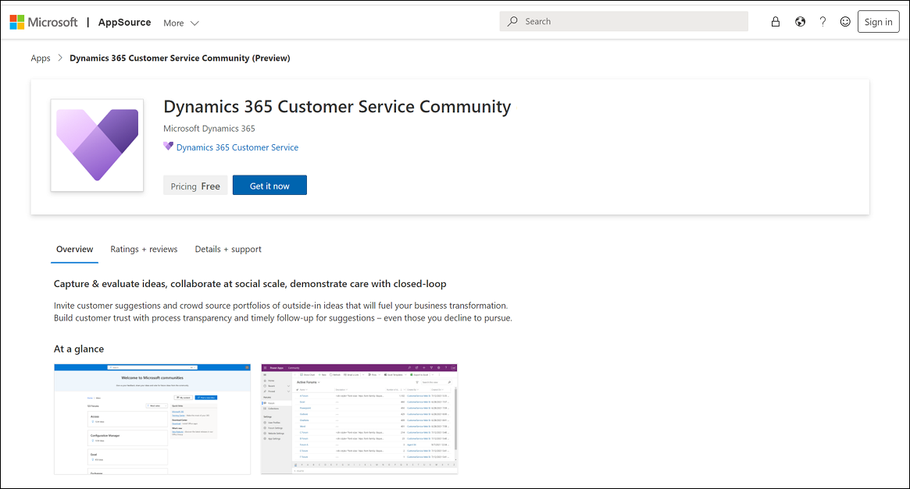

# Preview: Get started with Community

> [!IMPORTANT]
>
> [!INCLUDE[cc-preview-feature](../includes/cc-preview-feature.md)]
>
> [!INCLUDE[cc-preview-features-definition](../includes/cc-preview-features-definition.md)]
>
> [!INCLUDE[cc-preview-features-expect-changes](../includes/cc-preview-features-expect-changes.md)]
>
> [!INCLUDE[cc-preview-features-no-ms-support](../includes/cc-preview-features-no-ms-support.md)]
>
> [!INCLUDE[cc-preview-features-send-us-feedback](../includes/cc-preview-features-send-us-feedback.md)]

## Install Customer Service Community

> [!NOTE]
> To install Customer Service Community, you must have a Dynamics 365 organization and ensure that the organization tenant has at least one Customer Service Enterprise license.

To install Dynamics 365 Customer Service Community (Preview):

1.	Go to the [Microsoft AppSource Dynamics 365 Customer Service Community (Preview) download page](https://go.microsoft.com/fwlink/?linkid=2168784).
2.	Select **Get it now**, and then sign in with your Dynamics System Admin account.
    > [!div class="mx-imgBorder"] 
    > 
3.	Select the environment where you want to install Customer Service Community (Preview), accept the terms, and select **Install**.

## Provision Modern Community portal
1.	Confirm that Customer Service Community successfully installed in the previous procedure.
2.	Go to [Power Apps](https://make.preview.powerapps.com/), and then select the environment where you installed Customer Service Community.
3.	Go to the home page, and then select **All templates**.
4.	Select **Modern Community (Preview)**.
5.	Enter a **Name** and **Address**. The address is your Community portal URL.
6.	Select **Create**. Portal provisioning typically takes a few minutes, and then when it completes, it's displayed in the **Installed apps** list. 
When your Modern Community Portal has been created, you can view the Community home page, by going to https://&lt;name&gt;.powerappsportals.com/d365community. 

Next, [learn how to create your first Community forum](community-forum-setup.md).

### See also

[Community overview](community-overview.md) 
[Create a Community forum](community-forum-setup.md) 
[Content moderation and management](community-moderator-experience.md) 
[Community FAQs](community-faqs.md)

[!INCLUDE[footer-include](../includes/footer-banner.md)]
