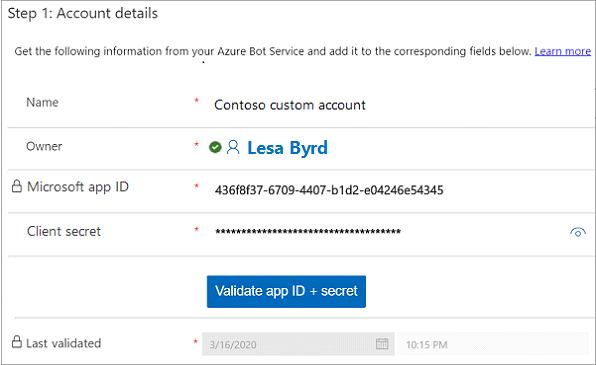
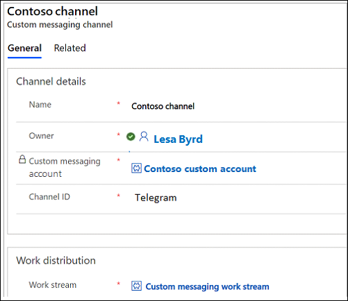
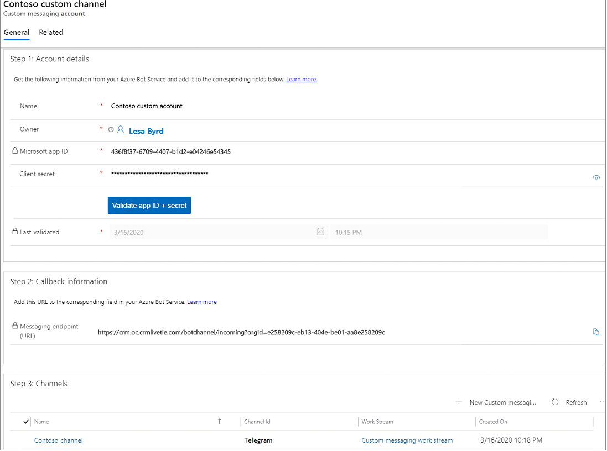

# Configure a custom messaging channel, or bring your own channel

[!INCLUDE[cc-use-with-omnichannel](../includes/cc-use-with-omnichannel.md)]

## Overview

As an organization, you want the ability to integrate your line-of-business (in-house) messaging channels or other messaging channels with Omnichannel for Customer Service. The custom messaging channel capability lets you bring in your own channels, so you can engage better with customers. Here are some of the messaging channel integrations that are supported:

- [Direct Line](bring-your-own-channel.md)
- Telegram

### Value proposition

- Integrate line-of-business (in-house) messaging channels that are specific to your organization.

- Easily configure the administrator experience in the Omnichannel admin center app.

- Create a single and unified agent experience in the Omnichannel for Customer Service app.

## Prerequisite

You must have channels provisioned in your environment. More information: [Provision Omnichannel for Customer Service](omnichannel-provision-license.md)

## End-to-end walkthrough

[Step 1: Register your messaging channel](#step-1-register-your-messaging-channel)

[Step 2: Add the messaging channel to bot channel registration](#step-2-add-the-messaging-channel-to-bot-channel-registration)

[Step 3: Create a work stream](#step-3-create-a-workstream)

[Step 4: Create a custom messaging account](#step-4-create-a-custom-messaging-account)

## Step 1: Register your messaging channel

To integrate your messaging channel with Omnichannel for Customer Service, register your channel in **Azure Bot Service**. To learn how to register, see [Register a bot with Azure Bot Service](/azure/bot-service/bot-service-quickstart-registration).

After you register, save the **Microsoft App ID** and **Client secret** values safely for future use. These two values are required to create a custom channel configuration in the Omnichannel admin center app.  To learn more, see [Get registration password](/azure/bot-service/bot-service-quickstart-registration#get-registration-password).

## Step 2: Add the messaging channel to bot channel registration

After registering your messaging channel, add the messaging channel to the bot channel registration. To learn more, see [Connect a bot to channels](/azure/bot-service/bot-service-manage-channels).

## Step 3: Create a workstream

After you add the messaging channel to the Bot Channel registration in Azure Bot Service, create a workstream for the custom channel.

### Create a workstream in Omnichannel admin center

**To configure a workstream for custom messaging channel in Omnichannel admin center**

1. [Create a workstream](create-workstreams.md)
2. [Configure work distribution](create-workstreams.md#configure-work-distribution)
3. [Configure Advanced settings](create-workstreams.md#configure-advanced-settings)
4. [Add a bot](create-workstreams.md#add-a-bot-to-a-workstream)
5. [Configure context variables](create-workstreams.md#configure-context-variables)

### Create a workstream in Omnichannel Administration

**To create a workstream for custom channel in Omnichannel Administration**

1. Sign in to Dynamics 365, and go to the Omnichannel Administration app.

2. Select **Work Streams** under **Work Distribution Management**.

3. Select **New** to create a new workstream.

4. Specify the values for the fields.

5. Select the **Custom** option for the **Channel** field.

6. Select **Save** to save the changes.

You've created a workstream for the custom channel. To learn more, see [Create workstreams](create-workstreams.md).

To configure other options in the workstream, see the following:

- [Skill-based routing](overview-skill-work-distribution.md)
- [Productivity tools](../app-profile-manager/productivity-tools.md)
- [Smart assist](../app-profile-manager/smart-assist.md)
- [Templates](/dynamics365/app-profile-manager/templates-overview)

## Step 4: Create a custom messaging account

### Create a custom messaging account in Omnichannel admin center

1. In the site map, select **Channels** under **General settings**, and on the **Accounts and channels** page, select **Add account**.
2. Enter the following details:
   1. On the **Channel details** page, enter a name and select **Custom** in **Channels**.
   2. On the **Account details** page, enter the Microsoft app ID in **Microsoft app ID** that you saved from the Azure Bot Channel Registration page, and the client secret in **Client secret**, and then select **Validate**.
   3. On the **Custom channel** page, select **Add**, and enter the following information:
      - **Name:** A name for the channel.
      - **Channel:** Select a channel in the list.
   4. On the **Callback information** page, copy the value in the **Messaging endpoint URL** box. You'll update this information in the custom channel account.
   5. Select **Done**. The custom channel instance is created.
3. In the site map, select the workstream that you've created for the custom channel, and on the page that appears, select **Set up Custom** and enter the following details:
   1. On the **Custom channel** page, select the account that you created.
   2. On the **Language** page, select the required language.
   3. On the **Behaviors** page, configure the following options:
      - [Custom automated messages](configure-automated-message.md)
      - [Post-conversation survey](configure-post-conversation-survey.md)
   4. On the **User features** page, set the toggle for **File attachments** to **On** and select the following checkboxes if you want to allow agents and customers to send and receive file attachments. More information: [Enable file attachments](enable-file-attachments.md).
      - Customers can send file attachments
      - Agents can send file attachments
   5. Verify the settings on the **Summary** page, and select **Finish**. The custom channel instance is configured.
4. Configure routing rules. More information: [Configure work classification](configure-work-classification.md).

### Create a custom messaging account in Omnichannel Administration

After you create a workstream for a custom channel, you need to create a custom channel with the details of the **Microsoft app ID** and **Client secret** that you retrieved while registering your messaging channel in Azure Bot Service.

To create a custom channel, follow these steps:

1. Sign in to Omnichannel Administrator.

2. Select **Custom** under **Channels**.

3. Select **New** in the **Active Custom messaging account** view.

4. In the **New Custom messaging account** page, specify the values for the following fields:

    | Section | Field | Description | Example  value |
    |-------------|-------------------|---------------------------|--------------------------------------|
    | Account details |Name| Specify a name for the custom channel.| Contoso custom channel |
    | Account details |Microsoft app ID| Copy and paste the **Microsoft app ID** that you saved earlier from the Azure Bot Channel Registration page.   To learn more, see [Get registration password](/azure/bot-service/bot-service-quickstart-registration#get-registration-password). | cae1d83e-8b07-4fca-8072-c2eb3444vxyz |
    | Account details |Client secret| Copy and paste the **Client secret** that you saved earlier from the Azure Bot Channel Registration page.    To learn more, see [Get registration password](/azure/bot-service/bot-service-quickstart-registration#get-registration-password).| |

5. Select **Validate app ID + secret**  to validate the **Microsoft app ID** and **Client secret** values. After the validation, a toast notification is displayed. Also, the **Last validated** field shows time and date. This ensures that bots are active and client secret refreshes are consumed. 

    > [!div class=mx-imgBorder]
    > 

6. Select **Save** to save the changes. After you save, in the **Callback information** section, the **Message endpoint (URL)** field is generated with a URL. Copy the URL from the field.

    > [!div class=mx-imgBorder]
    > 

7. Go to the **Azure Portal** > **Bot Channel Registration** page, paste the URL into the **Message endpoint** field, and save the changes.

8. In the **Channels** section, select **New Custom messaging channel**. The **New Custom messaging channel** page is displayed.

   After you create a **Custom messaging account**, you need to create a custom messaging channel, which is the actual channel from which Omnichannel for Customer Service agents will receive messages from the customer.

9. On the **New Custom messaging account** page, specify the values for the following fields:

    | Section | Field | Description | Example  value |
    |-------------|-------------------|---------------------------|--------------------------------------|  
    | Details | Name | Specify a name for the custom channel | Contoso channel |
    | Details | Custom Messaging Account | The **Custom messaging account** field is populated. However, you can change the value using the lookup. | Contoso custom channel |
    | Details | Channel ID | Select a channel from the list. The list might contain line-of-business (in-house) messaging or another messaging channel. | Telegram |
    | Work distribution | Work stream | Select a workstream from the lookup. | Contoso custom channel work stream |

    > [!Note]
    > A **Custom messaging account** can have multiple unique channel IDs. Don't add two or more same Channel IDs to a **Custom messaging account** because the Azure Bot Framework supports only one messaging account per App ID. For example, for **Contoso custom account**, you can't add two or more **Telegram** Channel IDs.

    > [!div class=mx-imgBorder]
    >  

10. Optionally, on the **Surveys** tab, [configure a post-conversation survey](configure-post-conversation-survey.md).

11. Select **Save** to save the custom messaging channel.

12. Select the back button on the browser to go to the custom messaging account page. You can see that the custom messaging channel is added in the **Channels** section.

13. Select **Save** to save the configurations.

    > [!div class=mx-imgBorder]
    > 

## Test your channel

For more information, see the developer guide, [Test your custom messaging channel: Test Client HTML](test-custom-channel-sample-html.md).

## Modify settings for a specific custom channel

1. In the Omnichannel Administration app, go to **Custom** and select the custom channel you want to modify.

2. On the **General settings** tab, provide the following information:
    
    - **Language**: Select the preferred language for your custom channel.
    
    - **Work stream**: Select an existing workstream or create a new one.

    - **Enable file attachments for customers**: Set to **Yes** to allow customers to send file attachments to agents. Otherwise, set **No**.

    - **Enable file attachments for agents**: Set to **Yes** to allow agents to send file attachments to customers. When the agent sends an attachment, the app sends the blob storage URL to the channel. Otherwise, set **No**.
    
       To learn more about attachments, see [Enable file attachments](enable-file-attachments.md).
       
       To learn more about uploading media in Direct Line, see [Azure Bot Service documentation](/azure/bot-service/rest-api/bot-framework-rest-direct-line-3-0-send-activity?view=azure-bot-service-4.0).
       
       To learn more about uploading media in Telegram, see the [Telegram Bot API](https://core.telegram.org/bots/api#available-types).

3. On the **Automated messages** tab, [configure automated messages](configure-automated-message.md).

4. On the **Surveys** tab, [configure a post-conversation survey](configure-post-conversation-survey.md).

### See also

[Extend Omnichannel for Customer Service](extend-omnichannel.md)  
[Bring your own custom messaging channel: Direct Line](bring-your-own-channel.md)  
[Test the custom messaging channel](test-custom-channel-sample-html.md)  
[Skill-based routing](overview-skill-work-distribution.md)  
[Productivity tools](../app-profile-manager/productivity-tools.md)  
[Smart assist](../app-profile-manager/smart-assist.md)  
[Templates](/dynamics365/app-profile-manager/templates-overview)  

[!INCLUDE[footer-include](../includes/footer-banner.md)]
