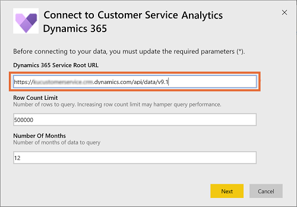
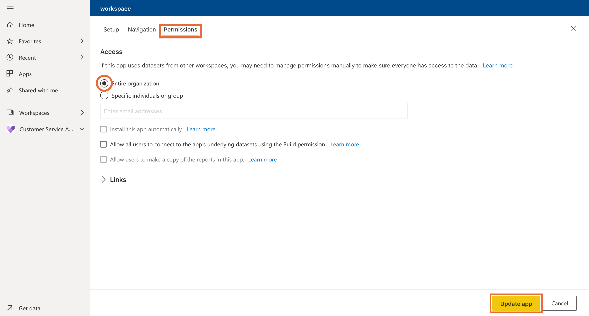

# Configure Customer Service Analytics Dashboard

You must perform the following steps to configure the historical customer service analytics dashboards to display in customer service Hub app: 

[Step 1: Review the prerequisites](#step-1-prerequisites )

[Step 2: Install Dynamics 365 Customer Service Analytics app](#step-2-install-dynamics-365-customer-service-analytics-app )

[Step 3: Connect Dynamics 365 organization to Customer Service Analytics app](#step-3-connect-dynamics-365-organization-to-customer-service-analytics-app)

[Step 4: Configure refresh frequency on Power BI Dataset](#step-4-configure-refresh-frequency-on-power-bi-dataset)

[Step 5: Publish application within your organization](#step-5-publish-application-within-your-organization )

[Step 6: Enable Power BI reporting in Dynamics 365 for Customer Engagement](#step-6-enable-power-bi-reporting-in-dynamics-365-for-customer-engagement ) 

[Step 7: Add Power BI Dashboard to Customer Service Hub](#step-7-add-power-bi-dashboards-to-customer-service-hub ) 

### Step 1: Prerequisites 

Review the following prerequisites before configuring the supervisor dashboard: 

- You have administrative privileges for Dynamics 365 and Power BI. 
- You have a Power BI Pro license for all supervisors. 

### Step 2: Install Dynamics 365 Customer Service Analytics app 

1. Sign in to [Power BI](https://app.powerbi.com/) app as an administrator. 
2. As a Power BI admin, browse to this link: [http://aka.ms/cs-insights](http://aka.ms/cs-insights)
3. Install **Dynamics 365 Customer Service Analytics** app. 
4. After **Dynamics 365 Customer Service Analytics** app is installed, the app configuration options page displays. 
    
    > [!div class=mx-imgBorder]
    >  
    
    Now proceed to configure the app by connecting your Dynamics 365 organization. 

### Step 3: Connect Dynamics 365 organization to Customer Service Analytics app
 
 1. On the **Dynamics 365 Customer Service Analytics** app configuration options page, select **Connect data**. 
    
    > [!div class=mx-imgBorder]
    >  
    
2. On the connect data page, enter your organization's Dynamics 365 Service Root URL and select **Next**. 
    
    > [!div class=mx-imgBorder]
    >  

3. (Optional) To find the Microsoft Dynamics 365 OData URL, follow these steps: 

    a. Sign into Dynamics 365 for Customer Engagement.

    b. Go to **Settings** and then select **Developer Resources**.  

    c. Find the OData URL under **Service Root URL**. 
    
    > [!div class=mx-imgBorder]
    >  

4. Select **Authentication method** as **OAuth2** and **Privacy level** as **Organizational**. Select **Sign in**. 
    
    > [!div class=mx-imgBorder]
    >  
    
5. Enter your Dynamics 365 organization credentials and press **Enter**. 

    When you are successfully signed in, the existing report is updated with the data from your organization. 
    Now configure the refresh frequency for the reports and dashboards. 

### Step 4: Configure refresh frequency on Power BI Dataset 

After you connect Dynamics 365 Customer Service Analytics app with Dynamics 365 organization, you need to configure the refresh frequency on the Power BI dataset to update reports and dashboards properly.

1. Sign into Power BI app as administrator
2. Go to the **Dynamics 365 Customer Service Analytics** app **workspace**
    
    > [!div class=mx-imgBorder]
    > 
    
3. Go to **Datasets** tab and select **Settings**
     
    > [!div class=mx-imgBorder]
    > 
 
4. Turn **on** the **Scheduled refresh**
     
    > [!div class=mx-imgBorder]
    > 

    Now, publish the application in your organization. 

 > [!NOTE]
 > We recommend you configure the refresh frequency to **Daily**. 

### Step 5: Publish application within your organization 
You must share the configured application with your entire organization for supervisors to view **Customer Service Analytics** dashboards and reports with their own **Power BI Pro** accounts.

1. On the App workspace, select **Update app**
  
    > [!div class=mx-imgBorder]
    > 
    
2. In the Update app wizard, go to the **Access** tab 
3. Choose **Entire organization** and select **Update app**
     
    > [!div class=mx-imgBorder]
    > 

    The app is now available to install for all individuals in your organization. 
 
> [!NOTE]
> Verify your administrator has allowed users in your organization to have read/write data permissions in Omnichannel Engagement Hub. T To learn more, see [Provide data access consent](https://review.docs.microsoft.com/en-us/dynamics365/omnichannel/administrator/omnichannel-provision-license#provide-data-access-consent) 

### Step 6: Enable Power BI reporting in Dynamics 365 for Customer Engagement 
As an administrator, you must enable Power BI reporting in the Dynamics 365 for Customer Engagement organization for supervisors to view the dashboards in the Omni-channel Administration app. 

1. **Sign In** to Dynamics 365 for Customer Engagement and go to **Settings** 
2. Select **Administration, System Settings**
3. Go to the **Reporting** tab and enable **Allow Power BI visualization embedding**
     
    > [!div class=mx-imgBorder]
    > 

    Supervisors can now configure dashboards. 
 
### Step 7: Add Power BI Dashboards to Customer Service Hub 
Each supervisor must configure their Dynamics 365 for Customer Engagement environment to integrate the Customer Service Analytics dashboard. 

1. Sign in to Dynamics 365 for Customer Engagement and open the **Customer Service Hub** app 
     
    > [!div class=mx-imgBorder]
    > 
2. Open **Supervisor Dashboards**
     
    > [!div class=mx-imgBorder]
    > 
3. Select **New, Power BI Dashboard**
4. Choose **Workspace** as **Dynamics 365 Customer Service Analytics** and **Dashboard** as **Customer Service Analytics Dashboard**. 
5. Save and close. 
6. Repeat Step 3 to step 5 to add Omni-channel Sentiment Insights app. 
    
    Customer Service Analytics dashboard is now available in Dynamics 365.

## Add users to supervisor configuration  
You must add users in the supervisor configuration to access any supervisor dashboard in Unified Service Desk. To add users in supervisor configuration, follow these steps: 
 
 1. Log in to Dynamics 365.
 2. Go to **Settings, Unified Service Desk** and then select **Configuration**.
 3. On the configuration page, select **Supervisor Configuration**.   
 4. On the **Users** section, select **+ Add User record** and enter the user name to add the user.
 5. Save and close the configuration.   

    Users are now added to the supervisor dashboard and when they log in to Omnichannel Engagement Hub on Unified Service Desk, the supervisor dashboard tabs are now available. 
 
## Customize Customer Service Analytics 
You must perform the below steps if you would like to enhance/customize the PowerBI template app for your organization needs.  
  
> [!IMPORTANT]
> Microsoft does not support customizations made to the Power BI template app and do not provide updates once modifications are made. 

## See Also 

[Introduction to Customer Service Analytics](introduction-customer-service-analytics.md) 

[View and understand Customer Service Analytics](customer-service-analytics.md) 
