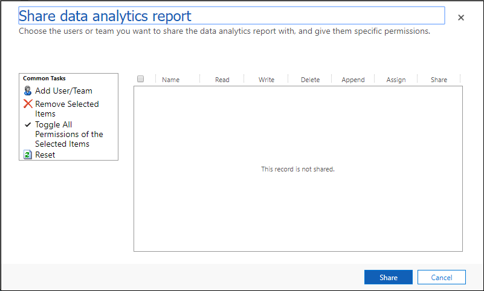

# Preview: Configure Customer Service Analytics and Insights in Customer Service Hub

[!include[cc-beta-prerelease-disclaimer](../includes/cc-beta-prerelease-disclaimer.md)]

> [!IMPORTANT]
>
> - A preview is a feature that is not complete, as it may employ reduced privacy, security, and/or compliance commitments, but is made available before it is officially released for general availability so customers can get early access and provide feedback. Previews are provided “as-is,” “with all faults,” “as available,” and without warranty.​
> - This preview feature does not come with technical support and Microsoft Dynamics 365 Technical Support won’t be able to help you with issues or questions.  If Microsoft does elect to provide any type of support, such support is provided "as is," "with all faults," and without warranty, and may be discontinued at any time.​
> - Previews are not meant for production use, especially to process Personal Data or other data that is subject to heightened compliance requirements, and any use of "live" or production data is at your sole risk.  All previews are subject to separate [Terms and Conditions](../legal/dynamics-insider-agreement.md).

## Overview

You can configure the Customer Service Analytics and Customer Service Insights reports in Customer Service Hub and share them with service managers who can then view and analyse the different activities performed in Customer Service Hub. The following reports are available out of the box:

- **Analytics reports:** Customers can view business intelligence (BI) analytics and metrics for their customer service organisation.
- **Insights reports:** Customers can view Customer Service Insights reports with a combination of BI analytics and artificial intelligence (AI) insights for their organisation.

## Prerequisites for installing Customer Service Insights reports

Make sure that the following prerequisites are met:

- Administrative privileges for Dynamics 365.
- Valid Customer Service Insights license is required to install and configure Customer Service Insights reports.
  > [!NOTE]
  >
  > The Customer Service Insights license is seeded for customers who have licenses for Dynamices 365 Customer Service Enterprise.

## Configure Customer Service Analytics reports in Customer Service Hub

### Enable Customer Service Analytics reports

Perform the following steps to enable the reports:

1. Sign in to Dynamics 365 as an administrator, and navigate to Customer Service Hub.
2. In the **Change area**, select **Service Management** > **Settings (Preview)**. The **Analytics and insights settings** page appears.
    > [!div class=ms-imgBorder]
    > 

3. In **Analytics reporting**, switch the toggle to **Enabled**. A provisioning message displays, and **Share reports** appears after the provisioning is complete.

### Share Customer Service Analytics reports

You can share the reports from the **Service Management** > **Settings (Preview)** > **Analytics and insights settings** page or **Service** > **Analytics and Insights** > **Reports (Preview)** > **Data Analytics Reports** page.

1. On the **Analytics and insights settings** page, select **Share reports**. The **Data Analytics Reports** page displays the list of available reports.
    > [!div class=mx-imgBorder]
    > 

2. Select a report. The report opens on a new page.
3. Select **Share**. The **Share data analytics report** dialog box appears.
    > [!div class=mx-imgBorder]
    > 
4. Select **Add User/Team**. The **Look Up Records** dialog box appears.
5. Search for users, and add them. The users appear in the table.
6. Select the permissions that you want to grant on the report, and select **Share**. The report is shared with the selected users.

### View Customer Service Analytics reports

The service managers nust have the admin or the service manager role to view the reports. Users with CSR Manager role will be able to view the reports only after the reports are shared with them.

You can see the reports by navigating to the **Service** > **Analytics and Insights** > **Reports (Preview)** > **Data Analytics Reports** page.

### Case Summary report

> [!div class=mx-imgBorder]
> 

### Agent Summary report

> [!div class=mx-imgBorder]
> 

## Configure Customer Service Insights reports

### Install Customer Service Insights reports

Perform the following steps to install the Customer Service Insights reports:

1. Sign in to Dynamics 365 as an administrator, and navigate to Customer Service Hub.
2. In the **Change area**, select **Service Management** > **Settings (Preview)**. The **Analytics and insights settings** page appears.
3. Select **Get started**. The **Install Customer Service Insights** page displays the installation process. After the installation, **Go to settings** appears.
    > [!div class=ms-imgBorder]
    > 
4. Select **Go to settings**. The **Analytics and insights settings** page is displayed.
    > [!div class=ms-imgBorder]
    > 

### Change security roles

By default, users with the following security roles will be able to see **Insights (Preview)** in the site map:

- Administrator
- CSR Manager

To change the security role, edit the permission of the security role to Customer Service Insights Configuration custom entity. For information, see [security roles](https://docs.microsoft.com/power-platform/admin/create-edit-security-role#edit-a-security-role).

### Share Customer Service Insights reports

On the **Analytics and insights settings** page, you can do the following:

- View reports
- Share reports
- Change settings

> [!IMPORTANT]
>
> After you share the reports, only those users who have a valid Customer Service Insights license can view them.

### View Customer Service Insights reports

Navigate to the **Service** > **Analytics and Insights** > **Insights (Preview)**. The Home page displays a dashboard view.

  > [!div class=ms-imgBorder]
  > 

You can view the following KPIs:

- KPI summary
- New cases
- Customer satisfaction
- Resolutions

### See also

[Introduction to Customer Service Analytics and Insights](introduction-customer-service-analytics.md)

[View and understand Customer Service Analytics and Insights](customer-service-analytics.md)