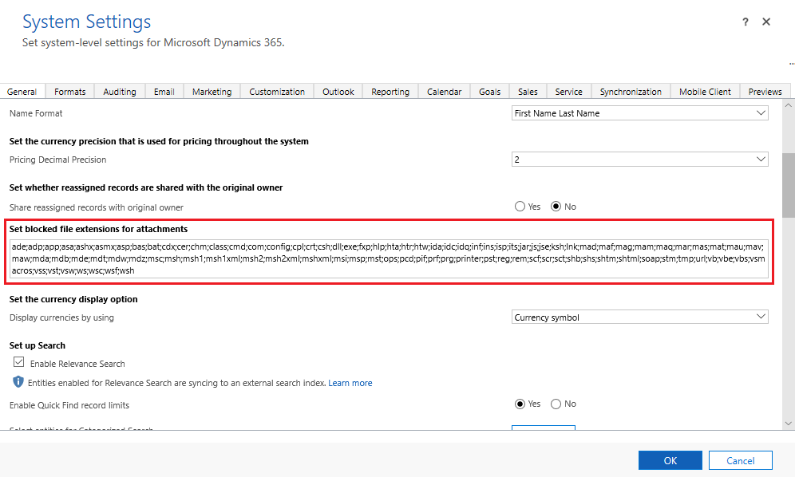
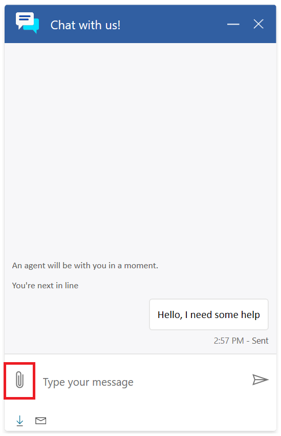
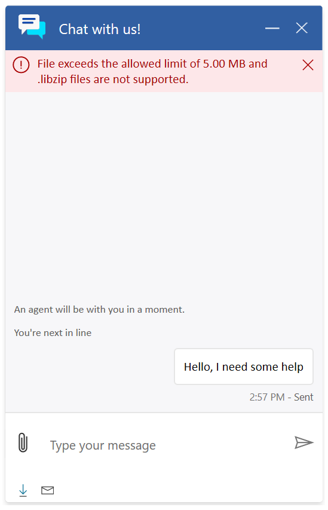

# Configure file attachment capability

[!INCLUDE[cc-omnichannel-administration-deprecation-note.md](../includes/cc-omnichannel-administration-deprecation-note.md)]

As an administrator, you can enable or disable the capability for your agents and customers to attach files during a conversation. When enabled, your customers and agents can send files and share more information about their issues. For example, if a customer receives an error while trying to complete a process, they can send the screenshots of the steps and error message to the agent.

Customers must use the **Attach** icon to send files. The drag-and-drop operation is not supported in the live chat widget. For information about file attachment limitations, see [Enable file attachments](enable-file-attachments.md).

If an agent transfers the chat to another agent, the agent who receives the chat can also access the files attached in the conversation.

> [!NOTE]
> In Unified Service Desk, if you sign in as an agent and want to attach a file while conversing with a customer, ensure that you select the required file type first and then attach the required file.

1. Sign in to Customer Service admin center.

1. In Customer support, go to **Channels** > **Chat**.

1. Edit the chat channel in which you need to configure the file attachment capability.

1. Go to the **User features** tab.

1. Set **File attachments** to **On**, and then select the check boxes for the following if they aren't selected:

    - **Customers can send file attachments**: Allows your customers to send a file to the customer service agent during a conversation.
    - **Agents can send file attachments**: Allows your customer service agents to send a file to a customer during a conversation.

    :::image type="content" source="media/file-attachment.png" alt-text="Enable file attachment settings.":::

## Set size limit, supported file types for file attachments

You can define the file size limit for attachments and unsupported file types in the advanced settings of Dynamics 365.

1. In the admin app, go to **Advanced Settings** on the top right, and then select **Settings** > **Administration** > **System Settings**.

2. In the **System Settings** window, go to the **Email** tab.

3. In the **Maximum file size (in kilobytes)** field, enter the value in kilobytes.

    :::image type="content" source="media/file-size-limit.png" alt-text="Set file size limit for attachment.":::

   > [!NOTE]
   > By default, the size is 5 MB. The maximum size for image files in live chat can be 20 MB only. For other types of file attachments, you can specify up to 128 MB.

4. To specify unsupported file types, go to the **General** tab.

5. In the **Set blocked file extensions for attachments** field, add or edit the file types.

    > [!div class=mx-imgBorder]
    > 

6. Select **OK**.

> [!NOTE]
> Customers with Apple devices must have iOS version 13 to send file attachments.

## Customer experience of attaching a file

When the file attachment capability is enabled for customers, the attachment icon is displayed in the chat widget. A customer can then use the **Attach** icon to send files. The drag-and-drop operation is not supported. The file attachment is scanned for malicious content and won't be uploaded if it poses a security threat. A message about the security concern is displayed to the agent.

When the conversation is going on, the file attachment is scanned and then uploaded. After the conversation ends, the attachment will be stored in the Annotations collection in Dataverse, which is an Azure BLOB-based entity. Customers can access attachments in transcripts by selecting the attachments, which are retrieved from the Dataverse entity.

> [!div class=mx-imgBorder]
> 

If a customer tries to attach an unsupported file type, a file larger than the allowed size limit, or a file with malicious content, the file is not uploaded and a corresponding error message is displayed.

> [!div class=mx-imgBorder]
> 

### See also

[Enable file attachments](enable-file-attachments.md)  
[Add a chat widget](add-chat-widget.md)  
[Configure a pre-chat survey](configure-pre-chat-survey.md)  
[Configure agent display name](agent-display-name.md) 
[Create quick replies](create-quick-replies.md)  
[Create and manage operating hours](create-operating-hours.md)  
[Create chat authentication settings](create-chat-auth-settings.md)  
[Embed chat widget in your website or portal](embed-chat-widget-portal.md)

[!INCLUDE[footer-include](../includes/footer-banner.md)]
