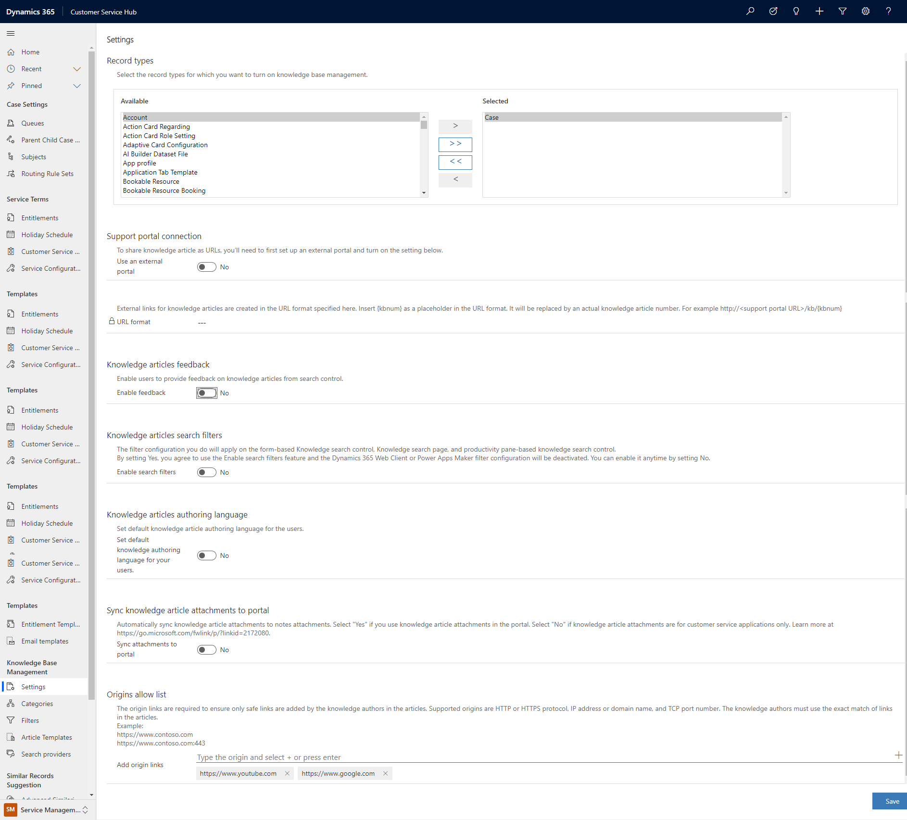

# Configure the origins allow list for knowledge articles

## Introduction

You can configure the origins allow list feature to ensure that knowledge authors add only safe links to their knowledge articles.

> [!IMPORTANT]
> The supported origins are HTTP or HTTPS protocol, IP address or domain name, and TCP port number. Knowledge authors must use only an exact match of these links in their articles.<!--note from editor: Suggested.-->

After you've enabled this feature and knowledge authors add links other than the supported origins or the exact match of links while creating articles, an error message will be displayed for links that are hosted within an iframe.<!--note from editor: Suggested. I think it's confusing to have more than one "if" clause in a sentence-->

In the **Content** field on the knowledge article form, knowledge authors will see the following message: "Update your origins allow list if any iframe in the article doesn't work or displays error."<!--note from editor: Can you ask that this error message be rewritten to say "...or displays an error"? Also, note that I put the period inside the quotation marks, in accordance with the example in the style guide (https://styleguides.azurewebsites.net/Styleguide/Read?id=2700&topicid=28975).-->

For published articles, agents and portal users will see an error in the article for the links that are hosted within an iframe. You must update the origins list so that all the existing iframe links will continue to work.

## Configure the origins allow list

1. Sign in to Customer Service Hub.

2. Select **Change area**  > **Service Management**.<!--note from editor: Suggested, if you actually have to click that change area icon. This is formatted very inconsistently in our docs, but this seems to be one of the most common ways (and a correct one, if there's any clicking involved). I'm not sure why "Change area" is initial capped everywhere. Perhaps that's the tooltip for the icon?-->

3. Under **Knowledge Base Management**, select **Settings**. The **Settings** page is displayed.
   > 

4.	Go to **Origins allow list**, and add your links to the **Add origin links** field. 

5.	Select **Add** or **Enter** to add the link to your list.

6.	Select **Save**.

To remove a domain, select **Close** next to the domain.

### See also

[Create and manage knowledge articles](customer-service-hub-user-guide-knowledge-article.md#create-and-manage-knowledge-articles)  
[Search for knowledge articles in the Customer Service Hub](search-knowledge-articles-csh.md#search-for-knowledge-articles-in-the-customer-service-hub)  
[Understand knowledge base search](knowledge-base-search-methods.md#understand-knowledge-base-search)

[!INCLUDE[footer-include](../includes/footer-banner.md)]