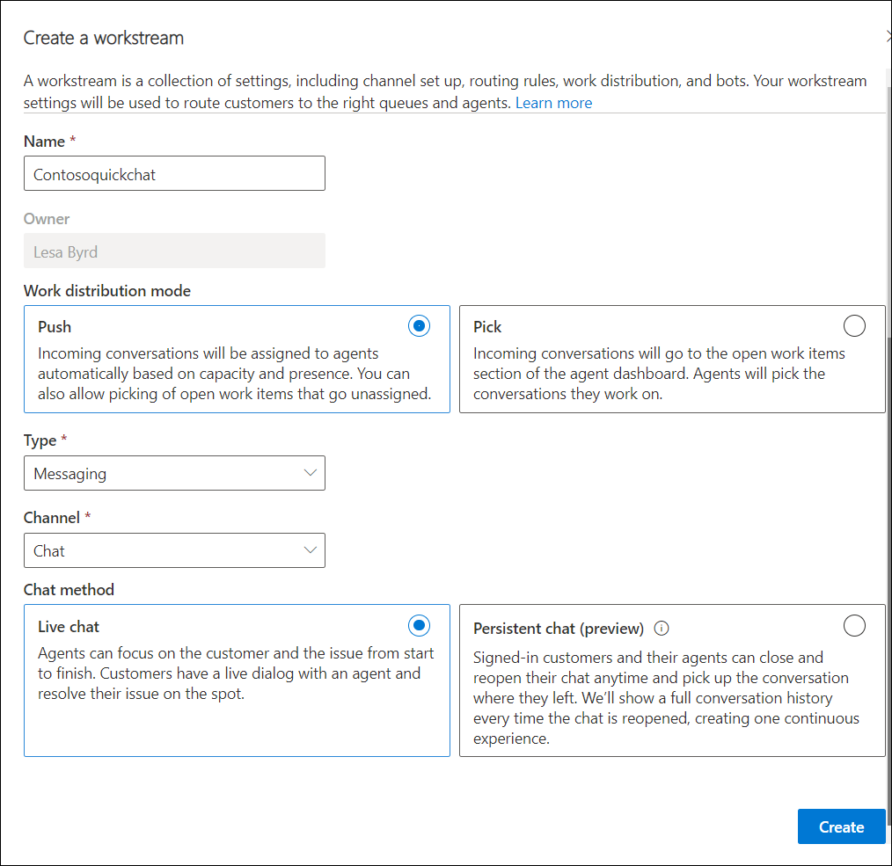

# Quickly configure a chat widget

[!INCLUDE[cc-use-with-omnichannel](../includes/cc-use-with-omnichannel.md)]

Use the Omnichannel admin center app to quickly configure and add a chat widget to your portal to chat with your website visitors. To configure a chat widget and embed it in portal, you must:

## Step 1: Create a workstream for chat

1. Sign in to Dynamics 365, and open the Omnichannel admin center app.
2. In the site map, go to **Workstreams** in **General Settings**, and select **New** from the command bar.
3. On the **Create a workstream** dialog box, do the following:
   
   - **Name**: Specify a workstream name
   - **Work distribution mode**: Select **Push** or **Pick**.
   - **Type**: Select **Messaging**.
   - **Channel**: Select **Chat**.

   > [!div class=mx-imgBorder]
   > 

4. Select **Create**.

## Step 2: Configure a chat widget

1. On the workstream page that you created, select **Set up chat**.
2. On the **Live chat setup** wizard that appears, enter the details. More information: [Configure a chat widget](add-chat-widget.md#configure-a-chat-widget).

## Step 3: Embed chat widget in portal

> [!NOTE]
> The chat widget requires session storage and local storage to be functional in your customers’ browsers. Make sure to notify your customers to enable cookies in their browsers so these services can work properly.

Follow these steps to embed your chat widget into a Power Apps portal. For steps to embed your chat widget into your website, see [Embed chat widget in your website or Power Apps portal](embed-chat-widget-portal.md). For steps to embed your chat widget into mobile experiences, see [Render a live chat widget on the mobile app](render-live-chat-widget-mobile.md).

1.	[Open the Portal Management app](/powerapps/maker/portals/configure/configure-portal).
2.	Go to **Portal** > **Content Snippets**.
3.	Find the **Chat Widget Code** content snippet and open it.
    > [!div class=mx-imgBorder]
    > 
4.	On the **General** tab, scroll down to the **Value (HTML)** section.
5.	Paste the chat widget snippet code in the **HTML** tab.
6.	Save the changes. The chat widget is now embedded into the portal. By default, the chat widget is displayed in minimized mode as follows:

    > [!div class=mx-imgBorder]
    > 
    
You can maximize the chat widget by selecting it.

> [!div class=mx-imgBorder]
> 

### See also

[create workstreams for unified routing](create-workstreams.md)  
[Configure work classification](configure-work-classification.md)  
[Configure a chat widget](set-up-chat-widget.md)  
[Embed chat widget in your website or Power Apps portal](embed-chat-widget-portal.md)  
[Supported browsers for live chat widget](system-requirements-omnichannel.md#browsers-for-chat)  
[Render a live chat widget on the mobile app](render-live-chat-widget-mobile.md)  

[!INCLUDE[footer-include](../includes/footer-banner.md)]
