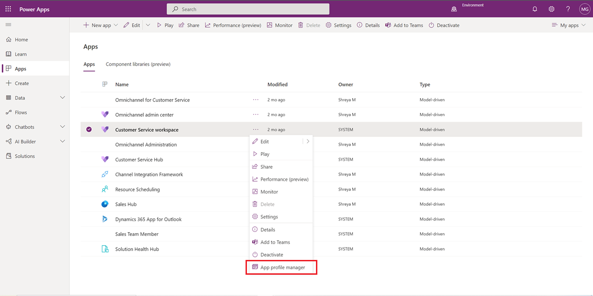
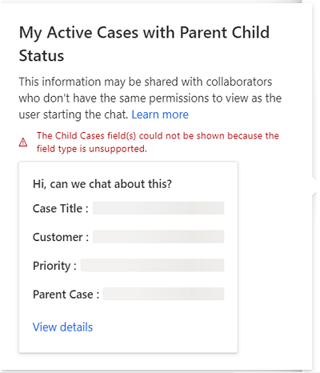

# (Preview) Configure Teams chat in Customer Service

> [!IMPORTANT]
> [!INCLUDE[cc-preview-feature](../includes/cc-preview-feature.md)]
>
> [!INCLUDE[cc-preview-features-definition](../includes/cc-preview-features-definition.md)]
>
> [!INCLUDE[cc-preview-features-expect-changes](../includes/cc-preview-features-expect-changes.md)]
>
> [!INCLUDE[cc-preview-features-no-ms-support](../includes/cc-preview-features-no-ms-support.md)]

You can configure the ability for agents to chat in Teams from within Dynamics 365 Customer Service Hub, Dynamics 365 Customer Service workspace, and your custom apps. Teams chat is also available in other customer engagement apps such as Dynamics 365 Field Service and Dynamics 365 Sales. When the feature is enabled, while working on customer records, agents can start a new chat or link an existing chat to a record, and thus collaborate efficiently without switching context or leaving the application. Linking all the associated chats to a record can help agents maintain all the chats related to the record in one place. You can also configure an optional introduction message that agents can use to provide further context when collaborating on Teams.

## Enable or disable Teams chat

In Customer Service workspace, Teams chat is enabled by default. For other customer engagement and custom apps, you must enable it. Teams chat requires certain permissions to access Teams data. Review the following permissions required section to learn more.

### Permissions required

As a tenant administrator, when you enable the Teams chat feature, the app has the following permissions:

|Permission | What the app does with the permission |
|-------------|-----------------------|
|Chat.ReadWrite.All |Reads user’s chats and recent messages to display in chat list. |
|Directory.Read.All	|Reads user’s teams and channels display name. |
|Presence.Read.All	|Reads presence information of all users to be displayed on the user avatars in chat list. |
|User.Read.All	|Reads users’ display name and licenses to validate if the suggested participants have a Teams license assigned. This is used by the suggested section in the chat list.|
|User.ReadBasic.All	|Reads users’ photos. |

### Add the Teams chat settings page to the sitemap of your app
1. In the Customer Service Hub app, select **Change area** in the lower-left corner, and then select **Service Management**.

2. Under **Microsoft Teams Integration**, select **Collaboration**.

3. Toggle **Turn on Microsoft Teams chats inside Dynamics 365 (preview)** and **Use record title as the default chat name for linked chats** to **Yes**.

   > [!div class="mx-imgBorder"] 
   > 
    
4. Save the changes. 
   The preview is now enabled for the Dynamics 365 Customer Service Hub, Customer Service workspace, and your custom apps (and also Field Service and Sales customer engagement apps, if you're using them). You can open a record and verify if you’re able to view the chats and channels related to the record.
    
    
### Add the Teams chat settings page for specific multisession users

If you want Teams chat to work for specific users, you can enable the feature for a custom profile. For more information about creating custom profiles in App profile manager, see [Overview of App profile manager](/dynamics365/app-profile-manager/overview).

To enable Teams chat settings for specific multisession users, complete the following steps:
1. Create a custom profile from the default profile in App profile manager. More info: [Create an app profile](/dynamics365/app-profile-manager/app-profile-manager#create-an-app-profile)

2. Go to [Power Apps](https://make.powerapps.com/), and then under **Environments**, select your environment.

3. In the left-side pane, select **Apps**, and then next to the custom app, select the **More Commands** ellipsis.

   > [!div class="mx-imgBorder"] 
   > 

4. From the dropdown menu, select **App profile manager**, select the custom profile, and then select **Edit**.

5. Select the **Productivity pane** tab, and then toggle **Turn on productivity pane** to **On**.

6. Under **Productivity tools**, toggle **Microsoft Teams collaboration** to **On**.

   > [!div class="mx-imgBorder"] 
   > 

7. Select the **General** tab to assign users. More information: [Assign profiles to users](/dynamics365/app-profile-manager/app-profile-manager#assign-profiles-to-users)

## Configure the ability to link chats to Dynamics 365 records

Once you’ve enabled Teams chats, you can link the chats to different record types. Standard record types, including case, account, contacts, knowledge article, and email, are available out-of-the-box, or you can add your desired record type.

**To configure the ability to link a chat to a record type:**

1.	In Customer Service Hub, open the **Microsoft Teams collaboration and chat settings** page.

2.	Under **Link chats to Dynamics 365 records**, select the record type you want to configure. 
  	If you want to add a record type, see Add record types in the section below.
    
3.	Select **Save**.

**To add a record type to link chats to in Dynamics 365 records**

1.	In Customer Service Hub, open the **Microsoft Teams collaboration and chat settings** page.
	
2.	Under **Link chats to Dynamics 365 records**, select **Add record types**.
	
3.	In the **Link chat to record type** pane, in **Choose record type**, type the name of the record type you want to use.
	
4.	(Optional): If you want to display content for new linked chats, toggle **Introduction message** to **Yes**, and then use the existing views functionality to define the fields that will represent context card or create a custom view with up to five fields that you want to include as a context card. 
            
5.	Select **Save**.

For any view that's selected, keep in mind the following details:
 - The first five fields of any view are used as the context card details (in addition to a link to the record).
 - If a field isn't supported, it's skipped and the display will include the first four fields that are supported. You'll be able to see from the configuration experience that the specific field isn't supported.
 
   > [!div class="mx-imgBorder"] 
   > 
    
 - Because the data fields are static, field-level permissions aren't checked for collaborators. This means if the agent has the field-level permissions to view data fields, collaborators will also be able to see those fields.
- If you don't select a view, agents will only see the default, out-of-box **Case introduction message** view.

   > [!div class="mx-imgBorder"] 
   > 

### See also

[Use Teams chat](/use-teams-chat.md) 

[!INCLUDE[footer-include](../includes/footer-banner.md)]
