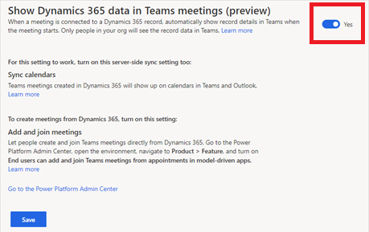

# Enable Microsoft Teams meeting integration in Customer Service (preview)

> [!IMPORTANT]
> [!INCLUDE[cc-preview-feature](../includes/cc-preview-feature.md)]
>
> [!INCLUDE[cc-preview-features-definition](../includes/cc-preview-features-definition.md)]
>
> [!INCLUDE[cc-preview-features-expect-changes](../includes/cc-preview-features-expect-changes.md)]
>
> [!INCLUDE[cc-preview-features-no-ms-support](../includes/cc-preview-features-no-ms-support.md)]

The Microsoft Teams meeting integration feature allows your Dynamics 365 Customer Service agents to quickly access and update records in Microsoft Teams before, during, and after meeting with their customers. 

By enabling this feature, you can help give agents and supervisors in your organization a cohesive, seamless experience between Dynamics 365 and Teams. Agents can use the meetings functionality to more efficiently meet their customers' needs.

## Prerequisites
To enable Teams integration in Customer Service, the following prerequisites must be met.

- You must have a Dynamics 365 Customer Service license for your organization.
- As an administrator, you must configure the ability for agents in your organization to add and join Teams meetings in the Power Platform admin center app. More information: [Manage feature settings - Power Platform](/power-platform/admin/settings-features) 
- Optional: Configure the ability to sync calendars so that any meetings that are created in Dynamics 365 apps will show up on calendars in Microsoft Outlook and Teams. More information: [Set up server-side synchronization of email, appointments, contacts, and tasks - Power Platform](/power-platform/admin/set-up-server-side-synchronization-of-email-appointments-contacts-and-tasks)

## Enable Teams meeting integration

Complete the following steps to enable Teams meeting integration.

1. In Customer Service Hub, on the lower-left corner of the screen, select **Change area** > **Service Management**.

1. On the site map, under **Collaboration**, select **Meeting integration using Teams (preview)**.

1. Turn on the **Show Dynamics 365 data in Teams meetings (preview)** toggle.

    
    
1. Select **Save**.

As mentioned in the prerequisites, the following settings are displayed on the page:

- **Sync calendars**: This optional setting ensures that the meetings created in Dynamics 365 are added to Microsoft Outlook and Teams, and show up on agent calendars. More information: [Set up server-side synchronization of email, appointments, contacts, and tasks - Power Platform](/power-platform/admin/set-up-server-side-synchronization-of-email-appointments-contacts-and-tasks)
- **Add and join meetings**: This required setting ensures that an agent can create and join Microsoft Teams meetings directly from Dynamics 365. More information: [Manage feature settings - Power Platform](/power-platform/admin/settings-features)

> [!Note]
> The **Record and get insights** setting is only available in Dynamics 365 Sales apps where customers have a premium license.

## Configure record side panel

The side panel helps agents quickly view and update details of the related record during a Teams meeting. The side panel displays notes, tasks, and activities associated with the record. As an administrator, you can customize the side panel to meet the needs of your agents. The record side panel supports only Contact, Opportunity, Lead, Account, and Case entities.

> [!Note]
> The record side panel can be customized by customizing the **In Context Form** of a table. The following table lists the supported and unsupported customizations for the side panel.

| Supported customizations | Unsupported customizations |
|------|--------|
|Define (add or remove) fields in the header. | Enable or disable tabs.  Rearrange tabs. |
| Define (add or remove) fields in the Key Details section. Change a field label. Set a field requirement (for example, read-only).| Enable or disable tabs. Rearrange tabs. Add custom tabs or sections. Add sections other than Key Details, Contacts, Notes, Tasks, Collaboration, and Recent Opportunities. Add a web resource. Add a subgrid. Change the format or layout for headers, tabs, sections, or fields.  Change certain properties for headers, tabs, sections, or fields. For example, the **available on phone** property can't be changed. 

**To customize the record side panel:**

1.	Sign in to Power Apps. 

1.	Select the environment, and then select **Dataverse** > **Tables**. 

1.	In the upper-right corner, select the dropdown list, and then select **All**. 

1.	Search for the required table and then select it to open it. 

1.	Go to the **Forms** tab and select the **In Context Form** form. 

1.	Edit the form to manage the fields that appear in the side panel. By default, all the fields in the form are editable. If you want to set a field as read-only, select the field, and then enable the **Read-only** property.
   
### See also
[Use Microsoft Teams Meeting integration in Customer Service](use-teams-meetings.md)
