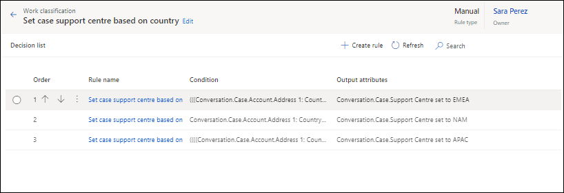
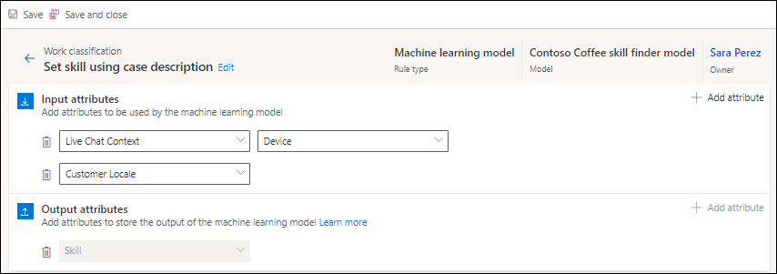

# Configure work classification rulesets for unified routing

## Introduction

Use the CSR Manager or Omnichannel administrator role to configure the work classification rules for a workstream.

You will do the tasks listed in this article in the Omnichannel admin center or Customer Service Hub app.

In unified routing, work classification lets you define rules to add detailed information to incoming work items that can be used to route and assign the work items optimally.

Typically, rules are written in the format of "if defined condition satisfies, then set the output attributes to certain values," but can also be surfaced through machine learning models. They are optional and can be used to add additional information to the incoming work items that are then used for more precise routing and assignment.

Work classification rules can be written by using the manual declarative decision list or by using machine learning models.

> [!IMPORTANT]
> You can create 10 rulesets per workstream, and for each ruleset, you can create up to 100 rule items.

## How classification rulesets work

A classification ruleset is an ordered list of multiple work classification rulesets and route-to-queue ruleset. During evaluation, the work classification rulesets are run first, followed by route-to-queue ruleset.

The work classification rulesets will be run in the order they are listed. Within a ruleset, rule items will be run in the order they are listed. As soon as one of the rule item conditions matches the output section of the rule item is run, and the system evaluates the rules in the next ruleset if it is configured.

After all the work classification rulesets have been run, the system evaluates the route-to-queue ruleset in which all the rule items will be run in the order they are listed. This is unlike the classification rules, where control passes to the next ruleset when one of the rule items in a ruleset condition matches.

In work classification rulesets, the values set in one of the rule items of a ruleset can be used in the next rulesets' rule items. For example: If in output section of one of the rule items of ruleset 1, priority is set to High; then any next ruleset rule item can use the priority variable and corresponding value "High" to set value for another attribute, such as, "If Priority equals High, set severity to critical".

For a rule item, you can set the output values for up to five attributes.

## Create work classification rulesets

Manual classification rules are run to update work item attributes. They are written in the format of "if defined condition satisfies, then set the output attributes to certain values." You can create conditions to define rules based on multiple entity attributes. Routing rules are written as rulesets that consist of rule items.

To create a manual work classification ruleset, do the following steps:

1. In Customer Service admin center (preview), Omnichannel admin center, or Customer Service Hub, select a workstream, and in the **Routing rules** area, for the **Work classification (optional)** option, select **Create Ruleset**.

2. On the **Work classification** page, select **Create new**, and in the **Create work classification ruleset** dialog, select **Rule Type** as **Manual**, and enter a name and description. By default, the root record is selected and displayed at the top of the condition builder for ease of reference and visibility of the record for which you are creating the rule.

3. In the **Decision list** area, select **Create Rule**, and on the **Create work classification rule** dialog, enter a name.

4. In the **Conditions** area, define the conditions according to your business needs. If you are creating classification rules for records, then the top-level condition is automatically populated. You can define conditions for up to two levels of the related records and attributes. 

5. In the **Output** area, select the attribute for which value needs to be set if the conditions are met.

   :::image type="content" source="media/create-work-classification-rule.png" alt-text="Create work classification rule with conditions.":::

6. Repeat steps 3 through 5 to create the demand rules.

   

## Create manual skill classification rulesets

Skill attachment rules are a sub-type of manual work classification rules and are defined to attach skills to the work item. They are written in the format of "if defined condition satisfies, then attach defined skills to the work item."

Follow these steps to create a manual skill classification ruleset:

1. For the selected workstream, in the **Routing rules** area, for the **Work classification (optional)** option, select **Create Ruleset**.

2. On the **Work classification** page, select **Create new**.

3. In the **Create work classification ruleset** dialog, select  **Rule Type** as **Manual**, and enter a name and description.

4. Select **Create Rule**, and on the **Create work classification rule** dialog, enter a name.

5. In the **Conditions** area, define the conditions as per your business needs:

   1. Select **Add row**, and select **Skills** from the list box.
   2. Select the required operator, and then select the skills for the condition.
   3. Repeat the steps to define any other conditions.

6. In the **Output** area, select the attribute whose value will be set if the conditions are met.

7. If you want to manually set up the skill attribute, in the **Conditions** area, define the conditions, and select the required value in the **Output** area for the skill that needs to be set.

   > [!Note]
   > Make sure that the rating model that you choose for a skill in the work classification rule is same as the rating model that's defined for the skill attached to the agent.

## Create classification rulesets based on capacity profiles

Create work classification rulesets that are based on capacity profiles to route work items to agents based on capacity.

1. Perform the steps 1 through 5 in [Create manual skill classification rulesets](#create-manual-skill-classification-rulesets).
2. In the **Output** area, select **Capacity profile**, and choose a capacity profile whose value should be set if the conditions are met.

   > 

## Create machine learning-based skill classification rulesets

Machine learning model-based rules are a sub-type of work classification rules, and are rules defined to attach skills to the work item using the AI Builder text classification machine learning model created as part of the intelligent skill finder bootstrapping experience. They are written in the format of "send work item selected attributes to the published model and attach the returned tags from the model as skills on the work item."

To configure a skill classification ruleset by using the machine learning option, you must have configured the intelligent skill finder models. More information: [Set up intelligent skill finder model](set-up-skill-based-routing.md#set-up-intelligent-skill-finder-model)

Do the following to configure a machine learning-based ruleset:

1. In Customer Service admin center (preview), Omnichannel admin center, or Customer Service Hub, select a workstream, and in the **Routing rules** area, for the **Work classification (optional)** option, select **Create Ruleset** or **See more**.

2. On the **Work classification** page, select **Create new**.

3. In the **Create work classification ruleset** dialog, select **Rule Type** as **Machine learning model**, and enter a name and description.

4. Select a model in the **Select skill identification model** list, and select **Create**.

   

5. On the page that appears, in the **Input attributes** area, select **Add attribute**, and select the attributes from the **Attributes** or **Related Entities** category. For an incoming work item, these attribute values will be concatenated and sent to the machine learning model for skill prediction.

    > [!NOTE]
    > Skill is the default selection for output attributes and can't be edited or deleted.

    

## Create rulesets based on sentiment prediction model (preview)

> [!IMPORTANT]
> This section is pre-release documentation and is subject to change.

You can create rules that are based on the sentiment prediction model to classify work items. More information: [Use sentiment prediction](use-sentiment-prediction-for-routing.md).

## Create rulesets based on effort estimation model (preview)

> [!IMPORTANT]
> This section is pre-release documentation and is subject to change.

You can create rules that are based on the effort estimation model to classify work items. More information: [Use effort estimation](use-effort-estimation-for-routing.md).

## Configure route-to-queues rulesets and rules

Queue routing rules send the work item to the right queue. They are written in the format of, "If defined condition satisfies, then route the work item to the defined queue." They are optional, and if no rules are defined or no rules match, then the incoming work item will be routed to the default queue of the respective channel type. For a workstream, the route-to-queue ruleset is run after all of the work classification rulesets are run. A workstream can have only one route-to-queues ruleset.

After you configure the route-to-queues rulesets and rules, during runtime, to assign a work item to a queue, the system matches the rule conditions and operating hours of the corresponding queue. If more than one rule matches the required condition and the corresponding queues also match the operating hours, then, the queue corresponding to the first rule in the list is selected for assignment. If none of the queues corresponding to the rules meet the operating hours, the work item is assigned to the queue that will be operational at the earliest.

When no rule condition is matched or no rule is defined, the work item is assigned to the default queue.

1. In Customer Service admin center (preview), Omnichannel admin center, or Customer Service Hub, select a workstream, and in the **Routing rules** section, select **Create ruleset** next to **Route to queues**, and then select **Create Rule** in **Decision list**.

2. In the **Create route to queue rule** dialog, enter a name in **Rule Name**. By default, the root record is selected and displayed at the top of the condition builder.

3. In **Conditions**, define the set of conditions. If you are creating rules for records, then the top-level condition is automatically populated. You can define conditions for up to two levels of the related records and attributes.

4. In **Route to queues**, select the queue to which the work items will be routed if the conditions are met.
   > [!NOTE]
   > Make sure that you don't select the **Default messaging queue** or **Default entity queue** in the list. More information: [Default queues in Omnichannel for Customer Service](queues-omnichannel.md#default-queues)

   :::image type="content" source="media/ur-route-to-queue-decision.png" alt-text="Configure route to queue decision rules.":::

5. Repeat steps 2 through 4 to define the rules to cater to your business needs.

6. Optionally, after you create the required rules, you can reorder them in the ruleset by selecting the arrows in the **Order** column on the **Decision list** page.

## Options available for rulesets

After you create the rules, you can change the order in which the rules should be evaluated, search for rules, and view the condition that's been used for each rule by hovering the mouse over the condition. You can also create copies of the rules and update only the necessary information to avoid writing the conditions from scratch. You can hover the mouse over a condition to view it without having to navigate to each condition.

:::image type="content" source="media/route-to-queue-ruleset.png" alt-text="Route-to-queues rulesets list":::

### See also

[Create a workstream for unified routing](create-workstreams.md)  
[Set up record routing](set-up-record-routing.md)  

[!INCLUDE[footer-include](../includes/footer-banner.md)]
