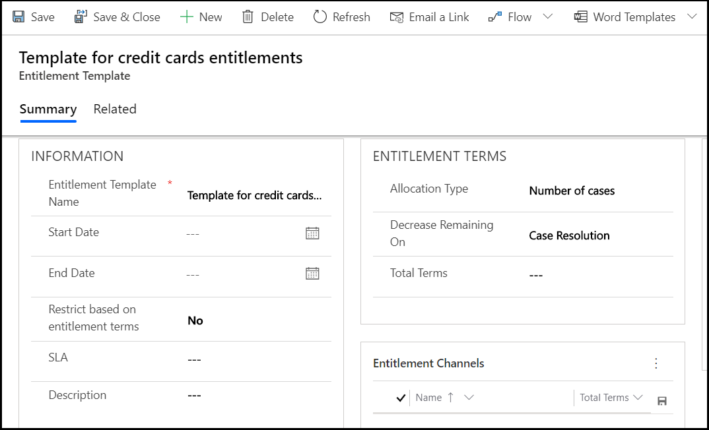
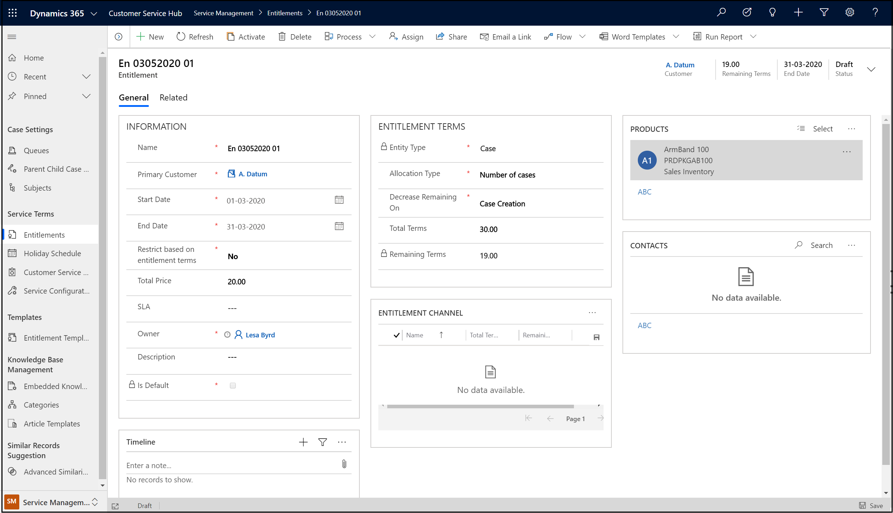

# Contracts to entitlements migration strategy

This document contains information about settings that admins have to take care of when migrating contract records to entitlements. This migration support information will help customers prepare for the deprecation of the following:

- Contracts
- Contract line items
- Contract template entities

## Migration planning

The process of migrating contracts to entitlements is as follows:

1. **Contract template to entitlement template mapping:** For records that are based on contract templates, migrate them to the entitlement templates.
2. **Contracts to entitlements:** Migrate the contract lines to entitlements by creating individual entitlements.
3. **Runtime tasks:** Run scripts to perform the migration.

## Mapping: Contract templates to entitlement templates

For feature parity, perform the following steps to map the contract templates to the entitlement templates.

### Allotment type

The allotment type based on coverage dates in the contracts template, which is used to allow any number of cases to be created between the start date and end date of a contract, is not available in the entitlements template. To enable the same functionality, in the entitlement template, set the value for **Restrict based on entitlements terms** to **No**.

A screenshot of the allotment type in the contract template is as follows.
  

A screenshot of the entitlement template is as follows,

  

> [!Note]
> After an entitlement is created from the entitlement template, add custom code to copy the custom fields added on entitlement for parity with contract lines.
> The calendar option in the contracts template is not available in the entitlements template.

**Benefits with entitlement:**

- Created cases will now display warning notices when they exceed the allocated terms.
- Customer usage can be monitored with the option to set and apply restrictions in the future.

### Custom fields

You will need to create custom fields in entitlements to migrate data from the fields in the contract template that are not available in the entitlement template. Perform the following steps to switch from the contract template and map to the entitlement template:

- **Step 1:** Create custom fields with attributes on the entitlement template. For more information, see [Create and edit fields (attributes)](/dynamics365/customerengagement/on-premises/customize/create-edit-fields).
- **Step 2:** Place the created fields on the form as per your business needs. Use the [basic update](/powerapps/developer/common-data-service/org-service/entity-operations-update-delete#basic-update) SDK code examples as a reference guide to update the entity. For more information, see [Add a field to a form](/dynamics365/customerengagement/on-premises/customize/add-field-form).

## Mapping: Contracts to entitlements

If you're currently using contracts, you can map to entitlements by following these steps:

1. Create a separate entitlement for each contract line.
2. Create custom attributes on the entitlement for missing contract lines attributes.
3. After an entitlement is created from the entitlement template, add custom code to copy the custom fields added on the entitlement for parity with contract lines.

### Things to consider

This section provides information on the functionalities that are different between contracts and entitlements and need to be considered when you are migrating the contracts records to entitlements.

#### Single product contract

If you have a contract tied to a single product, follow these steps:

1. Create an entitlement.
2. Add only one product in the **PRODUCTS** grid.

>  

> [!Note]
> The concept of grouping contract lines for a contract is not available in entitlements. You need to create separate entitlements for every contract line.

#### Contract and entitlement cancellation

A contract or entitlement can be canceled using the following steps:

**Cancel a contract**  
Contracts can be canceled immediately or in the future by selecting a date.
  
  

**Cancel an entitlement**  
An entitlement can be canceled only immediately; you can't set a date to cancel it in the future.
  

#### Billing unit in contracts

Billing unit is not available in entitlements. To achieve this in entitlement, use custom logic.

For simple rollups, use rollup fields. For more information, see [rollup fields](/dynamics365/customerengagement/on-premises/customize/define-rollup-fields).

#### Commands in contracts

The following commands have been deprecated in entitlements:

- **Copy Contract:** To clone the contract.
- **Recalculate:** To recalculate the billing rollup.
- **Onhold:** To hold the contract.
- **Release Hold:** To release the on-hold contract.

The following commands are available in entitlements:

- **Renew:** To renew the expired entitlement.
- **Cancel:** To cancel the active entitlement.

#### State mapping

- The invoiced state in contract can be mapped to the waiting state in the entitlement.
- The draft, active, canceled, and expired states are the same for both contracts and entitlements.
- The onhold state is not available in entitlements.

## Runtime scripts for migrating contracts

Use the following steps to migrate from contracts to entitlements:

- **Step 1:** Move the contract and contract lines to entitlements.
- **Step 2:** Run update script to update entitlements on a case instead of contracts.

For business requirements, if a resolved case needs to be updated, follow these steps:

- **Step 1:** Activate the case.
- **Step 2:** Update the entitlement lookup.
- **Step 3:** Resolve the case.

> [!IMPORTANT]
> In contracts and contract lines, the contract lines can be associated with a product that is different from the one listed in a case. However, in entitlements, the product listed in a case should match the product listed in the entitlement.
>
> **Example**: Contract lines associated with the product Armband 100 can be associated in the case list that is linked to another product, Armband 150. However, in entitlements, an error will occur when you link an entitlement associated with a product, Armband 100, with a case linked to Armband 150.

### See also

[Important changes (deprecations) coming](/power-platform/important-changes-coming)