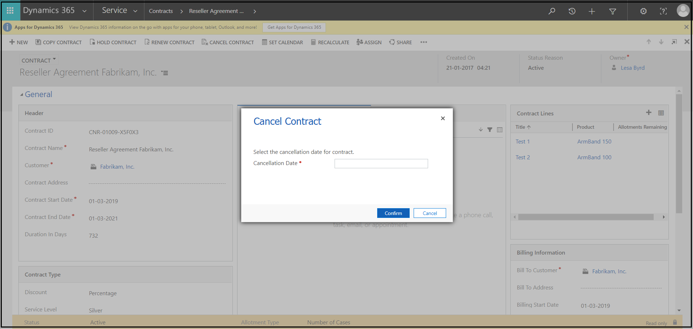
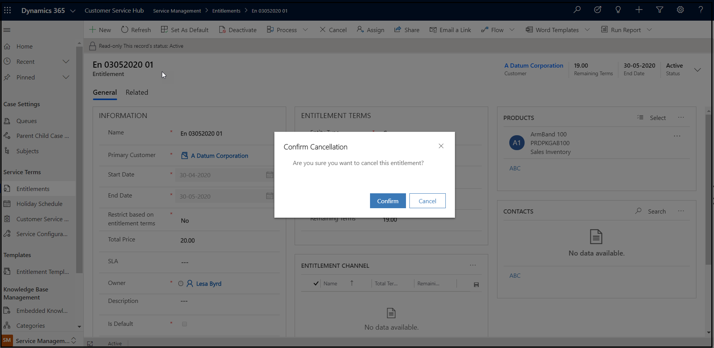

# Contract to Entitlement migration

Dynamics 365 Customer Service will be completing deprecation of contracts, contract line items, and contract template entities by [4Q20](/power-platform/important-changes-coming#contracts-contract-line-items-and-contract-templates-entities-are-deprecated). These items will be removed and replaced by Entitlements and will not be included in future releases.

The following migration support information has been provided to assist customers and prepare for the deprecation of the following:

- Contracts
- Contracts line items
- Contract template entities

## Migration planning

Depending on how your contract is set up, choose from the following options to prepare your migration:

- [Mapping: Contract template to Entitlement template](#1)
- [Mapping: Contract to Entitlements](#2): 
  a. [Single Product Contract](#2a) 
  b. [Contract and Entitlement cancellation](#2b) 
  c. [Billing unit on contract](#2c) 
  d. [Commands on Contract](#2d) 
  e. [State mapping](#2e)

## Mapping: Contract template to Entitlement template

If you're currently using the Contract templates, use the following steps to map to the Entitlement template.

### Allocation Type

Allocation type to "Coverage Dates" on contract template is used to allow any number of cases to be created between start date and end date of contracts. To switch from the Contract template and map to the Entitlement template:

- **Step 1:**  Select **allocation type**.

  

- **Step 2:** Set **Restriction based on Entitlement terms** to **No**.

  

>[!Important]
>
> After an entitlement is created from the Entitlement template, add custom code to copy the custom fields added on entitlement for parity with contract lines.

**Benefits with Entitlement:**

- Created cases will now display warning notices when they exceed allocated terms.
- Customer usage can be monitored with the option to set and apply restrictions in future.

## Custom Fields

Fields that are required for business use case, but not available out of the box on Entitlement or for other required fields not available on Entitlements.

To switch from the Contract template and map to the Entitlement template:

- **Step 1:** Create custom fields with attributes can be created on Entitlement template.  For more information, see [Create and edit fields (attributes)](/dynamics365/customerengagement/on-premises/customize/create-edit-fields).
- **Step 2:** Place the created fields on the form as per business needs. Use the [basic update](/powerapps/developer/common-data-service/org-service/entity-operations-update-delete#basic-update) SDK code examples as a reference guide to update the entity. For more information, see [Add a field to a from](/dynamics365/customerengagement/on-premises/customize/add-field-form).

## Mapping: Contract to Entitlements

If you're currently using Contract you can map to Entitlements by using the following steps:

- **Step 1:**	Create a separate Entitlement for each contract line.
- **Step 2:**	Create custom attributes on Entitlement for missing contract lines attributes.
- **Step 3:**	After entitlement is created from Entitlement template, add custom code to copy the custom fields added on Entitlement for parity with contract lines.

### 2a. Single Product Contract

If you have a contract tied to a single product, use the following steps:

 - **Step 1:** Create an entitlement.
 - **Step 2:** Add only one product in the **PRODUCTS** grid.
  

> [!Note]
> The concept of the Contract group contract lines Contract has been deprecated and is not available on entitlement. Entitlement does not provide concept grouping.

### 2b. Contract and entitlement cancellation

A contract or entitlement can be canceled using the following steps:

**Cancel a contract** 
Contracts can be canceled immediately or in the future by:
- **Step 1:**	Selecting a date.
- **Step 2:**	Selecting **Confirm**.

  

**Cancel an entitlement** 
Entitlement can be canceled immediately, but can't be canceled in future.
  

### 2c. Billing unit on contract

Billing unit is not available in entitlement. To achieve this in entitlement, use custom logic.
For simple rollups, use rollup fields. For more information, see [rollup fields](/dynamics365/customerengagement/on-premises/customize/define-rollup-fields).

### 2d. Commands on contract

The following is a list of commands that have been deprecated on entitlement:

- Copy Contract – this command is used to clone the contract
- Recalculate – this command is used to recalculate the billing rollup
- Onhold – to hold the contract
- Release Hold – to release the holded contract

The following is a list of commands available on Entitlements:

- **Renew** to renew the expired entitlement.
- **Cancel** to cancel the active entitlement.

### 2e. State mapping

- The invoiced state in contract can be mapped to the waiting state in the entitlement.
- The draft, active, canceled, and expired states are same for both contract and entitlement.
- The Onhold state is not available in entitlement.

## Runtime impact

Use the following steps to migrate from contract to entitlement:

- **Step 1**: Move the contract and contract lines to entitlements.
- **Step 2**: Run update script to update entitlement on case instead of contracts.

For business requirement, if resolved case needs to be updated, use the following steps:

- **Step 1**: Activate the case.
- **Step 2**: Update the entitlement lookup.
- **Step 3**: Resolve the case.

> [!IMPORTANT]
> Contract and Contract Lines allowed Contract Lines to be associated to a product different than the one listed in Case. However, an entitlement requires the product listed in Case matches the product listed in the entitlement.
>
> **Example**: Contract lines associated with the product Armband 100 can be associated in the Case list which is linked to another product Armband 150. However with Entitlement, an error will occur when you link an Entitlement associated with a product, "Armband 100", with a Case linked to "Armband 150".

### See also

- [Important changes (deprecations) coming](/power-platform/important-changes-coming)
