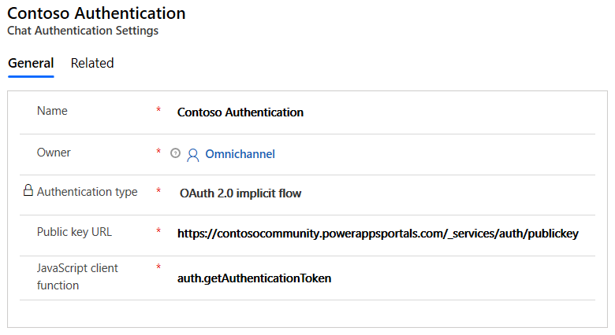
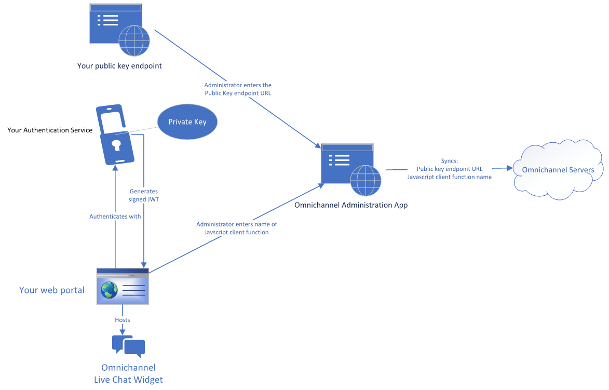
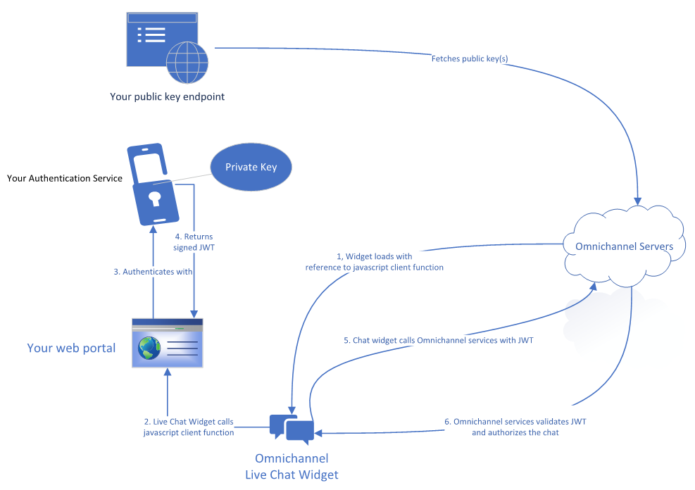

# Configure authentication settings

[!INCLUDE[cc-use-with-omnichannel](../includes/cc-use-with-omnichannel.md)]

[!INCLUDE[cc-omnichannel-administration-deprecation-note.md](../includes/cc-omnichannel-administration-deprecation-note.md)]

You can create authentication settings to validate a signed-in customer from a domain, and extract information based on the context variables that are defined. You can differentiate your anonymous customers from authenticated customers, and you can create rules based on the context variables.

For example, you can have separate queues for anonymous customers and authenticated customers. Because you have more information about your authenticated customers, you can also prioritize them based on specific variables, such as a shopping cart value or a privileged status.

After you create an authentication settings record, you must add it to a channel instance within a workstream's channel setup to make it work. Authentication is supported for these channels:
 - Chat
 - Apple Messages for Business

The agent will get a notification in the **Conversation summary** section whether the customer is authenticated or not. The **Authenticated** field is set to **Yes** or **No** based on the authentication of the customer. More information: [Conversation summary](oc-customer-summary.md#conversation-summary)

## Prerequisites

Make sure your organization has working knowledge of OAuth 2.0 and JSON Web Tokens (JWTs). 

### Create an authentication setting record for chat

You can create a chat authentication setting record in the admin app.

1. Go to one of the admin apps, and perform the following steps.
   
   ### [Customer Service admin center](#tab/customerserviceadmincenter)

     1. In the site map, select **Customer Settings** in **Customer support**. The **Customer settings** page appears.
     1. In the **Authentication settings** section, select **Manage**.

     The **Authentication settings** page is displayed.

   ### [Omnichannel admin center](#tab/omnichanneladmincenter)
    
     1. In the site map, select **Customer Settings** in **Advanced settings**. The **Customer settings** page appears.
     2. In the **Authentication settings** section, select **Manage**.

      The **Authentication settings** page is displayed.
      
2. Select **New Authentication Settings**, and provide the following information on the **Add authentication setting** page:

    - **Name**: Enter a name for the authentication setting.
    - **Owner:** Accept the default value or change to a required value.
    - **Authentication type:** By default, it's OAuth 2.0 implicit flow that can't be edited.
    - **Public key URL**: Specify the public key URL of the domain. This URL is used to validate the information that comes in from the JavaScript Object Notation (JSON) Web Token (JWT) of the domain that a customer has signed in to.
    - **JavaScript client function**: Specify the JavaScript client function to use for authentication. This function extracts a token from the token endpoint.

        > [!div class=mx-imgBorder]
        > 

    For more information about how to find the public key URL and JavaScript client function, see the [Setup for Power Apps portals](#setup-for-power-apps-portals) or [Setup for custom portals](#setup-for-custom-portals) section later in this article.

3. Select **Save**.

### Add authentication to chat widget

1. Open the chat widget to which you want to add authentication and do one of the following steps:
   - In Customer Service admin center or Omnichannel admin center, go to the **Behaviors** tab. 
   - In Omnichannel Administration, go to the **Basic details** tab.
2. In the **Authentication settings** box, browse and select the chat authentication record.

When a signed-in customer on a portal opens the chat widget, the JavaScript client function passes the JWT from the client to the server. The JWT is decrypted and validated by using the public key, and the information is then passed to the chat agent in Omnichannel for Customer Service. As an admin, you can also pass additional information about the signed-in customer in the JWT by defining custom context variables. The context variables must be defined exactly as they're defined in the workstream that's associated with the chat widget. More information: [Manage context variables](manage-context-variables.md#considerations)

### Setup for Power Apps portals

If you're adding authentication for a chat widget on a website developed using Power Apps portals, then the public key URL and JavaScript client function are available out of the box. You'll need to [upload a custom certificate](/power-apps/maker/portals/oauth-implicit-grant-flow#custom-certificates) to have a valid public key URL on Power Apps portals. 

- **Public key URL**: `<portal_base_URL>/_services/auth/publickey`
- **JavaScript client function**: `auth.getAuthenticationToken`

The Power Apps portal will try to automatically link a contact record to the conversation through the context passed in its JavaScript client function.

### Setup for custom portals

If you're adding an authenticated chat experience to a custom website (that's not developed using Power Apps portals), here are a few steps that your web development team must perform before your administrators can configure authenticated chat:

1. Generate a public/private key pair in their authentication servers. The keys must be generated using the RSA256 algorithm. 

    Here's sample code for generating private/public key pairs.

    ```Powershell
    openssl genpkey -algorithm RSA -out private_key.pem -pkeyopt rsa_keygen_bits:2048
    openssl rsa -pubout -in private_key.pem -out public_key.pem
    ```

2. Create an endpoint that will return your public keys. The public keys will be used by the Omnichannel servers to validate the JWT token passed as a part of authorizing the chat request. The URL of this endpoint will be entered into the admin app when creating an authentication setting record.  

    Your public key endpoint will look similar to this example:
      ```
        -----BEGIN PUBLIC KEY----- 
        NIIBIjANBgkqhkiG9w0BAQEFABCOPQ8AMIIBCgKCAQEAn+BjbrY5yhSpLjcV3seP 
        mNvAvtQ/zLwkjCbpc8c0xVUOzEdH8tq4fPi/X5P/Uf2CJomWjdOf1wffmOZjFasx 
        ELG+poTqy5uX2dNhH6lOMUsV31QGG36skLivpLBCSK6lWlzsV6WGkb/m8r86aGzp 
        jtNhw8yvoTYB4updDrJ8pC+tx4EWK0WEmKn1GsW6TjUtxJjcTLI1puSbmcGHbkSi 
        RSbWkKPqaEVFALprw+W5ZCung5QX3KOkY/rJd+2JwULm7okyQCQaF7qwa5i9Uf65 
        7M6ZL4vsDevq7E/v3tf6qxpSSHzt4XspXVQty9QHhqDqBEY3PfI4L2JjgIGuPhfS 
        YQIDAQAB 
        -----END PUBLIC KEY-----   
        
  If you need to use multiple public keys, your public key endpoint can return a set of `<kid, publickey>` pairs, where `kid` refers to the key ID. Note that key ID pairs must be unique. The kid will need to be passed in the JWT token in step 4. If you're using multiple keys, your public key endpoint should return something that looks like this. The public key is base64-encoded.

  ```
   [
        { 
            "kid": "qWO4EaKT1xRO7JC/oqALz6DCVr41B/qL0Hqp4in7hu4=",
            "publicKey": LS0tLS1CRUdJTiBQVUJMSUMgS0VZLS0tLS0NCk1JSUJJakFOQmdrcWhraUc5dzBCQVFFRkFBT0NBUThBTUlJQkNnS0NBUUVBbjFLdXhtSEh3V3hjelZSWGRBVmMNCnBEaFZwa0FnYklhTGZBUWc1bFpvemZqc29vcWRGWkl0VlFMdmRERWFVeDNqTytrTkxZM0JFRnBYVDZTN3ZNZCsNCnZoM2hpMDNsQ1dINnNCTWtaSWtuUUliMnFpekFsT0diU2EvK3JrUElnYnpXQjRpT1QyWVhyOVB4bXR5d2o4WUINCnYram55VU5DSzMyZy9FYWsvM0k3YW1vZ2pJY0JISjNFTjVuQWJBMExVVnJwMW5DODJmeEVPOHNJTzNYdjlWNVUNCnc5QnVTVVFRSmtMejNQYVI5WTdRZUEyNW5LUGtqTXZ2Y0UxVU5oeVpIYlNLbmorSitkZmFjb1hsSGtyMEdGTXYNCldkSDZqR0pWcGNQMHBkNjFOa3JKa2c0aStheThwS2ZqdjNUOHN3NWdaVHFweFFaaitVRWxqaVM0SHRPTlhkNlENCnZRSURBUUFCDQotLS0tLUVORCBQVUJMSUMgS0VZLS0tLS0NCg==",
            "expiry": 1608495423
        },
   {
            "kid": "qWO4EaKT1xRO7JC/oqALz6DCVr41B/qL0Hqp__valid=",
            "publicKey": "LS0tLS1CRUdJTiBQVUJMSUMgS0VZLS0tLS0NCk1JSUJJakFOQmdrcWhraUc5dzBCQVFFRkFBT0NBUThBTUlJQkNnS0NBUUVBbjFLdXhtSEh3V3hjelZSWGRBVmMNCnBEaFZwa0FnYklhTGZBUWc1bFpvemZqc29vcWRGWkl0VlFMdmRERWFVeDNqTytrTkxZM0JFRnBYVDZTN3ZNZCsNCnZoM2hpMDNsQ1dINnNCTWtaSWtuUUliMnFpekFsT0diU2EvK3JrUElnYnpXQjRpT1QyWVhyOVB4bXR5d2o4WUINCnYram55VU5DSzMyZy9FYWsvM0k3YW1vZ2pJY0JISjNFTjVuQWJBMExVVnJwMW5DODJmeEVPOHNJTzNYdjlWNVUNCnc5QnVTVVFRSmtMejNQYVI5WTdRZUEyNW5LUGtqTXZ2Y0UxVU5oeVpIYlNLbmorSitkZmFjb1hsSGtyMEdGTXYNCldkSDZqR0pWcGNQMHBkNjFOa3JKa2c0aStheThwS2ZqdjNUOHN3NWdaVHFweFFaaitVRWxqaVM0SHRPTlhkNlENCnZRSURBUUFCDQotLS0tLUVORCBQVUJMSUMgS0VZLS0tLS0NCg==",
            "expiry": 1608495423
        } 
   ]
   ```
        
3. You'll need a service that generates the JWT to send to Omnichannel’s servers as a part of starting a chat for an authenticated user.  

    a. The JWT header will look similar to the following example.
       
    ```JavaScript
    { 
      "alg": "RS256", 
      "typ": "JWT", 
    } 
    ```

    If you're using multiple public keys, you'll need to pass in the key ID (kid). Your header will look similar to this example:

    ```JavaScript
    { 
      "alg": "RS256", 
      "typ": "JWT",
      "kid": "qWO4EaKT1xRO7JC/oqALz6DCVr41B/qL0Hqp4in7hu4="
    } 
    ```

   b. The JWT payload should include: 
      - At minimum, the following claims:
         
          | Claim | Definition |
          |-------|-------------------------------------------------------------------------------------------------------------|
          | iss   | The issuer of the token. |
          | iat   | The date the token was issued, in numeric date format.  |
          | exp   | The expiration date of this token, in numeric date format.  |
          | sub   | The subject of the claim. <br> **NOTE:** We recommend that you pass the GUID of the contact or account record in Customer Service for the logged-in user. This GUID will be used to identify and link the contact record to the conversation. |
          |||

      -  **lwicontexts** The context variables to pass in as part of the conversation, either for routing purposes or to display to the agent. <br>
            More information: <br>
            [Manage custom context](send-context-starting-chat.md)  <br>
            [setAuthTokenProvider method](/developer/reference/methods/setauthtokenprovider.md)<br>
            [Identify records automatically using context variables](record-identification-rule.md)<br>
     
      - Any other data that you want to pass.

      Your payload will look similar to this example: 

      ```JavaScript
        { 
            "sub" : "87b4d06c-abc2-e811-a9b0-000d3a10e09e",  
            "lwicontexts" :"{\"msdyn_cartvalue\":\"10000\", \"msdyn_isvip\":\"false\", \"portalcontactid\":\"87b4d06c-abc2-e811-a9b0-000d3a10e09e\"}", 
            "iat" : 1542622071, 
            "iss" : "contosohelp.com", 
            "exp" : 1542625672, 
            "nbf" : 1542622072 
        } 
        ```     
        
    c. The JWT signature should be signed by your private key. 

      > [!NOTE]
      > - If the token has expired or is invalid, the chat widget will throw an error event. 
      > - The [setContextProvider method](/developer/reference/methods/setcontextprovider.md) is not supported for authenticated chat. You should pass in your lwicontexts as a part of the JWT payload.

4. Create a JavaScript function on your website that will accept a callback function and return a JWT to the callback function. To avoid timeout, this JavaScript function should return a JWT within 10 seconds. This JWT must: 

    - Contain the header, payload, and signature from step 3. 

    - Be signed by the private key from the key pair in step 1. 

      (We recommend generating your JWT on your web server). 

      The name of this JavaScript method will be used to create the authentication settings record in the Omnichannel admin app.

        ```JavaScript
        // This is a sample JavaScript client function  

        auth.getAuthenticationToken = function(callback){ 

          var xhttp = new XMLHttpRequest(); 
          xhttp.onreadystatechange = function() { 
              if (this.readyState == 4 && this.status == 200) { 
                  callback(xhttp.responseText); 
              } 
          }; 
          xhttp.onerror = function(error) { 
              callback(null); 
          }; 
        //Replace this with a call to your token generating service 
          xhttp.open("GET", "https://contosohelp.com/token", true); 
          xhttp.send(); 
        } 
        ```


5. Your developer will need to share the following information with your Omnichannel administrator:

    a. The URL of the public key service from step 2.  
       
      Example: https://www.contoso.com/auth/publickey 

    b. The name of the JavaScript client function from step 4. This will be called internally by the live chat widget during the start of a chat.
       
      Example: auth.getAuthenticationToken

    > [!NOTE]
    > If your user experience exposes the chat button before users are authenticated, make sure to redirect them to your authentication page as needed. This can be done in the method in step 4, or as an earlier step in your user flow.

    The following illustration demonstrates the setup.
    
   > [!div class=mx-imgBorder]
   > 

    Then, you can set up authenticated chat by following these steps: 

## Set up authenticated chat

1. Go to the admin app, and create an authentication settings record with the information from step 5 of the previous section. More information: [Create an authentication setting record for chat](create-chat-auth-settings.md#create-an-authentication-setting-record-for-chat) 

2. Associate the authentication settings to the chat widget that will have an authenticated experience. More information: [Add authentication to chat widget](create-chat-auth-settings.md#add-authentication-to-chat-widget)

    The following illustration demonstrates the call sequence when a user accesses your chat in an authenticated setup.

     > [!div class=mx-imgBorder]
     > 


## Create authentication settings for social channels<a name="socialauth"></a>

### Prerequisites

- Administrators who are configuring authentication settings will need additional security permissions. More information: [Set up security permissions for a field](/power-platform/admin/set-up-security-permissions-field.md)

- Make sure your organization has working knowledge of OAuth 2.0 code flow.

- Confirm that your organization has at least one Apple Messages for Business **Authentication type rich message**. This is required for setup.

### Create an authentication setting record for Apple Messages for Business

1. In the site map of the Customer Service admin center or Omnichannel admin center app, select **Customer settings**, and then select **Manage for Authentication settings**. A list of existing authentication settings is shown.

1. Select **New authentication setting**, and in the **Add authentication setting** page, provide the following details:

     1. On the **Channel type** page, enter a name and select **Apple Messages for Business** as the channel type.<br>
        By default, the authentication type is OAuth 2.0 code flow. This cannot be changed.<br>
    
     2. On the **Details** page, provide the following information:<br>
        - **Client ID**: OAuth 2.0 Client Identifier issued by an authorization server.<br>
        - **Client secret**: Client secret used to authenticate requests sent to an authorization server.<br>
        - **Scope**: Each scope added will specify which pieces of user data you've requested from the customer. The scope content must exactly match those available through your service provider.<br>
        - **Decrypted token URL**: Endpoint where the OAuth 2.0 API can retrieve the customer info requested in the scope.<br>
     
     3. On the **Additional details** page, you can optionally define an access token expiry time, in seconds. The default expiry time is one hour.<br>
        After the specified time, the **Authenticated** field in the **Customer summary** section of a previously authenticated conversation will change to **No**.<br>
    
     4. On the **Rich messages** page, select **Add**, and then select one or more rich messages to associate to this authentication setting.<br>
    
     5. Review the **Summary** page, and then select **Finish**. The authentication setting is configured.

### Add authentication to an Apple Messages for Business channel

1. Open the workstream containing the channel instance to which you want to add authentication.

2. On the **Behaviors** page of the channel settings, navigate to **Authentication settings**, enable the capability, and select the correct setting from the dropdown menu. More information: [Configure an Apple Messages for Business channel](configure-apple-messages-for-business-channel.md)

3. Review or update the authentication settings for each channel instance by selecting **Edit**.


### See also

[Add a chat widget](add-chat-widget.md)  
[Configure a pre-conversation survey](configure-pre-chat-survey.md)  
[Create quick replies](create-quick-replies.md)  
[Create and manage operating hours](create-operating-hours.md)  
[Embed chat widget in Power Apps portals](embed-chat-widget-portal.md)  
[Automatically identify customers](record-identification-rule.md)  


[!INCLUDE[footer-include](../includes/footer-banner.md)]
