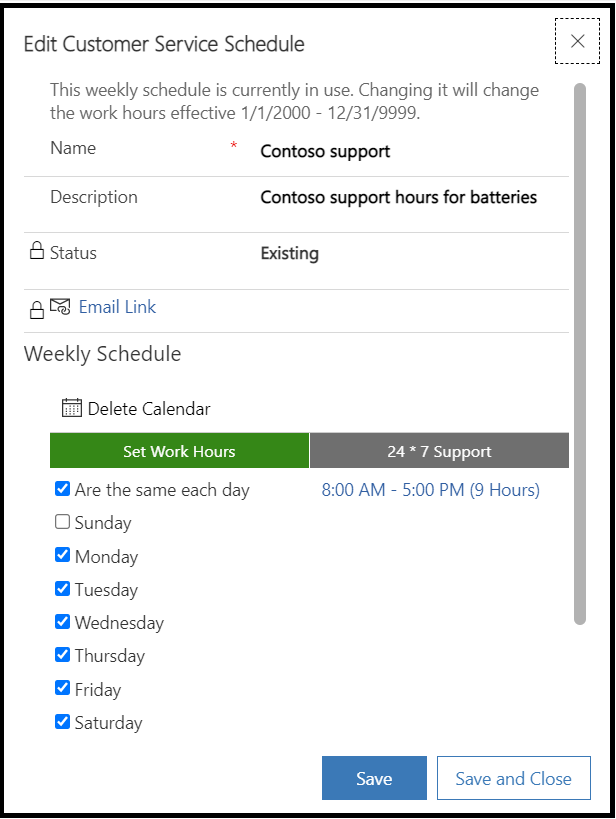

# Create customer service schedule and define the work hours

To define when your service or support team is available for providing support to customers, create a customer service schedule in Dynamics 365 Customer Service. A customer service schedule determines the business hours for each day in a week and also the weekly off. Customer Service uses these details for time tracking of service-level agreements (SLAs).  
  
For SLA time tracking, make sure you add a holiday schedule to the customer service schedule, and associate this customer service schedule to the SLA record.

You can create the service schedule and define work hours in Dynamics 365 Customer Engagement (on-premises) 9.1 also. More information: [New features in Dynamics 365 Customer Engagement (on-premises)](/dynamics365/customerengagement/on-premises/whats-new#new-work-hour-calendar-in-service-scheduling)

> [!NOTE]
> With the latest release of Dynamics 365 Customer Service app, customer service schedule in service management is available in the Customer Service Hub. We recommend that you create and manage customer service schedule using the new experience.
  
## Create a customer service schedule  
  
1. Make sure that you assign the Customer Service Manager, System Administrator, System Customizer security role, or equivalent permissions at the user level only.
  
    #### Check your security role
  
   - [!INCLUDE[proc_follow_steps_in_link](../includes/proc-follow-steps-in-link.md)]  
  
   - [!INCLUDE[proc_dont_have_correct_permissions](../includes/proc-dont-have-correct-permissions.md)]  

2. Navigate to the Customer Service admin center or Customer Service Hub app, and perform the following steps:

   ### [Customer Service admin center](#tab/customerserviceadmincenter)

    1. In the site map, select **Calendar** in **Operations**. The **Calendar** page appears.
    1. In the **Customer service calendar** section, select **Manage**.                                                                         
        
        The **All Customer Service Calendars** view is displayed. You can switch between various system views using the drop-down list.  

   ### [Customer Service Hub](#tab/customerservicehub)

    1. In the site map, go to **Service Management**.
    1. From the list of entity records, select **Customer Service Schedule** in **Service Teams**.                                                              
       
       The **All Customer Service Calendars** view is displayed. You can switch between various system views using the drop-down list.
  
    > [!NOTE]
    > In the Customer Service app, [!INCLUDE[proc_settings_service_management](../includes/proc-settings-service-management.md)] and select **Customer Service Schedule**.
  
3. To create a customer service schedule, select **New**.  
  
    To edit an existing schedule, select the schedule in the list of records, and then select **Edit** on the command bar.  
  
4. In the **Name** field of the **Create Customer Service Schedule** dialog, enter a meaningful name for the schedule such as “APAC Customer Schedule", and then select **Create**.  
  
5. In the **Weekly Schedule** dialog, follow these steps:  
   1. For work hours, select one of these options:  
  
      - **Are the same each day**: The schedule is the same for every day of the week. After you select this option, to select the days of the week that the customer support is available, select **Set Work Hours**.  
  
           To set the work hours for the days, select **Set Work Hours**. For more information, see [Define work hours for the customer service schedule](#define-the-work-hours-for-the-schedule).  
  
      - **Vary by day**: The new schedule is different for one or more days of the week. After you select this option, select the days of the week that the customer support is available, and also specify the work hours for each day.  
  
      - **24 x 7 support**: The customer support is available 24 hours a day and all days of the week.  
  
   2. For **Work Days**, select the checkbox for each day that the customer support resources will be available and working.  
  
   3. For **Holiday Schedule**, select **Observe** to specify when your service organization will be closed.  
  
       If you selected **Observe**, select a holiday schedule from the lookup box. [!INCLUDE[proc_more_information](../includes/proc-more-information.md)][Set up a holiday schedule](../customer-service/set-up-holiday-schedule.md)  
  
6. In the **Time Zone** dropdown box, under **Select the time zone**, select the time zone in which your customer support resources will work. If applicable, the daylight saving time is taken into account for the selected time zone.
  
7. Select **Save**.  

   
 
## Define the work hours for the schedule

 In the **Set Work Hours** dialog, complete the following fields, and then select **OK**.
  
- **Start**: Select the time the work day starts.  
  
- **End**: Select the time the work day ends.  
  
  To add a break in the work hours, like a lunch break, select **Add Break**, and then select the start and end time of the break.  
  
### See also

[Set up a holiday schedule](../customer-service/set-up-holiday-schedule.md)  

[!INCLUDE[footer-include](../includes/footer-banner.md)]
