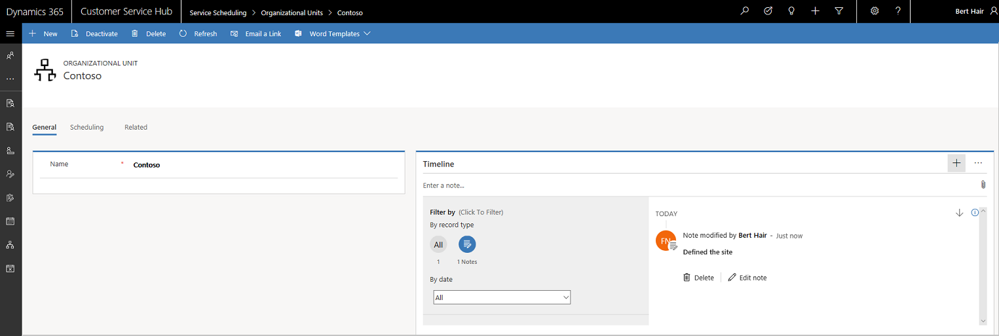

# Create and manage organizational units  

Create organizational units to organize and maintain a company's business by geography, function, or other areas. You can create multiple organizational units in Service Scheduling to categorize your business by various areas.

## Create a new organizational unit

Make sure that you have the required security role or equivalent permissions. 

[!INCLUDE[proc_more_information](../includes/proc-more-information.md)] [Manage security roles in service scheduling](manage-security-roles.md)

1. In the Customer Service Hub sitemap, go to **Scheduling**.

2. From the list of entity records, select **Settings > Organizational Units**.
   - The **Active Organizational Units** view is displayed. You can switch between various system views using the drop-down.
   - Select any existing organizational unit to see additional options in the command bar

3. On the command bar, select **New** to create a new organizational unit.

4. In the **General** section:

   - Type a **Name** for the organizational unit.

5. In the **Scheduling** section:

   - Provide **Latitude** and **Longitude** for the organizational unit.

7. Select **Save** to save the new organizational unit. The new record is saved and activated by default.

   Active organizational units can be edited, assigned, shared, or viewed from the **Active Organizational Units** system view.

   

### See also

[Service Scheduling overview](basics-service-service-scheduling.md)