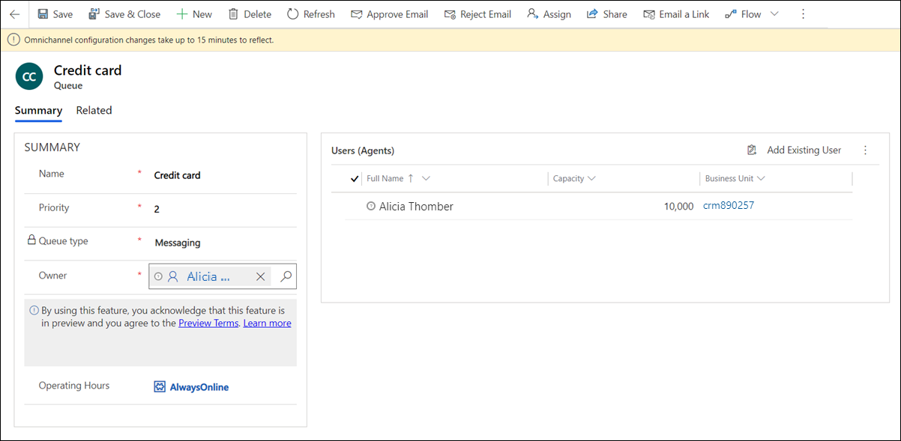

# Create queues in the Omnichannel Administration app

[!INCLUDE[cc-use-with-omnichannel](../includes/cc-use-with-omnichannel.md)]

## Introduction

In Omnichannel for Customer Service, queues are used for collecting and distributing workload among agents. The workload includes conversations, such as chat or SMS. Agents are added as members to the queues, and the workload is distributed among these agents.

## Route conversations to queues

Queues in Omnichannel for Customer Service are proxies for skills or domains. You can create separate queues for each line of business, such as billing, investment, and products. When a customer query is raised for any of the areas, it is routed to the corresponding designated queue. You also can set up a customer support availability matrix by using a combination of queues, operating hour schedules, and routing rules.

In an enterprise scenario, you can have various supervisors handling different issues, and therefore, different types of queues are required to handle the various scenarios. Accordingly, routing rules are set up based on the complexity of issues that need to be handled.

To simplify the routing experience for administrators and supervisors, queues are categorized based on the channel types as follows:

- **Messaging**: To route all messaging conversations pertaining to the live chat, SMS, and social channels.
- **Entity records**: To route cases pertaining to entity records.

The queue types help ensure that issues will be routed correctly and help avoid cross-queue assignments. When you configure workstreams and routing rule items, the queues that will be available for selection will be based on the channel type for the workstream. For example, for routing rules for a live chat workstream, only messaging-type queues will be shown for selection. Similarly, in a conversation transfer scenario, you can transfer a chat conversation only to a messaging queue and a case to an entity queue.

You can assign priority to queues. A lower value indicates higher priority, and a higher value indicates lower priority. All conversations in a queue take the priority that is defined for the queue; higher priority conversations are allocated first. For example, if two chat conversations are waiting in two queues that have priority defined as 1 and 2 respectively, the chat conversation with priority value 1 will be allocated to an agent first.

## Create queues in Omnichannel Administration

Out of the box, the following default queues are available in Omnichannel for Customer Service:

- **Default entity queue**: The queue that is available for routing entity records.
- **Default messaging queue**: The queue that is available for routing all messaging conversations pertaining to the live chat, SMS, and social channels.

The default queues can't be edited or deleted. All Omnichannel for Customer Service users are members of the default queues. Therefore, the membership of these default queues also can't be changed.

> [!NOTE]
> When no custom queues or routing rules are defined, all conversations are directed to one of the out-of-the-box default queues based on the work item type.

Perform the following steps to create a queue in Omnichannel for Customer Service:

1. In the Omnichannel Administration site map, go to **Queues & Users** > **Queues**. The **Omnichannel queues** view is displayed.
2. On the command bar, select **New**.
3. On the **Summary** tab, in the **General Information** section, provide the following information:

    - **Name**: Enter a name for the queue.
    - **Priority**: Assign a priority to define how quickly a conversation should be picked from the queue.
    - **Queue type**: Select either **Messaging** or **Entity**. You can't edit the queue type after you save the queue.
    - **Owner**: Search and select an owner for the queue if you do not want to use the default owner.
    - **Operating Hours**: Search and select an operating hour schedule that you want to specify for the queue.

4. Select **Save**. The **Users (Agents)** section is displayed.

   > [!div class=mx-imgBorder]
   > 

5. In the **Users (Agents)** section, select **Add Existing User** to add existing agents to the queue.
6. On the **Lookup Records** flyout menu, select the agents to add, and then select **Add**.

    > [!TIP]
    > To select users from other views, you can change the view by selecting **Change View**.

> [!IMPORTANT]
>
> If you've upgraded your Omnichannel for Customer Service environment to 2021 release wave 1, your queues will start using unified routing services for assignment. By default, all existing queues will use the "highest capacity" assignment method for work distribution. You can change the assignment method to round robin or a custom assignment method according to your need. More information: [Set up assignment methods in Customer Service](assignment-methods.md).

### See also

[Create workstreams in Omnichannel Administration](create-workstreams-oca.md)  
[Understand unified routing and work distribution](unified-routing-work-distribution.md)  
[Create and manage operating hours](create-operating-hours.md)  

[!INCLUDE[footer-include](../includes/footer-banner.md)]
