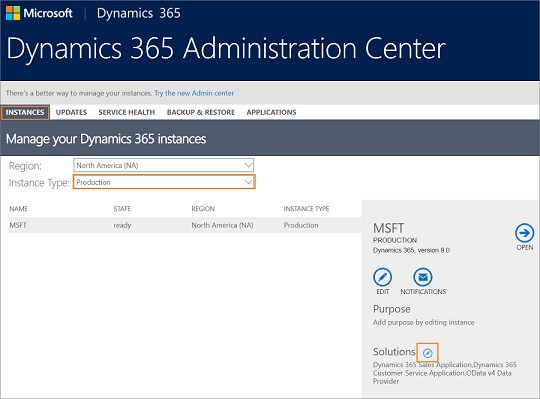
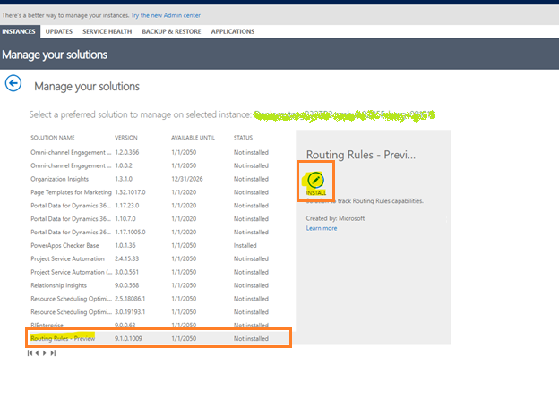
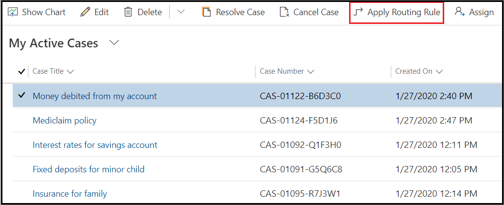

# Automatically route cases using routing rule sets

Use routing rules in [!INCLUDE[pn_dynamics_crm](../includes/pn-dynamics-crm.md)] to automatically route cases to the right people at the right time without any manual intervention. You can also use routing rules to route cases that are escalated to specific queues. 

## Preview: Install Routing Rules - Preview solution

[!include[cc-beta-prerelease-disclaimer](../includes/cc-beta-prerelease-disclaimer.md)]

1. Go to [Microsoft 365 Admin center](https://admin.microsoft.com/AdminPortal/Home).

2. Select **... Show all** > **Admin centers** > **Dynamics 365**. Dynamics 365 opens in a new tab.

   > [!div class=mx-imgBorder]
   > 

3. In the **Dynamics 365 Administration Center**, under the **Instances** tab, select an instance type from the drop-down. 

4. Select the edit icon next to solutions. Manage your solutions page appears.

   > [!div class=mx-imgBorder]
   > 

5. In the **Manage your solutions** page, select **Routing Rules - Preview**. The status column shows **Not installed**.

6. Select the install icon next on the **Routing Rules - Preview** card. The **Terms of service** page appears.

   > [!div class=mx-imgBorder]
   > 

7. In the **Terms of service** page, read the terms and conditions and then select **install**. The installation may take few minutes.

    The solution is installed in your organization.

## Preview: Add routing rule sets sitemap for custom apps 

While creating custom apps, you might not have routing rules sets available in your sitemap. You must add the routing rule sets sitemap for your custom app to access. To add routing rule sets to sitemap, follow these steps:

1. Sign in to Dynamics 365 and go to App designer.

2. On your custom app, select more options (**...**) and then select **OPEN IN APP DESIGNER**.

3. Select pencil icon corresponding to **Site Map**. 

4. Select the area in which you want to add the routing rule set entity. Select **+ Add** and then select **Subarea**.
 
5. On the **Properties** tab, under General section, add the subarea properties:

    - **Type** as **Entity**.

    - **Entity** as **Routing Rule Sets**.

6. Save and publish the sitemap. 

    The sitemap is created with Routing Rule Set and go to your custom app to locate Routing Rule Sets in the sitemap.

To Learn more, see [Create a site map for an app using the site map designer](../customize/create-site-map-app.md)

## Preview: Create a routing rule set (Customer Service Hub)

[!include[cc-beta-prerelease-disclaimer](../includes/cc-beta-prerelease-disclaimer.md)]

### Prerequisites

Review the following prerequisites before creating a routing rule set:

1. Verify that you have the Customer Service Manager, System Administrator, System Customizer security role, or equivalent permissions before creating a routing rule set record.

   **Check your security role**  

    - [!INCLUDE[proc_follow_steps_in_link](../includes/proc-follow-steps-in-link.md)]  

    - [!INCLUDE[proc_dont_have_correct_permissions](../includes/proc-dont-have-correct-permissions.md)]  

2. In addition to the specified security role for creating a routing rule set, verify that you have below permissions for Routing Rule Instance entity before applying routing rules:

    > [!div class="mx-imgBorder"]
    > 

### Creating routing rule set

1.	In the Customer Service Hub sitemap, go to **Service Management** and select **Case Settings** > **Routing Rule Sets**.

2.	To create a new routing rule set, select **New** on the command bar.

3.	Enter **Name** and **Description** of the new routing rule set in the **Routing Rule Set Information** section of the **General** tab.

4.	Select **Save** to save the new routing rule set. The **Rule Items** section is displayed.

    > [!div class="mx-imgBorder"]
    > 

5.	In the **Rule Items** section, select **Add New Rule Item** to specify conditions that will be evaluated while routing cases to a queue, an agent or a team.

6.	You can add multiple rule items and arrange them in the desired order. The rule items are evaluated in the order of definition.

    Rule items are evaluated from top to bottom. If a rule item is evaluated as **True**, the case gets routed to the destination agent and skips further evaluation. If a rule item is evaluated as False, further rule items are evaluated.
    
    a.	In the **General** tab of the **Rule Item** form, enter a **Name** and **Description** for the new rule item.

    b.	Specify the **If Conditions** and **Then Conditions**. **If Conditions** evaluate the case and **Then Conditions** specify the destination of the case once it is evaluated. You can specify the conditions in the following ways:
    
       - Add a new condition row using **Add Row**. Select **…** to group multiple rows of conditions into one group.
        
       -	Add a group of conditions using **Add Group**. Select **…** to ungroup a group of conditions.
        
       -	Add a condition for a specific entity using **Add related entity**.
    
      > [!TIP]
      > To group conditions in a particular criterion, use the **And** or **Or** options.

       -	Select the destination in the **Action** section. You can route the case to an agent, a queue, or a team.

      For example, all cases (Case Title) about printer issues from customers based in Portland, United States, should be routed to an agent named Gilda Moss, who is the subject-matter expert of the team. The rule item for the above condition can be configured as shown next.

      > [!div class="mx-imgBorder"]
      > 

    c.	Select **Save & Close** to save and close the rule item.

7.	In the **Routing Rule Set** record, select **Activate** so that the rule set is applied to the cases matching the conditions in the rule.

    > [!NOTE]
    > - Only one routing rule set can be active at any point of time. If you try to activate another rule when one rule is already active, it will deactivate the currently active rule. You can activate or deactivate only the rules that you own.  
    > - You can’t edit an active routing rule set. Therefore, if you’re importing a solution that includes an active routing rule set into an organization where the rule already exists with the same ID, the solution import will fail.  

## Create a routing rule set (Customer Service app)

1. [!INCLUDE[proc_permissions_custsvcmgr_sysadmin_and_customizer](../includes/proc-permissions-custsvcmgr-sysadmin-and-customizer.md)]  

     When you create and activate a routing rule set, internally a corresponding workflow is also created. Whatever action you do on the routing rule set, like creating or assigning the rule, you must have privileges to perform the same action on workflows. For the rule to work, you must have sufficient privileges to run a workflow. The routine rule set is applied in context of the privileges that the owner of the routing rule set has.  

    #### Check your security role  

   - [!INCLUDE[proc_follow_steps_in_link](../includes/proc-follow-steps-in-link.md)]  

   - [!INCLUDE[proc_dont_have_correct_permissions](../includes/proc-dont-have-correct-permissions.md)]  

2. [!INCLUDE[proc_settings_service_management](../includes/proc-settings-service-management.md)]  

3. Select **Routing Rule Sets**.  

4. To create a new routing rule set, select **New**.  

    -OR-  

    To edit a routing rule set that you already have, in the list of records, select the rule that’s in the Draft state, and then on the command bar, select **Edit**.  

5. [!INCLUDE[proc_handy_infotips](../includes/proc-handy-infotips.md)]  

6. After you enter information in all the required fields, select **Save**.  

7. In the **Rule Items** section, select the **Add Rule Item** button **+** to specify conditions for routing cases to a queue.  

    You can add multiple conditions here and arrange them in the desired order. The rule items are run in the same order. As soon as an applicable rule item (based on the If Conditions) is applied on the case, the other rule items are not run on the case.  

   1. In the Rule Item form, type a descriptive name for the rule item.

   2. Under **Rule Criteria** in the **If Conditions** section, specify the conditions for which the case will be routed.

      For example, to route all cases that have the **IsEscalated** field set to **Yes** to the **Tier 2 support** queue, specify the conditions as shown here:  

      

   3. Under **Then Conditions**, specify the queue to which the cases will be routed or the user or team to which the cases will be assigned if the conditions in the **If Conditions** section are met.

        

> [!TIP]
> To group conditions in the criteria, use the **Group And** or **Group Or** options.  

8. [!INCLUDE[proc_click_or_tap_save_and_close](../includes/proc-click-or-tap-save-and-close.md)]  

9. In the Routing Rule Set record, select **Activate** so that the rule set is applied to the cases matching the conditions in the rule.  

> [!NOTE]
> - Only one routing rule set can be active at any point of time. If you try to activate another rule when one rule is already active, it will deactivate the currently active rule. You can activate or deactivate only the rules that you own.  
> - You can’t edit an active routing rule set. Therefore, if you’re importing a solution that includes an active routing rule set into an organization where the rule already exists with the same ID, the solution import will fail.  

## Apply a routing rule set  

An active routing rule set automatically applies to all automatically created cases. To manually apply the rule to any existing or manually created cases:

1.	In the Customer Service Hub, go to the list of cases in the **My Active Cases** view.
2.	Select the cases that you want to route using this rule, and on the command bar, select **Apply Routing Rule**.

    > [!div class="mx-imgBorder"]
    >  

> [!NOTE]
> If you’re importing bulk records, and you don’t want the routing rules to apply to the cases that you’re importing, add a column **Route Case** to your spreadsheet, and add the value **No** for all the cases that you don’t want to route.  

## Recommendation to upgrade solution

Perform the following steps before you upgrade a solution:

1.	Deactivate the Routing Rule Sets which are brought through the previous version of the solution. The state of Routing Rule Sets changes to draft.

2.	Upgrade your solution as required. 

3.	After the successful upgrade of the solution, activate the Routing Rule Sets as required.

  
### See also 

[Create and manage queues](set-up-queues-manage-activities-cases.md)