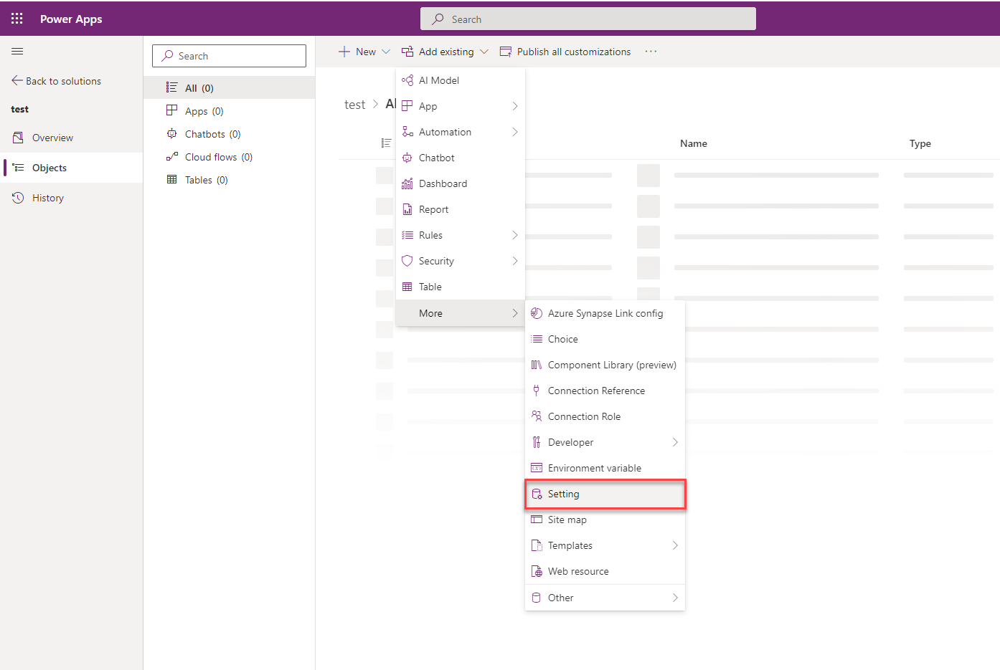
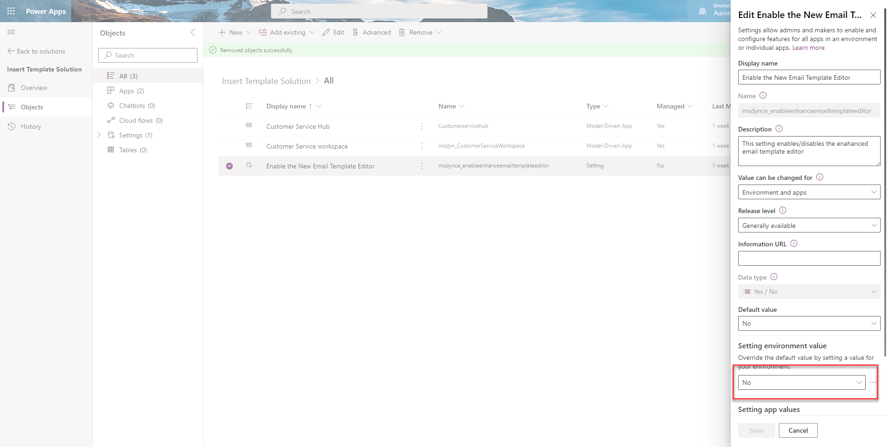
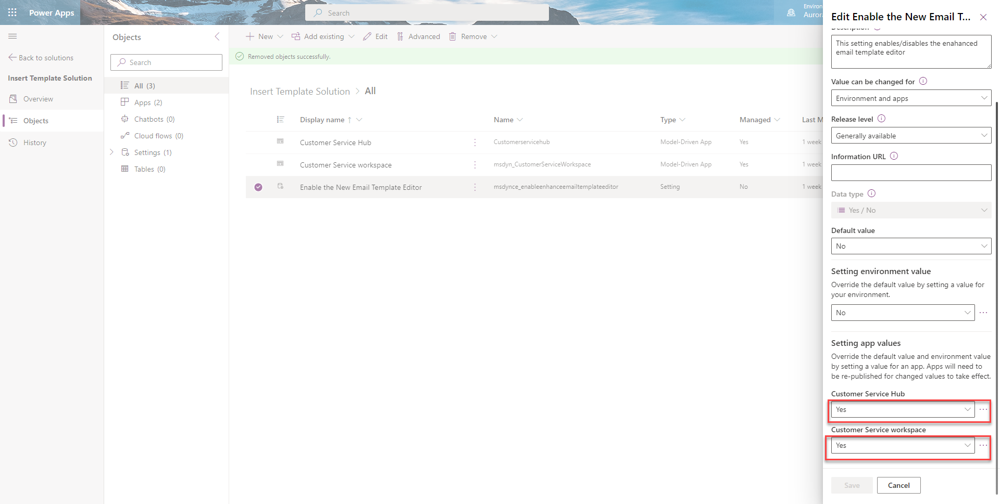

# Enable the enhanced email template editor page

Turn on the enhanced email template editing experience in the Customer Service Hub and Customer Service workspace apps. If you need to, you can turn off the enhanced email template page for a specific app. And then, the users of the app see the default email template editor page.

### Enable the enhanced email template editor for Customer Service apps

1. In [Power Apps](https://make.preview.powerapps.com/), select the environment the environment that contains your solution.
2. Select **Solutions**, and then select the solution in which you want to turn on the enhanced template editing experience.
   > [!NOTE]
   > Don't select the default solution to configure the template.
4. Select **Add Existing** > **More** > **Setting**.

   > 
1. On the **Add existing Setting Definition** pane, select the **Enable the New Email Template Editor** option and then select **Next**.
1. Select **Add** on the **Selected Setting Definition** to add the **Enable the New Email Template Editor** option to your solution. 
1.  Go to **Add Existing** > **App** > **Model-driven app**> **Add existing model-driven apps** pane. Select the Customer Service workspace and Customer Service Hub apps.
1. Select the **Enable the New Email Template Editor** option. The **Edit Enable the New Email Template Editor** pane appears.
1. Set the **Setting environment value** option to **No** on the **Edit Enable the New Email Template Editor** pane.
   > 
1. On the **Edit Enable the New Email Template Editor**, in the **Setting app value** section, the Customer Service Hub and workspace apps are displayed. 
1. Select **New app value** for the app, and select **Yes** for the specified app.
   > 
1. Select **Publish All Customizations**.

### See also

[How to create an email template  in model-driven apps](/power-apps/user/email-template-create)  
[Customize an email template using the template editor](/power-apps/user/cs-template-options)

[!INCLUDE[footer-include](../includes/footer-banner.md)]
