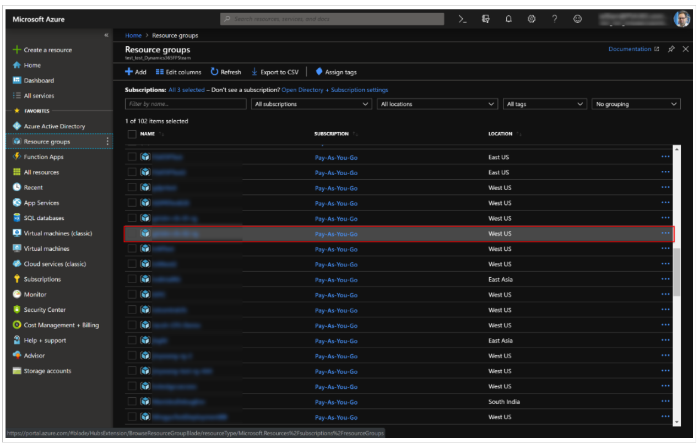
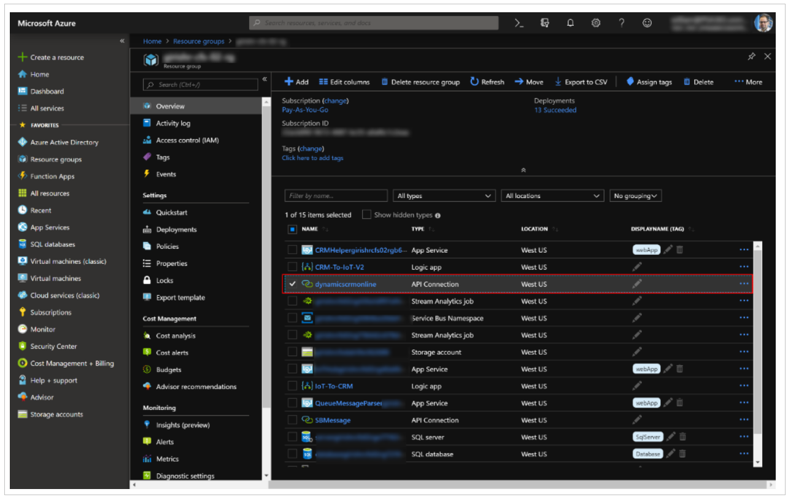
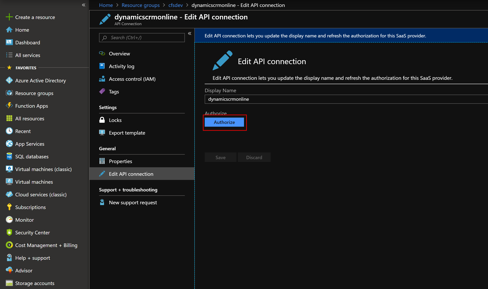

# Authorizing API connections between Dynamics 365 and Azure IoT

In order to begin using Connected Customer Service (CCS) with IoTHub, you need to authorize CRM API Management Access, which is the final step when deploying from [https://iotdeployment.dynamics.com/](https://iotdeployment.dynamics.com/). This allows data and actions to be passed between Azure IoTHub and Dynamics 365. More specifically, it allows LogicApps to read and write Dynamics 365 data bi-directionally. 

Without completing this step, you will not be able to: 

1. Send IotAlerts from IoTHub to Dynamics 365
2. Add a device in Dynamics 365 and register it in IoTHub

## Prerequisites
- Azure account and subscription
- Dynamics 365 Customer Service 
- CCS with IoTHub deployed though deployment app

## Instructions

Sign into your Azure account, and then go to the [Azure portal](https://portal.azure.com). 

From there, go to **Resource Groups** and find the resource group you recently deployed IoTHub to. See the following screenshot for reference.

> [!div class="mx-imgBorder"]
> 

One such resource will be an API Connection type to Dynamics CRM. Select and edit this resource.

> [!div class="mx-imgBorder"]
> 

Finally, select **Authorize**, **Save**, and use your Dynamics 365 credentials that you use to sign into your Connected Customer Service environment, which may be different than your Azure credentials to the Azure portal.

> [!div class="mx-imgBorder"]
> 

Congratulations! You are now ready to pass data between Azure IoTHub and Dynamics 365 to use Connected Customer Service.

[!INCLUDE[footer-include](../includes/footer-banner.md)]
