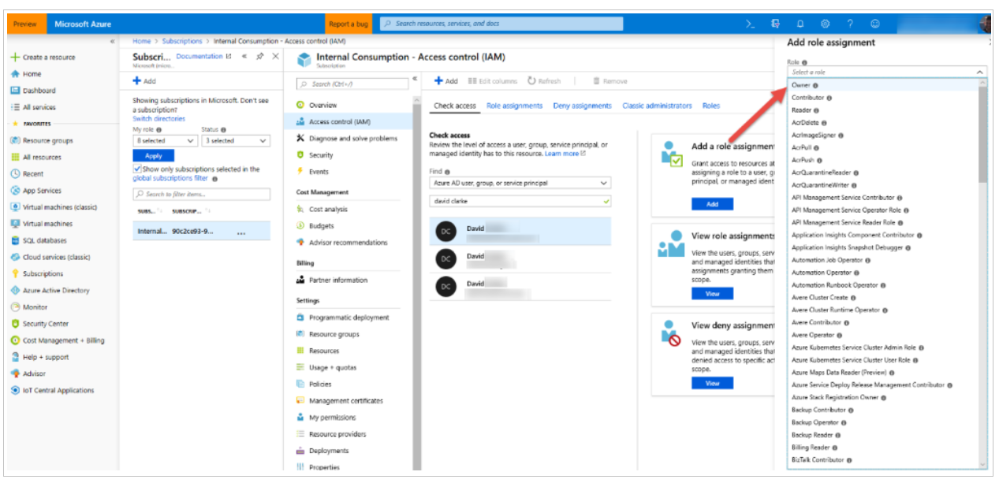
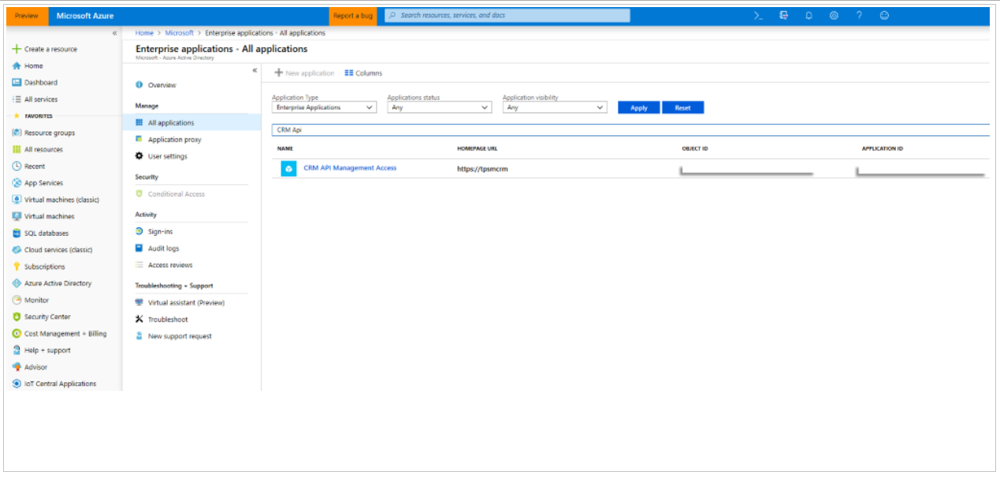

# Azure subscription prerequisites for Connected Customer Service with IoTHub

[!INCLUDE[azure-ad-rename](../includes/cc-azure-ad-rename.md)]

When you're deploying and administering Connected Customer Service with IoTHub, you must make sure of the considerations and prerequisites for your Azure subscription. 

## Prerequisites 

1. You can deploy and administer Connected Customer Service with IoTHub in one Azure tenant only, which should be the home (first) Azure tenant tied to your credentials.

2. To deploy and administer IotHub, you must have one of the following Azure security roles:

- Owner in role assignments (see the following screenshot)
- One of the following administrator roles:
  - Co-administrator
  - Service administrator
  - Account administrator

> [!div class="mx-imgBorder"]
> 

3. You'll see subscriptions that are tied to your sign-in **primary active directory** only. For example, david@contoso.com will see subscriptions from the contoso.com directory only. If jason@fabrikam.com invites David into their fabrikam.onmicrosoft.com subscription, David won't be able to use the fabrikam subscription on the deployment app.

4. Organizational Azure accounts only can be used to deploy CCS with IoTHub; personal accounts such as Outlook or Gmail can't be used.

5. Your user must have permission to use the Dynamics API within the Microsoft Entra ID tenant.

> [!div class="mx-imgBorder"]
> 

[!INCLUDE[footer-include](../includes/footer-banner.md)]
