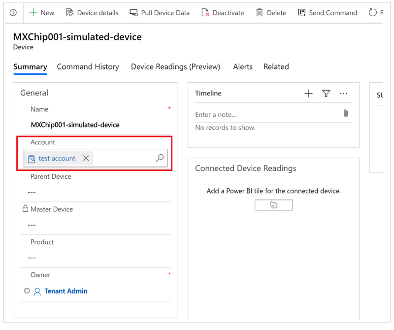

# 2 - Associate devices with customer accounts in Connected Customer Service

If an IoT device isn't associated with a customer account in Connected Customer Service, the system won't be able to generate work orders or cases for incoming alerts. In this tutorial, we'll walk through how to associate a device with a customer account. While customer accounts are an optional association in Azure IoT Central, they're required in Connected Customer Service.

## Goal

Associate a device in Connected Customer Service with a customer account so that work orders or cases can be generated against incoming IoT alerts.

## Steps

1. In your Connected Customer Service application, select **Devices** from the left pane.  

    > [!div class="mx-imgBorder"]
    > 

2. On the **Active Devices** page, select one of the devices that doesn't have an account already associated with it.

    > [!div class="mx-imgBorder"]
    > 

3. On the device's detail page, start typing the name of the customer account in the **Account** field.

    > [!div class="mx-imgBorder"]
    > 

4. Save the changes.

## See the results

This device will now be associated with a customer account, and can receive IoT alerts from Azure IoT Central.

### See also

[Prerequisites for setting up Connected Customer Service for Azure IoT Central](cs-iot-prerequisites.md) 
[Receive IoT alerts in Connected Customer Service from Azure IoT Central](cs-iot-receive-alerts.md) 

[!INCLUDE[footer-include](../includes/footer-banner.md)]
