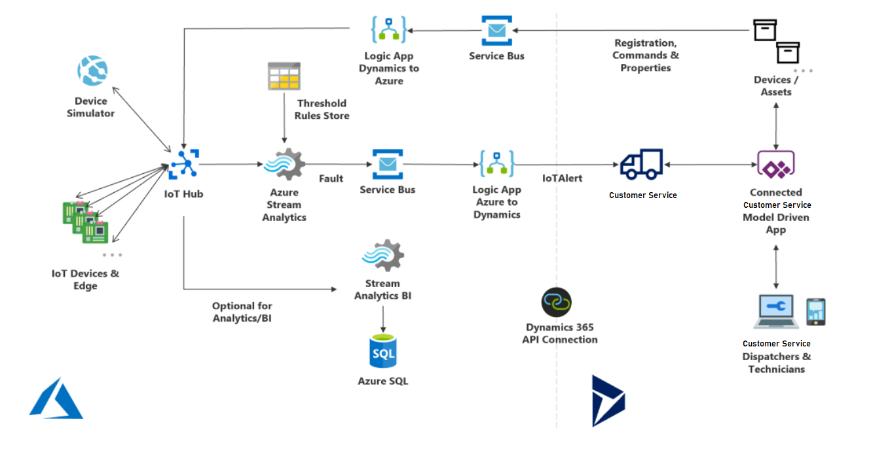

# Architecture of Connected Customer Service with IoTHub

Connected Customer Service with IoTHub brings together AzureIoT and Dynamics 365 Customer Service. In this topic, you will find an explanation of the architecture and how it all works together.

## Prerequisites

To understand what's covered in this topic, you need to know that Connected Customer Service (CCS) refers to a set of solutions, entities, and processes built inside the Dynamics 365 Customer Service Hub app. As of Customer Service Hub 9.0.20034.20XX,  CCS is included as part of Customer Service. 

For this topic, the words **data** and **telemetry** refer to information sent from an IoT device to the cloud. The words **devices** and **sensors** refer to internet-connected things like thermometers, gyroscopes, magnetometers, pressure readers, and more that take specific measurements. An **asset** is a piece of equipment that can have one or more sensors connected to it.

## Architecture

> [!div class="mx-imgBorder"]
> 

- **IoT Devices & Edge**: Internet-connected sensors on equipment send data to IoTHub typically via WiFi or cellular connectivity. A single piece of equipment can have multiple sensors, each taking different measurements such as temperature and pressure. If a building or area has a collection of equipment each with multiple sensors, then an **Edge device** can be used to organize them and broker telemetry sent to IoTHub.

- **Device Simulator**: Administrators can simulate devices and telemetry for testing and development purposes before the hardware is set up. This lets them see how simulated alerts flow to Dynamics 365 Customer Service and create work orders.

- **IoTHub**: The gateway to the cloud, capable of ingesting data on a large scale. IoTHub is a collection of applications and processes tailored to connected device scenarios that are also customizable. Deploying IoTHub will deploy a resource group with this collection of applications and processes.

- **Azure Stream Analytics**: Queries device data as it enters IoTHub. Data only passes through and is not stored.

- **Threshold Rules Store**: Helps decide if device data is abnormal and beyond acceptable boundaries. Abnormal data is characterized as a **Fault**.

- **Service Bus**: Takes faults and enters them into a queue to systematically keep track of them. The queue is helpful for scenarios where faults fail to get transferred to Dynamics 365 and should be attempted again after some time.

- **Stream Analytics & Azure SQL**: Used to store device data for longer time periods to perform data analysis. For example, this would be an option for organizations interested in analyzing large amounts of historical data to predict device failures in the future. This generally incurs a greater Azure cost.

- **Logic App Azure to Dynamics**: Connects Azure with Dynamics 365 (and other applications and platforms). Serves as a way to apply more logic, map entities, and trigger the appropriate actions in Dynamics 365, such as the creation of an **IoT Alert** record. Compare this to IoTCentral, which uses Power Automate.

- **IoT Alert**: Faults are passed from IoTHub to Dynamics 365 in the form of IoT alerts, which is an entity in Customer Service. An IoT alert is the first part of the process inside Dynamics 365. An IoT alert is a subset of all device data that requires attention and potentially an action from the customer service or customer service department.

- **Connected Customer Service Model Driven App**: A set of entities and processes built on Dynamics 365 Customer Service. Among other things, Connected Customer Service allows you to connect IoT devices (sensors) with Customer Service customer assets.

- **Customer Service Agent**: The end users of Connected Customer Service who interact with IoT alerts and cases, on their phones, tablets, and computers.

- **Devices**: Entities in Connected Customer Service in Dynamics 365 that help you manage the sensors and equipment that your organization manages.

- **Registration, Commands & Properties**: Processes used in Connected Customer Service to interact with and send data back to IoTHub and finally to the device, making CCS a bi-directional solution. For example, commands allow you to execute actions on devices such as reboot. Another example is to display a message on the device for someone to view..

- **Logic App Dynamics to Azure**: The reverse of the previously explained Logic App, this adds detail to data and actions that need to be sent to IoTHub from Dynamics. IoTHub will then send the data or action to the connected device.

## Component data flow diagram
A data flow between the Azure IoT Hub and Connected Customer Services components is detailed in this [downloadable diagram](https://download.microsoft.com/download/3/A/7/3A744B76-3E04-49F5-A30B-938400CEB73E/AzureIoTCfsDataFlowDiagram.jpg). It details each information flow, its flow direction and relative order for a standard installation of Connected Customer Service for Dynamics 365.
