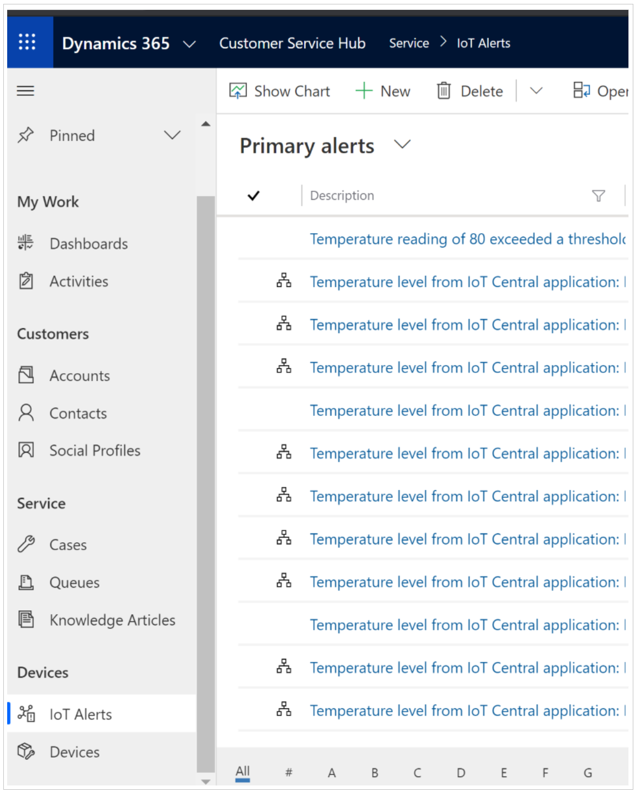
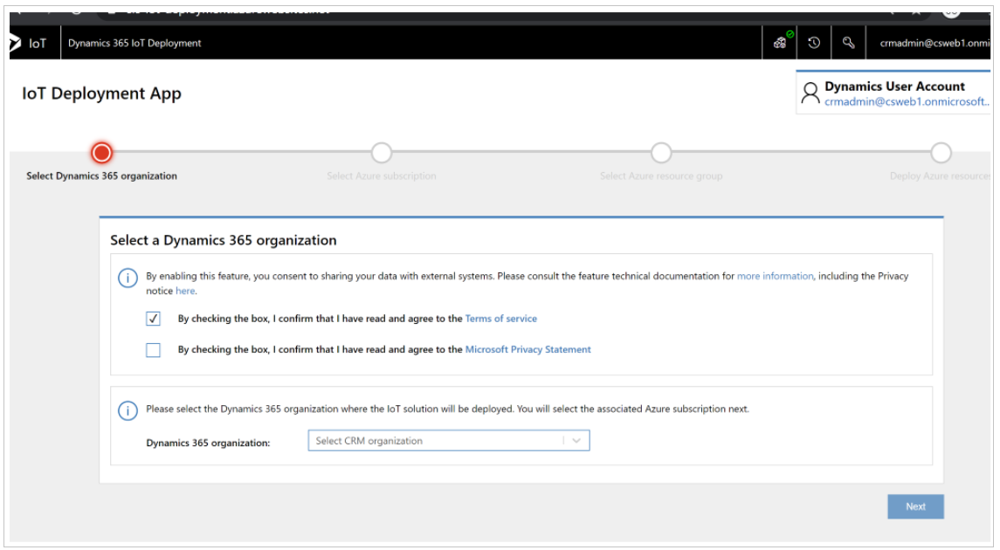
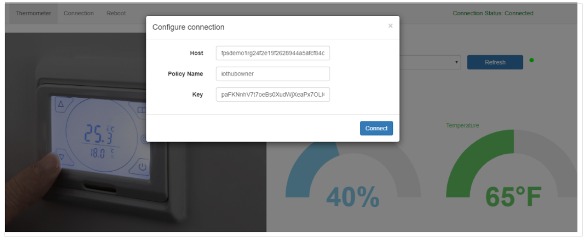
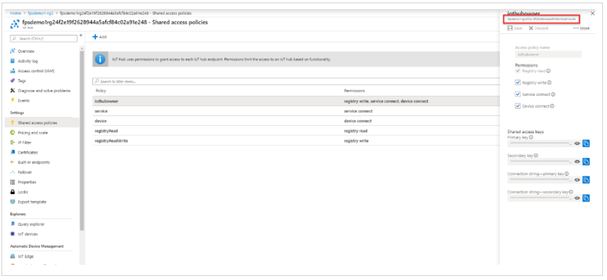
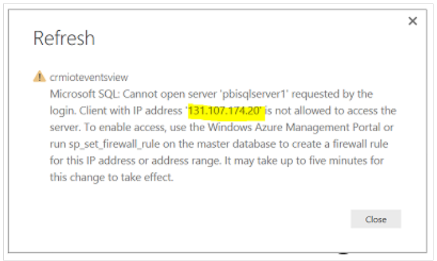

# Installation and setup - Connected Customer Service for IoT Hub

This guide provides the steps required for getting up and running with Connected Customer Service (CCS) for IoT Hub. If you're looking for information about CCS for IoT Central, be sure to visit our tutorial on getting set up.

## Prerequisites  
 Before you install Connected Customer Service, make sure you have the following:  
  
- Dynamics 365 system administrator credentials. For users with Microsoft 365 global administrator access, they must be assigned the **System Administrator** security role within the Dynamics 365 organization.
   
- An IoT – Administrator role in the IoT solution (to access IoT entities and IoT functionality), plus another role, like Customer Service – Dispatcher (to access Dynamics 365).  
  
- An active Azure subscription with appropriate privileges. See our [topic on Azure prerequisites](cs-iot-azure-subscription-prerequisites.md) for more information.
  
- Microsoft Power BI PRO and the sample report template. [!INCLUDE[proc_more_information](../includes/proc-more-information.md)] [Download the Power BI Template for Connected Customer Service](https://download.microsoft.com/download/E/B/5/EB5ED97A-A36A-4CAE-8C04-333A1E463B4F/PowerBI%20Report%20Template%20for%20Connected%20Field%20Service%20for%20Microsoft%20Dynamics%20365.pbix)  
  
   

## Install Connected Customer Service  
 
Connected Customer Service is included with Dynamics 365 Customer Service. Creating a new Customer Service environment or upgrading an existing one to v9.0.20034.20XX+ will automatically include the following Connected Customer Service entities and related processes:

 - Devices
 - IoT alerts
 
 
> [!div class="mx-imgBorder"]
> 

Verify you have the Connected Customer Service entities in your environment.

Next, deploy and connect Azure IoTHub to your Customer Service environment by going to [https://iotdeployment.dynamics.com/](https://iotdeployment.dynamics.com/) and following the instructions.

> [!div class="mx-imgBorder"]
> 

  
### Set up the sample simulator (optional)  
 To find the simulator URL, sign in to your Azure subscription, and then select the App Service resource type under the newly created resource group. You’ll see the URL is in the top-right corner. Copy the URL and complete the following steps:  
  
1. Paste the URL into your browser’s address bar to load the page.  
  
2. When the simulator page opens, click **Configuration**.  
  
3. Enter the IoT hub host name and key. The host is simply the name of the IoT Hub resource in Azure portal. 

> [!div class="mx-imgBorder"]
> 

 The key can be accessed by clicking on the IoT Hub resource and going to the shared access policies, then copying the primary key for **iothubowner** as seen in the following screenshot.

> [!div class="mx-imgBorder"]
> 
  
4. Select the IoT hub in the **Resource Group**.  
  
5. On the left under **General**, click **Shared access policies** to get the host name and primary key.  
  
6. Make sure **Connection status**  is marked as **Connected** and then close the dialog box.  
  
   Now you can send a test command by using the sample simulator. For example, click the temperature and increase it to above 70 degrees.  
  
   

### Set up a Power BI chart (optional)  
 Set up Power BI accounts and open the sample .pbix report.  
  
1. Go to [https://powerbi.microsoft.com](https://powerbi.microsoft.com) and create a free Power BI account.  
  
2. [Install Power BI Desktop](https://powerbi.microsoft.com/desktop/).  
  
3. Sign in to Power BI Desktop with the Power BI user credentials (we recommend that this user is the same as the Dynamics 365 user).  
  
4. Download and open the sample Power BI template.  
  
   The Power BI report will open with errors because it was created with a sample SQL database and user. Update the query with your SQL database and user, and then publish the report to Power BI.  
  
#### Update the query to point to your SQL database  
  
1. Click **Edit Queries**.  
  
2. Click **Advanced Editor**.  
  
3. Replace the source SQL database with the database provisioned in your Azure resource group.  
  
4. Click **Close and Apply**.  
  
    You can find your SQL server name in the SQL database in the Azure portal.  
  
5. Add your IP address to the SQL server firewall to allow Power BI Desktop to connect to the SQL server.  
  
6. Copy the IP address when you see this message.  
  
> [!div class="mx-imgBorder"]
>   
  
7. Go to the Azure portal, open the SQL server, and add your IP address to the firewall.  
  
#### Publish to your Power BI account  
  
1.  Save your changes and publish.  
  
2.  Once you publish, Power BI Desktop will provide a link and message that instructs you to open the report and provide credentials.  
  
3.  Once the report is open, you’ll see notifications to edit your credentials.  
  
4.  Enter the SQL server admin user name and password to allow Power BI to access your database.  
  
5.  In the Power BI  sidebar, open the report and pin these tiles to a dashboard. You can create a dashboard or pin to an existing one.  
  
6.  Save the dashboard, and then share it with any users who have permissions to see the dashboard and tiles.  
  
    -   In the top-right corner of the dashboard, click **Share**, enter the users email address, and click the **Share** button.  
  
#### Pin the tile in Dynamics 365  
  
1.  Open the device, alert, or asset form.  
  

    > [!IMPORTANT]
    >  The device that is related to any of the open forms must have a device ID and be registered; otherwise, the PowerBI section will be hidden.

2.  The first time you will need to specify the tile you want pinned. After that, the tile will load when you go to the page.

    1.  Click the **Add** button.

    2.  A configuration window displays. Sign in if prompted.

    3.  Pick your dashboard and tile.

         A preview of the tile will load; however, if you have not run the simulator for that device, there will be no data, as shown here.

3.  Save the tile.

4.  The config window closes, and the Power BI section reloads with the pinned tile.

5.  The tile is filtered to the device ID of the current entity.

6.  The next time you load any of the device, alert, or asset forms, the Power BI section will load the tile automatically, filtered to the current entity device ID (if there is a device ID and the device has been registered).

## Categorize devices  
 You can also manage devices by categorizing them. For example, you can categorize devices by the commands they support, the type of device, or by devices that break down more often.  
  
### Create a new IoT device category  
  
1. Navigate to either on the Customer Service Hub or on Customer Service admin center (preview) app, and perform the following steps:

    ### [Customer Service admin center (preview)](#tab/customerserviceadmincenter)

    > [!IMPORTANT]
    > The Customer Service admin center app is in preview. [!INCLUDE[cc-preview-features-definition](../includes/cc-preview-features-definition.md)]

      1. In the site map, select **Miscellaneous** in **Operations**.
      1.  In the **Device Categories** section, select **Manage**.
       
          The **Active IoT Device Categories** view is displayed. You can switch between various system views using the drop-down list.  

     ### [Customer Service Hub](#tab/customerservicehub)

     1. In the site map, go to **Service Management**.
     1. From the list of entity records, select **Device Categories** IN **IoT**.
       
        The **Active IoT Device Categories** view is displayed. You can switch between various system views using the drop-down list. 
   
2.  On the command bar, click **New**.  
  
3.  Enter a **Name** for the device category.  
  
4.  Use the helpful tooltips to fill in information.  
  
5.  When you're done, select **Save**.  
  
6.  Open the IoT device category record that you created.  
  
7.  In the **Devices** section, click **Add IoT Device record**, and then add a device to the category.  
  
### Add devices to an existing category  
  
1.  From the main menu, select **Internet of Things** > **Registered Devices**.  
  
2.  Click an IoT device record to open it.  
  
3.  In the **Category** field, use the search button to find and add the device to a category.  
  
   
## View device readings  
 Once a device is registered, you can open the record to view the readings sent by the device. For example, if you’re monitoring a thermostat, your reading will show the thermostat temperature.  
  
 By default, you can view the last 20 readings. You can change the default setting in the Power BI report by using Power BI Desktop.  
  
1.  To view a device reading, from the main menu, click **Customer Service** > **Devices**.  
  
2.  From the list of devices, choose a device and open the record.  
  
3.  Refer to the **Connect Device Readings** section to view the device readings.  
  
   
## Remotely send commands to a registered device  
 When a device isn’t working properly, the system receives an alert. To troubleshoot the issue remotely, you can send a command by choosing a registered device or by using an existing IoT alert.  
  

> [!NOTE]
>  When you receive multiple alerts from the same device, the alerts will be listed in hierarchical order. You can change the grouping by changing the IoT - Parent IoT Alerts workflow.

### Send commands from a registered device

1.  From the main menu, click **Customer Service** > **Devices**.

2.  From the list of devices, choose a registered device.

3.  On the command bar, click **Send Command**.

4.  Enter a **Name** for the command.

5.  In the **MESSAGE TO SEND** box, copy and paste one of these supported commands. `{"CommandName":"Reset Thermostat","Parameters":{}}` `{"CommandName":"Notification","Parameters":{"Message":"Technician has been dispatched"}}` `{"CommandName":"Set Values","Parameters":{"Reading":{"Temperature":"30","Humidity":"30"}}}`

    > [!NOTE]
    >  Before sending a command, make sure there are no spaces or extra characters in the command.

6.  On the command bar, click **Send & Close** to send the command.

### Respond to an alert

1.  Navigate to **Customer Service** > **IoT Alerts**.

2.  Choose an existing IoT alert record.

3.  On the command bar, select **Send Command**.

4.  Enter a **Name** for the command.

5.  In the **MESSAGE TO SEND** box, copy and paste one of the supported commands listed in the section above.

6.  On the command bar, click **Send & Close** to send the command.

### View history of commands sent to a device

1.  From the main menu, click **Customer Service** > **Devices**.

2.  From the list, choose a device.

3.  Scroll down to the **Command** section to view the history.

## Create business process flows to automatically handle incoming IoT alerts
 When you receive an alert from a device, your service team can manually monitor the alerts and troubleshoot the issue remotely. If the issue is not resolved by sending a remote command, the service rep can create a case or work order and dispatch a field tech. The provided business process flow guides you through the process of manually responding to IoT alerts. [!INCLUDE[proc_more_information](../includes/proc-more-information.md)] [Create a business process flow](../customerengagement/on-premises/customize/create-business-process-flow.md)

 

## View the IoT dashboard
 The default IoT dashboard provides data on registered devices and alerts. [!INCLUDE[proc_more_information](../includes/proc-more-information.md)] [Create or customize dashboards](../customerengagement/on-premises/customize/create-edit-dashboards.md)

1.  From the main menu, click **Customer Service** or **Internet of Things**.

2.  Click **Dashboard**.

    -   The first chart shows alerts that you can sort by clicking the IoT **Alerts by** menu.

    -   The second chart shows alerts by time.

    -   The third chart shows alerts along with the action taken to resolve the issue.

## Privacy notice
By installing Connected Customer Service for Dynamics 365, when you provide your Azure subscription information, the required Azure resources (listed below) will be deployed and your Dynamics 365 for Customer Engagement instance will send data (such as commands and registrations) to Azure to enable IoT–enabled scenarios that register devices and then send and receive commands to the registered devices. An administrator can uninstall Connected Customer Service to remove the functionality and then navigate to the Azure portal to manage any related Azure services that are no longer needed. 

Azure components and services that are involved with Connected Customer Service functionality are detailed in the following sections. 

Note: For more information about additional Azure service offerings, see the [Microsoft Azure Trust Center](https://azure.microsoft.com/support/trust-center/). 

[Service bus queue](/azure/service-bus-messaging/service-bus-dotnet-get-started-with-queues) 

This provides a queue for both inbound and outbound messages (commands) flowing between Dynamics 365 for Customer Engagement and Azure. When an IoT alert is sent to Dynamics 365 for Customer Engagement, or a command is sent from Dynamics 365 for Customer Engagement to the IoT hub, it will be queued here. 

[Logic Apps](https://azure.microsoft.com/services/logic-apps/) 

This provides an orchestration service that uses a Dynamics 365 for Customer Engagement connector and a Queue connector. Dynamics 365 for Customer Engagement connectors are used to construct entities that are specific to Dynamics 365 for Customer Engagement and Queue connectors are used for polling the queue. 

[Stream analytics](https://azure.microsoft.com/services/stream-analytics/) 

This provides a fully managed, real-time event processing engine that helps to unlock deep insights from data. Stream Analytics makes it easy to set up real-time analytic computations on data streaming from devices, sensors, web sites, social media, applications, infrastructure systems, and more. It is functioning as a funnel to send selective IoT alerts to Dynamics 365 for Customer Engagement. 

[IoT Hub](https://azure.microsoft.com/services/iot-hub/) 

Connected Customer Services uses the IoT Hub to manage the state of registered devices and assets. In addition, the IoT Hub sends commands and notifications to connected devices—and tracks message delivery with acknowledgement receipts. Device messages are sent in a durable way to accommodate intermittently connected devices. 

Simulator

This is a test web app to emulate the device that is sending commands or receiving commands from the IoT hub. 

[Azure SQL Database](https://azure.microsoft.com/services/sql-database/)

Connected Customer Service uses SQL Azure to store device heartbeat messages for later use by PowerBI to show the status of devices in Dynamics 365 for Customer Engagement. 

[Azure Blob Storage](https://azure.microsoft.com/services/storage/) 

Queries that Stream Analytics will use are stored to Azure Blob storage. 

[Azure Time Series Insight (Preview)](/azure/time-series-insights/) 

[!INCLUDE[footer-include](../includes/footer-banner.md)]
