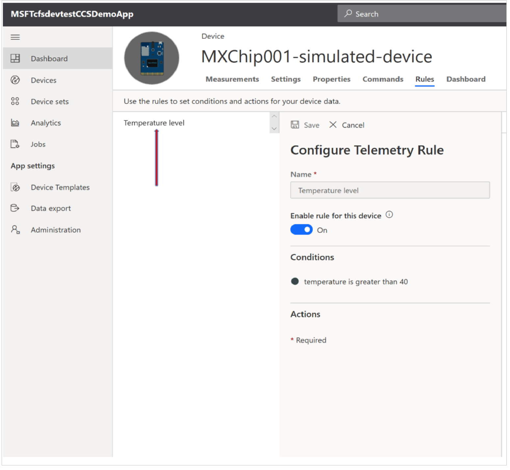
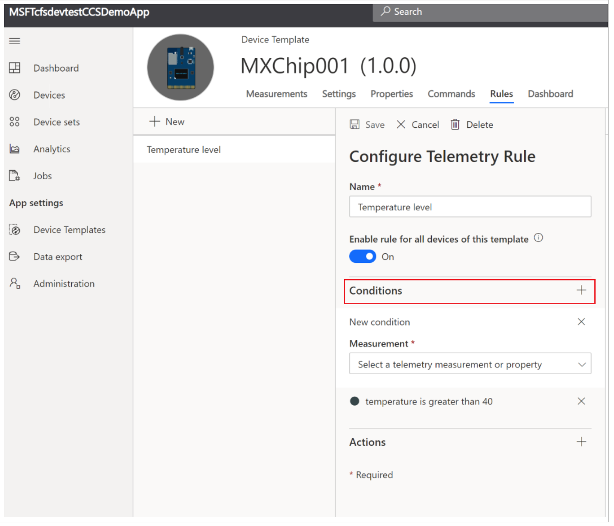
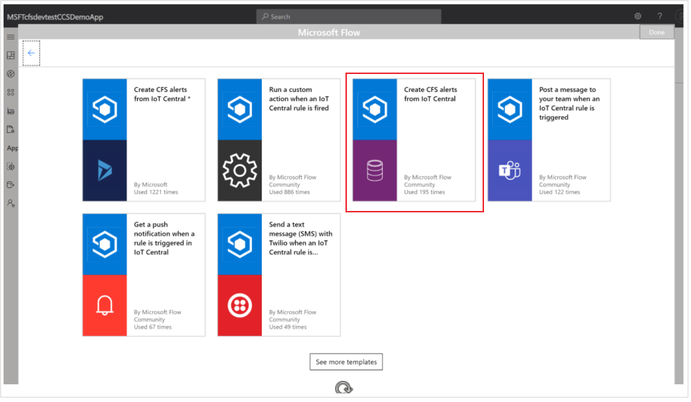
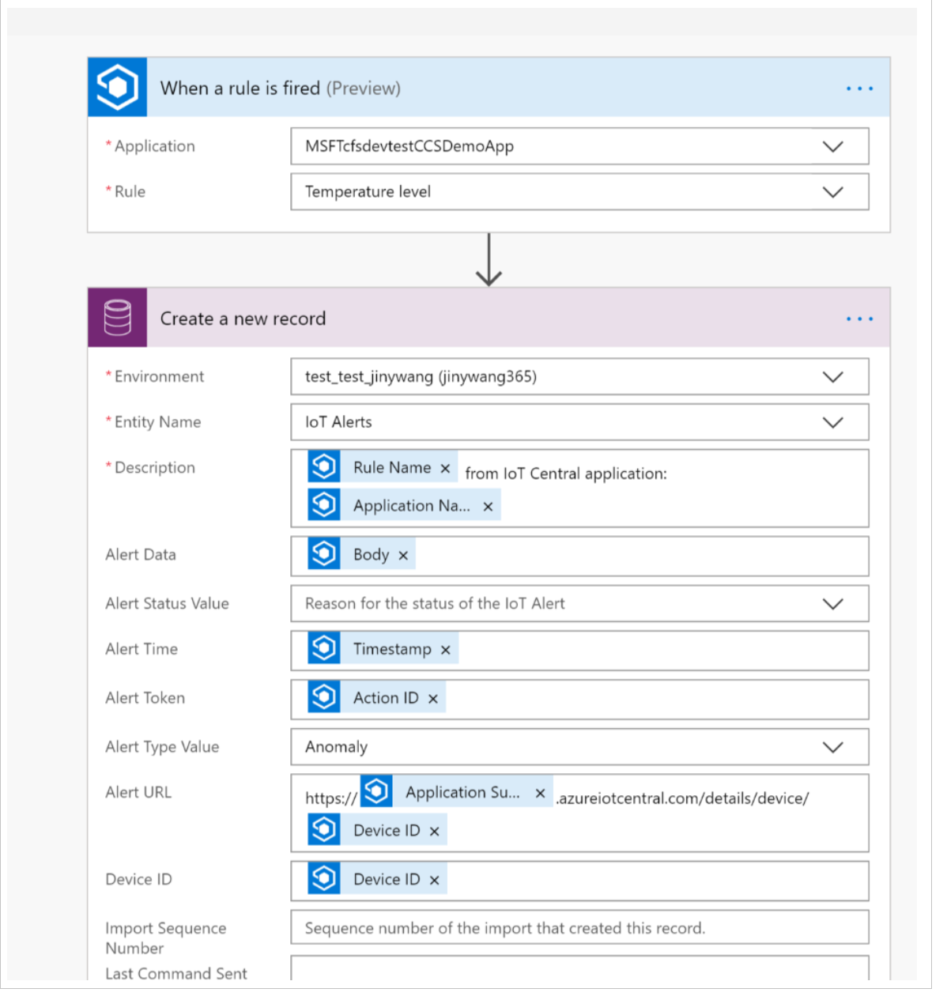
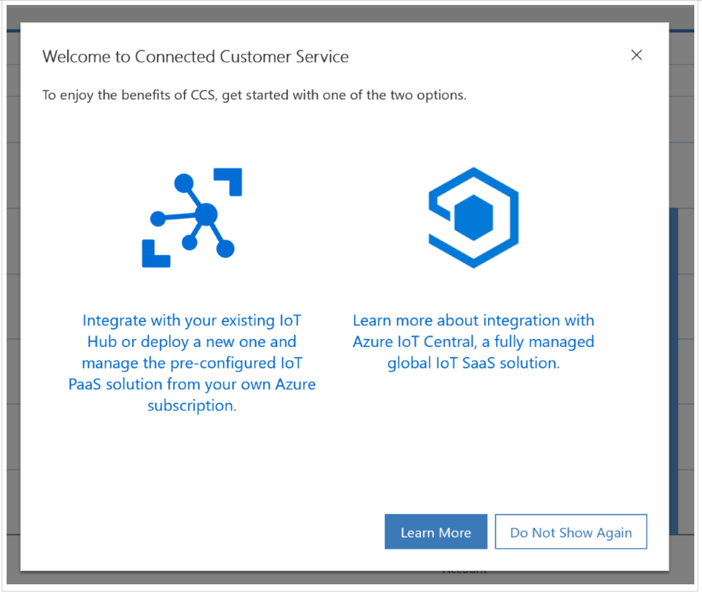

# 1 - Receive IoT alerts in Connected Customer Service from Azure IoT Central

At the end of this step in the tutorial, you'll be able to receive and see alerts from Azure IoT Central in your instance of Connected Customer Service. IoT alerts will display on your dashboard and relate to relevant work orders that have been created automatically.  

## Goal

Connect Azure IoT Central to Connected Customer Service by configuring the "Create Connected Service alerts from IoT Central" template in Power Automate.

## Steps

1. Sign in to your Azure IoT Central application and navigate to **Devices**.

    > [!div class="mx-imgBorder"]
    > 

2. From the list of devices, select **MXChip001**.

    > [!div class="mx-imgBorder"]
    > 
   
   The MXChip001 detail page is displayed.

3. Select the **Rules** tab, and then create the rule, **Temperature level**. More information: [IoT Central tutorial](/azure/iot-central/tutorial-configure-rules).

    > [!div class="mx-imgBorder"]
    > 

4. Select the plus sign (+) next to **Conditions** to set up the alert trigger threshold. 
    
    > [!div class="mx-imgBorder"]
    > 

5. Select the plus sign (+) next to **Actions**, and then select **Microsoft Flow**. This is where you'll set up your integrations.

    > [!div class="mx-imgBorder"]
    > 

    > [!div class="mx-imgBorder"]
    > 

   The Power Automate template page for **Create Connected Service alerts from IoT Central** is displayed.

6. Select **Use this template**. (If you can't find these templates, go to the [Power Automate Templates page](https://flow.microsoft.com/templates/) and search for "CDS").

    > [!div class="mx-imgBorder"]
    > 

    > [!div class="mx-imgBorder"]
    > 

7. You'll be prompted to sign in to both IoT Central and Dynamics 365 accounts. Select your accounts from each, and then select **Continue**. 

    > [!div class="mx-imgBorder"]
    > 
    
   Now you'll see the actual flow.

8. Because this is a template, you only need to take the following actions:

    a. Select your Azure IoT Central application name.

    b. Set **IoT rule** as the one you created earlier. In our suggested example, it would be: "Temperature level".

    c. Select your Dynamics 365 organization name.

    d. Set **Entity Name** to **IoT Alerts.**

    e. Select **Show advanced options** to reveal several hidden customers.

    f. Set **Alert Type Value** to **Anomaly**.

    g. Save the flow.

    > [!div class="mx-imgBorder"]
    > 

    > [!div class="mx-imgBorder"]
    > 

From here, the workflow will trigger based on the alert type.

## See the results

1. After you've saved your flow, sign in to Dynamics 365 Customer Service, and then select **Connected Customer Service**. 
   You might see a window that offers a few links to learn more about Connected Customer Service and Azure IoT offerings. You can choose to learn more, or just dismiss this window. 

   > [!div class="mx-imgBorder"]
   > 

2. In Connected Customer Service, you should now see incoming alerts from Azure IoT Central on the dashboard. You can select one of these alerts to see more details, including device information, threshold, and the violated rules. You can also select the IoT Central alert URL that will take you back to IoT Central.

   > [!div class="mx-imgBorder"]
   > 

   > [!div class="mx-imgBorder"]
   > 

### See also

[Prerequisites for setting up Connected Customer Service for Azure IoT Central](cs-iot-prerequisites.md) 
[Associate devices with customer accounts in Connected Customer Service](cs-iot-central-associate-devices.md) 

[!INCLUDE[footer-include](../includes/footer-banner.md)]
