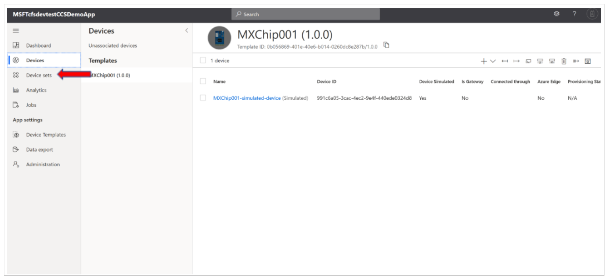
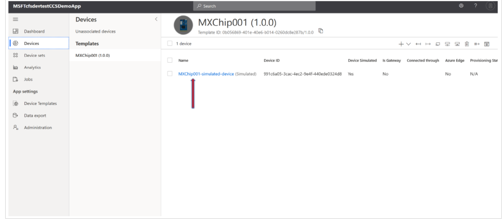
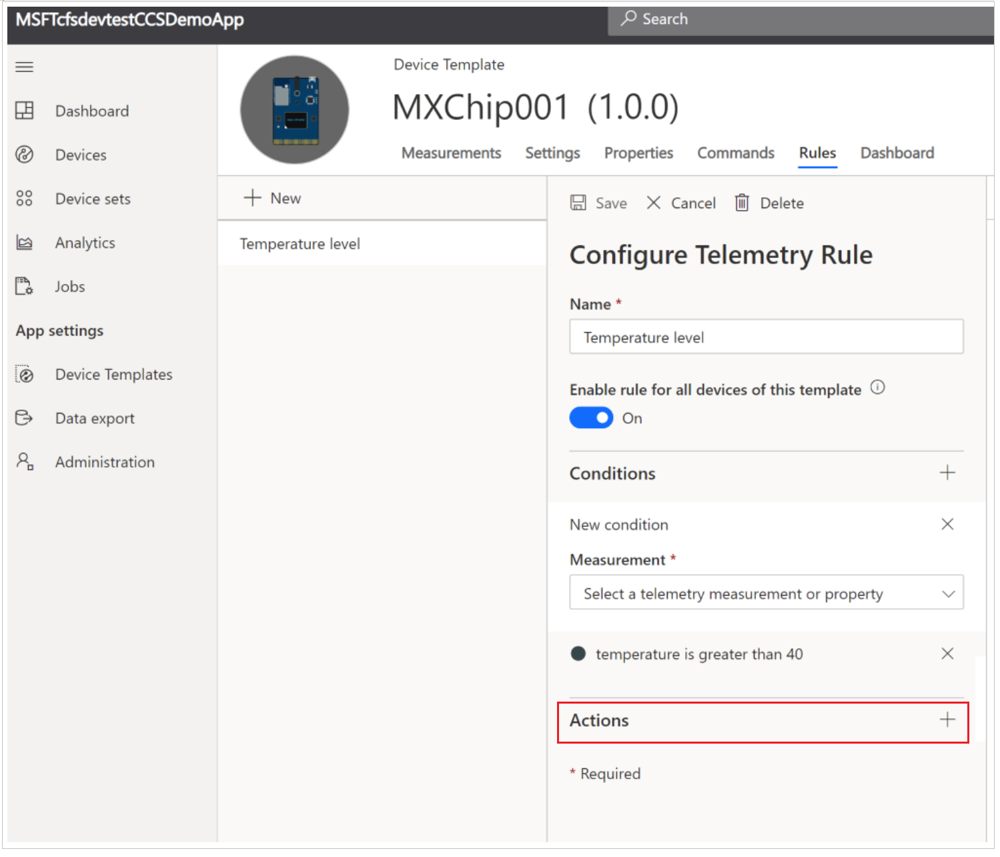
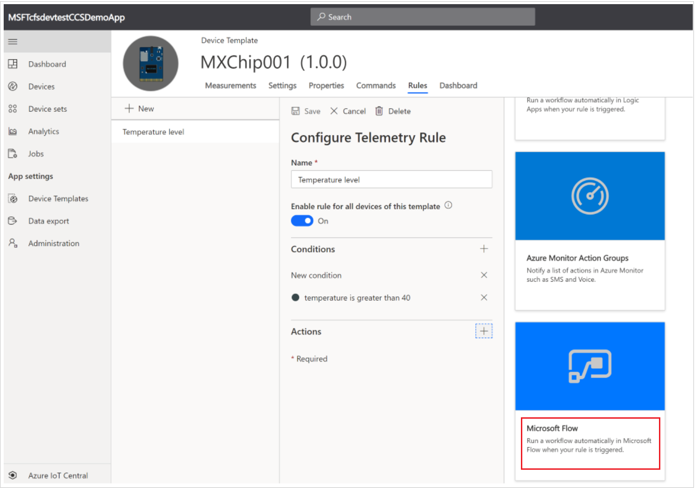
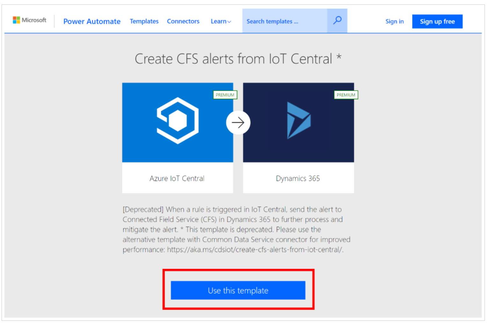
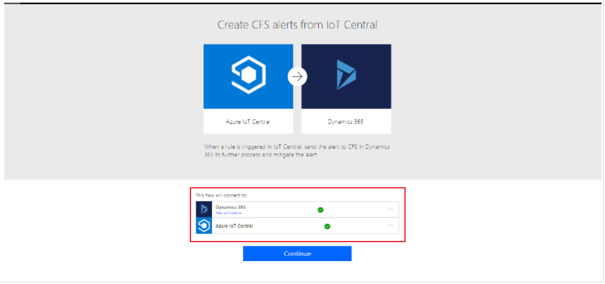
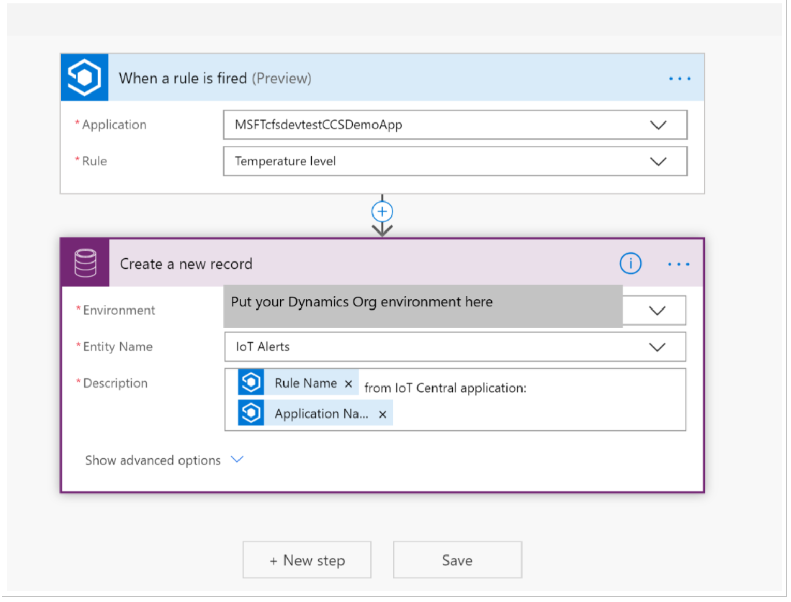

# 1 - Receive IoT alerts in Connected Customer Service from Azure IoT Central

At the end of this step in the tutorial, you'll be able to receive and see alerts from Azure IoT Central in your instance of Connected Customer Service. IoT alerts will display on your dashboard and relate to relevant work orders that have been created automatically.  

## Goal

Connect Azure IoT Central to Connected Customer Service by configuring the "Create Connected Service alerts from IoT Central" template in Power Automate.

## Steps

1. Log into your Azure IoT Central application and navigate to **Devices.**

    > [!div class="mx-imgBorder"]
    > 

2. From the list of devices, select "MXChip001".

    > [!div class="mx-imgBorder"]
    > 

3. Once on the MXChip001 detail page, navigate to the **Rules** tab, and create the rule "Temperature level." For more information on creating a rule, learn more in [this IoT Central tutorial](https://docs.microsoft.com/azure/iot-central/tutorial-configure-rules).

    > [!div class="mx-imgBorder"]
    > 

4. Then, under **Conditions**, select **+** to set up the alert trigger threshold. 
    
    > [!div class="mx-imgBorder"]
    > 

5. Then, under **Actions**, click **+**, and then choose **Microsoft Flow**. This is where you will set up your integrations.

    > [!div class="mx-imgBorder"]
    > 

    > [!div class="mx-imgBorder"]
    > 

6. You'll be taken to the Power Automate template page for "Create Connected Service alerts from IoT Central." Select **Use this template**. (If you have trouble finding these templates, head to the [Power Automate Templates page](https://flow.microsoft.com/templates/) and search for "CDS").

    > [!div class="mx-imgBorder"]
    > 

    > [!div class="mx-imgBorder"]
    > 

7. You'll be prompted now to sign in to both IoT Central and Dynamics accounts. Select your accounts from each, and then select **Continue**. 

    > [!div class="mx-imgBorder"]
    > 

8. Now you'll see the actual Flow. Because this is a template, the only actions you must take are:

    a. Select your Azure IoT Central application name.

    b. Set IoT rule as the one you created earlier. In our suggested example, it would be: "Temperature level."

    c. Select your Dynamics 365 organization name.

    d. Set Entity Name to **IoT Alerts.**

    e. Select "Show advanced options" to reveal several hidden customers.

    f. Set **"Alert Type Value** to **Anomaly** 

    g. Save the Flow.

    > [!div class="mx-imgBorder"]
    > 

    > [!div class="mx-imgBorder"]
    > 

From here, the workflow will trigger based on the alert type.

## See the results

Once you've saved your Flow, log in to Dynamics 365 Customer Service, and select **Connected Customer Service**. You may see a window that offers a few links to learn more about Connected Customer Service and Azure IoT offerings. You can choose to learn more, or just dismiss this window. 

> [!div class="mx-imgBorder"]
> 

In Connected Customer Service, you should now see incoming alerts from Azure IoT Central on the dashboard. You can select one of these alerts to see more details, including device information, threshold, and the violated rules. You can also select the IoT Central alert URL that will take you back to IoT Central.

> [!div class="mx-imgBorder"]
> 

> [!div class="mx-imgBorder"]
> 
