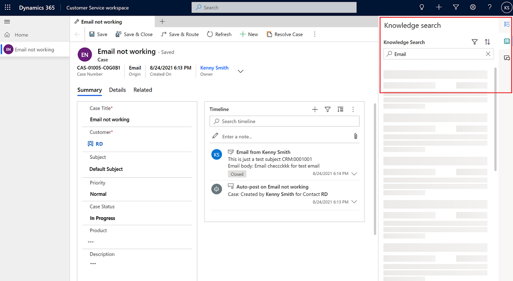
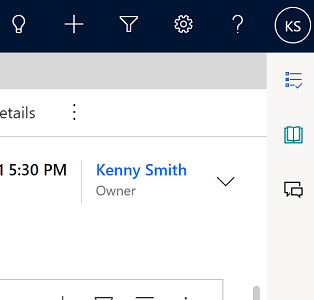

# Use the productivity pane to help resolve customer issues

The productivity pane in the Customer Service workspace is an auxiliary work area that contains tools for supporting or expediting tasks when agents are resolving customer issues.

Currently, the productivity pane includes controls to help agents quickly view and interact with relevant AI-generated knowledge articles and similar cases suggestions for the case they are working on, work with agent scripts and macros, and search for knowledge base articles.

The productivity pane and the controls are enabled for agents through profiles that are managed in app profile manager. More information: [App profile manager](../app-profile-manager/app-profile-manager.md)

> [!Important]
> The productivity pane displays information (for example, knowledge article and similar case suggestions) for the first tab (referred to as the anchor tab) of an active case session.

## Productivity pane modes

The productivity pane has two modes: expanded and collapsed. Depending on which settings your administrator has configured, you can use the arrow to set the mode of the productivity pane, and the mode you choose is preserved in different sessions. For example, say in session A you expanded the pane, but while in session B, you collapsed it. When you switch from session A to session B, the pane mode changes from expanded to collapsed. Then if you switch back to session A, the pane is still in its expanded mode.

**Expanded mode**:

**Collapsed mode**:

Two things to keep in mind about the productivity pane modes:

The productivity pane stays collapsed for entities that don't have productivity controls configured to use it. For example, if you open an account record, which typically doesn't have smart assist or knowledge enabled for it, or if agent scripts or macros aren't enabled by your administrator, the pane remains collapsed. 

The productivity pane places focus on the first control that has data for any table. Typically, the order is smart assist, agent scripts and macros, and then knowledge controls. For example, if you open an account record that has only scripts configured, when the record opens, the productivity pane expands and the focus is on the agent scripts and macros. 

## Smart assist

Smart assist is an intelligent assistant that provides real-time recommendations to help you take actions while interacting with customers. It allows organizations to build a custom bot and plug-in to their environment. These custom bots interpret conversations in real time and provide relevant recommendations such as knowledge articles, similar cases, and next-best steps to the agent's user interface.

Smart assist displays the relevant suggestions as individual cards that are grouped as either Knowledge article suggestions or Similar cases suggestions. For more information, see [View AI-suggested similar cases and knowledge articles](csw-view-ai-suggested-cases-knowledge-articles.md).

## Agent scripts and macros

> [!Important]
> - In the out-of-box Customer Service workspace application, you must first create a custom profile before you can enable agent scripts. Only the Smart assist and knowledge article search functions are available in the out-of-box experience. For information about creating custom profiles, see [Overview of app profile manager](../app-profile-manager/overview.md). 

Agent scripts in Customer Service workspace help provide guidance for what you should do when you have a customer issue, and helps ensure that you share only accurate and company-endorsed information. These scripts help you be accurate, effective, and efficient in customer handling. For more information, see [Guide customer interaction with agent scripts](oc-agent-scripts.md). For administrator information about configuring scripts, see [Guide agents with scripts](../app-profile-manager/agent-scripts.md).

A macro is a set of instructions that tells the system how to complete a task. When a macro runs, the system performs each instruction. Macros in agent scripts show a title, instruction that system performs, and the macro icon. For administrator information about configuring macros, see [Automate tasks with macros](../app-profile-manager/macros.md). 

## Knowledge article search

The knowledge base search lets you search for relevant knowledge articles to resolve a case. These articles are displayed based on relevance and full-text search mechanisms. For more information, see [Search for knowledge articles](search-knowledge-articles-csh.md). 

### See also

[Customer Service workspace - overview](csw-overview.md)  
[View AI-suggested similar cases and knowledge articles](csw-view-ai-suggested-cases-knowledge-articles.md)  
[Guide customer interaction with agent scripts](oc-agent-scripts.md)  
[Automate tasks with macros](../app-profile-manager/macros.md)  
[Search for knowledge articles](search-knowledge-articles-csh.md)

[!INCLUDE[footer-include](../includes/footer-banner.md)]
