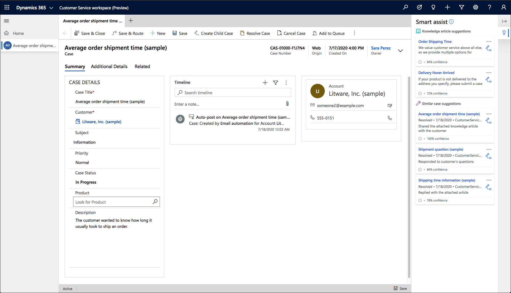

# View AI-suggested similar cases and knowledge articles

[!include[cc-beta-prerelease-disclaimer](../includes/cc-beta-prerelease-disclaimer.md)]

## Introduction

If your administrator has enabled the AI-suggested similar cases and knowledge articles, you can view the similarly resolved cases and knowledge articles that are displayed on the Smart assist pane when you open an active case.

[!IMPORTANT]
The **Smart assist** pane is displayed only when you open the case in a new session tab by using the Shift+mouse click action.

## Prerequisites

- *List the role information*
- *List the availability of smart assist*

## How the AI model works for displaying similar cases and knowledge articles

When you open a case to work on it, the top three knowledge articles and the top five similar cases chosen by the AI model that match the case context are displayed. The smart assist uses [Microsoft Adaptive Cards](https://docs.microsoft.com/adaptive-cards/) to display the information as annotated and explained in this section.

The following table lists the explanation of the smart assist card for AI-suggested knowledge articles.

| Callout | Description |
|--------|-------------|
| 1 | Displays the information about the cards when selected.|
| 2 | Title of the related knowledge article. |
| 3 | More commands|
| 4 | Displays the actions that can be performed when you select more commands:   - **Copy Url:** Copies the knowledge article link to the clipboard.   - **Email URL:** Opens the email compose form with the link to the article pasted in the email body.   - **Email:** Opens the email compose form with the contents of the knowledge article pasted in the mail body.|
| 5 | Select to link the article with the case as a related article. |
| 6 | The first few lines of the knowledge article. |
| 7 | Select to display information on the keywords that were used by the AI model to match the article. |
| 8 | The match rate in percent value. |
|  |  |

The following table lists the explanation of the smart assist card for AI-suggested similar cases.

| Callout | Description |
|--------|-------------|
| 1 | Displays the title of the similar case.|
| 2 | Displays the actions that can be performed when you select more commands:  - **Copy resolution:**   - **Email Agent:** Opens the email compose form for you to mail your questions to the agent who handled the similar case. |
| 3 | Status of the similar case. |
| 4 | Date the similar case was resolved.|
|||

If no cases or knowledge articles match, then the card displays an appropriate message, such as "No suggestions found for knowledge article."

## View AI-suggested similar cases and related knowledge articles

1. In Dynamics 365, select Customer Service Workspace. The **Customer Service Agent Dashboard** page appears.

   > 

2. In the **My Active Cases** list, select shift+mouse click the case you want to work on. The case opens in a session tab, and the **Smart assist** pane appears on the right. The Smart assist pane lists the top three knowledge articles and five similar cases suggested by AI based on the case context.

   > 

3. Optionally, select a suggested knowledge article title to go through and get relevant information.
4. Optionally, select a suggested similar case title to drill through the details.

### See also

[Knowledge base search control powered by Relevance search](search-knowledge-articles-csh.md)  
[See similar case suggestions in the Customer Service Hub](suggest-similar-cases-for-a-case.md#see-similar-case-suggestions-in-the-customer-service-hub)  