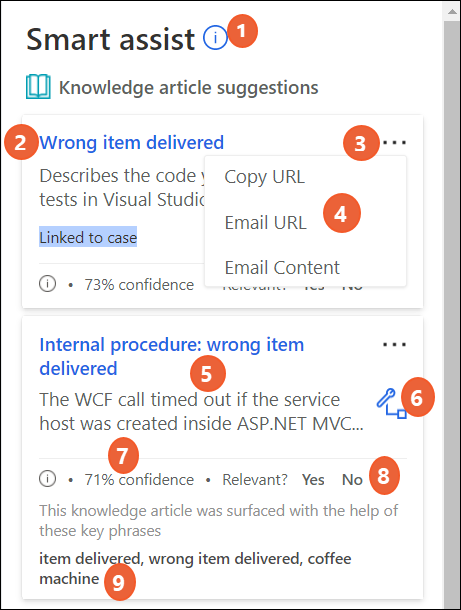
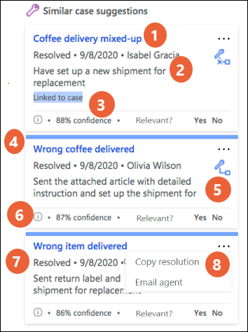

# View AI-suggested similar cases and knowledge articles

 When you open an active case, you can view suggestions about similar cases that were previously resolved successfully and knowledge articles. With the use of AI, these features help you find the right solutions and provide better and faster service to customers. To understand how AI-suggestions work, see [How AI suggestions for similar cases and knowledge articles work](csw-enable-ai-suggested-cases-knowledge-articles.md#how-ai-suggestions-for-similar-cases-and-knowledge-articles-work).

The AI suggestions are displayed in smart assist, an intelligent assistant that provides real-time recommendations to you, helping you take actions on active cases or during your interactions with customers in ongoing conversations. If similar cases and knowledge articles aren't displayed, your Administrator would've disabled the AI-suggestions for similar cases and knowledge articles features.

> [!IMPORTANT]
> The **Smart assist** pane is displayed only when you open the case in a new session tab. If you open to view a resolved case in an app tab when your in-progress case is open, smart assist will not be refreshed for the resolved case.

## Prerequisites

- AI-suggestions for similar cases and knowledge articles should be enabled. This feature is enabled out of the box.
- Smart assist feature must be enabled by your administrator. More information: [Smart assist in Customer Service Workspace](csw-productivity-pane.md#smart-assist)
- The Productivity tools user role must be assigned to you.

## Understand the knowledge article components in smart assist

When you open an active case to work on it, up to three top knowledge articles that match the case context are displayed in the **Smart assist** pane.

 

The following table lists the explanation of the smart assist card for AI-suggested knowledge articles.

| Label | Description |
|--------|-------------|
| 1 | Displays the information about the cards when selected.|
| 2 | Title of the related knowledge article. |
| 3 | More commands|
| 4 | Displays the actions that can be performed when you select more commands.|
| 5 | A brief summary of the knowledge article that is generated by the AI model. |
| 6 | Option to link the article with the case as a related article. |
| 7 | Displays the confidence score based on which the knowledge article was selected by the AI model. Usually, the suggested knowledge articles are highly relevant to the context of conversations when the confidence score is above 80%; suggestions with lower confidence score may still be relevant based on the semantic meaning of some key words in the conversation. The minimum confidence score is 65%. |
| 8 | When user selects **Yes**, the label is highlighted and the card remains on the pane. If user selects **No**, the card is replaced with a new suggestion, if it exists. This feedback from agents is used by the AI model to retrain and improve the suggestions over time.|
| 9 |Displays information on the keywords that were used by the AI model to match the article. |
|  |  |

If no knowledge articles match, then the card displays an appropriate message, such as "No suggestions found for knowledge article."

## Understand the similar cases components in smart assist

When you open an active case to work on it, up to top three resolved cases that you have access to are suggested by the AI model and displayed in the **Smart assist** pane. By default, the suggestions are made based on case title and description. Your administrator may change the settings to use other text fields for the AI model to get the case context.

The following table lists the explanation of the smart assist card for AI-suggested similar cases.

| Label | Description |
|--------|-------------|
| 1 | The title of the similar case.|
| 2 | Summary of the case resolution that is generated by the AI model. |
| 3 | Displays the confidence score based on which the knowledge article was selected by the AI model. Usually, the suggested cases are highly relevant to the context of cases when the confidence score is above 80%; suggestions with lower confidence score may still be relevant based on the semantic meaning of some key words in the cases. The minimum confidence score is 65%. |
| 4 |  Blue bar indicates that the user hasn't interacted with the card yet. |
| 5 | When selected, links to the current active case or removes the link to the similar case. |
| 6 | When selected, displays information on the keywords that were used by the AI model to match the article. |
| 7 | Status of the similar case. |
| 8 | Displays the actions that can be performed when you select more commands. |

If no cases match, then the card displays an appropriate message, such as "No suggestions found for similar cases."

## View AI-suggested similar cases and related knowledge articles

Perform the following steps to view the similar cases and related articles for the case you are working on. The actions that you can perform with the options available in the suggestions are determined by the role assigned to you.

1. In Dynamics 365, select Customer Service Workspace. The **Customer Service Agent Dashboard** page appears.

   > 

2. In the **My Active Cases** list, select shift+mouse click the case you want to work on. The case opens in a session tab, and the **Smart assist** pane appears on the right. The Smart assist pane lists the top three knowledge articles and five similar cases suggested by AI based on the case context.

3. In the **Knowledge article suggestion** area, do any of the following:
   - Select an article title to go through and get relevant information. The selected knowledge article opens in a new application tab.
   - Select more commands to do the following:
       - **Copy Url:** Select to copy the knowledge article link to the clipboard. 
       - **Email URL:** Select to open the email compose form with the link to the article pasted in the email body.
       - **Email:** Select to open the email compose form with the contents of the knowledge article pasted in the mail body.
   - Select the link icon to associate the article with the case as a related article.

4. In the **Similar case suggestions** area, do any of the following:
   - Select a case title to drill through the details of the resolved case.
   - Select more commands to do the following:
     - **Copy resolution:** Select to copy the resolution notes information from the resolved case to the clipboard. 
     - **Email agent:** Select to open the email compose form to send your questions to the agent who handled the similar case. The mail form opens on a new tab with the pertinent information and link to the resolved case filled in.
   - Select the link icon to link or clear the link with the similar case.

### See also

[Enable AI-suggestions for similar cases and knowledge articles](csw-enable-ai-suggested-cases-knowledge-articles.md)  
[Knowledge base search control powered by Relevance search](search-knowledge-articles-csh.md)  
[Create and manage knowledge articles](customer-service-hub-user-guide-knowledge-article.md)  
[See similar case suggestions in Customer Service Hub](suggest-similar-cases-for-a-case.md#see-similar-case-suggestions-in-the-customer-service-hub)  

[!INCLUDE[footer-include](../includes/footer-banner.md)]
