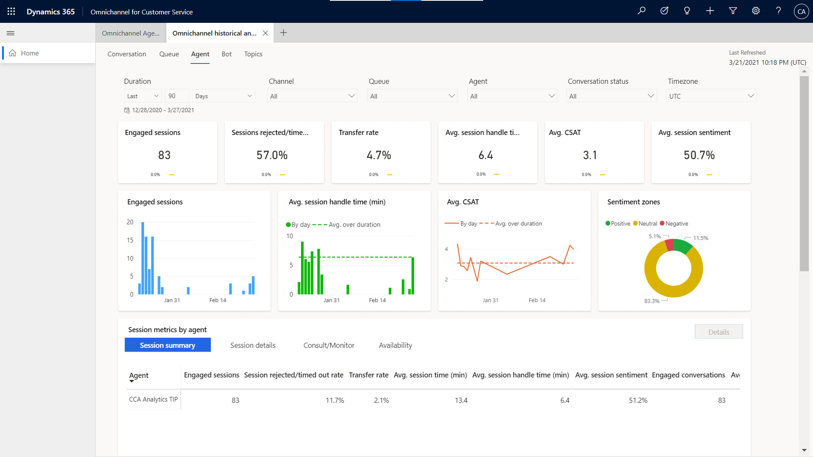

# Preview: Dashboard overview

[!include[cc-beta-prerelease-disclaimer](../includes/cc-beta-prerelease-disclaimer.md)]

> [!IMPORTANT]
>
> - A preview is a feature that is not complete, as it may employ reduced privacy, security, and/or compliance commitments, but is made available before it is officially released for general availability so customers can get early access and provide feedback. Previews are provided "as-is," "with all faults," "as available," and without warranty.
> - This preview feature does not come with technical support and Microsoft Dynamics 365 Technical Support won't be able to help you with issues or questions.  If Microsoft does elect to provide any type of support, such support is provided "as is," "with all faults," and without warranty, and may be discontinued at any time.
> - Previews are not meant for production use, especially to process Personal Data or other data that is subject to heightened compliance requirements, and any use of "live" or production data is at your sole risk. All previews are subject to separate [Terms and Conditions](../legal/supp-dynamics365-preview.md).

The Insights dashboards for Customer Service contain a variety of charts and metrics to help you to understand the factors that have the greatest impact on customer service for your organization. Key performance indicators and visual breakdowns of your organization's support cases are coupled with AI-generated insights on cases, agents, and topics that contribute to overall trends.

Customer Service dashboards give you a performance summary in addition to detailed reports on agents and topics.  

Right-clicking on a chart entry and hovering over **Drill through**, selecting **Agent Details** or **Topic details** brings up a more detailed report that's specific to the selected agent or topic.

Navigate to the Knowledge Search analytics tab to view key details about what search terms agents and smart agent assist are using to find knowledge articles related to cases. For more information, see [Knowledge search analytics dashboard](knowledge-search-analytics-cs.md).

## Configure dashboards

To enable the dashboards, see the following topics:

- [Configure historical analytics reports](configure-historical-analytics-csh.md)

- [Configure knowledge search insights](enable-knowledge-search-analytics.md)

## Customer Service analytics reports

The following dashboard reports are available for Customer Service analytics:

### Summary

The Summary dashboard gives you a broad overview of the customer service experience in your organization. It uses artificial intelligence (AI) technology to show you topics that are generating the highest volume and emerging topics with the highest rate of change in volume.

   > [!div class=mx-imgBorder]
   > 
   
For more details about the Summary dashboard, see [Summary dashboard](summary-dashboard-cs.md)

### Agent

The Agent dashboard shows charts and KPIs for individual agents and overall agent performance.

   > [!div class=mx-imgBorder]
   > 
   
For more details about the Agent dashboard, see [Agent dashboard](agent-dashboard-cs.md)

### Topics

The Topics report dashboard shows a detailed breakdown of cases and their assigned topics.

   > [!div class=mx-imgBorder]
   > 
   
For more details about the Topics dashboard, see [Topics dashboard](topics-dashboard-cs.md)
   

## Information you need to know about Customer Service analytics reports

### Reports refresh, data retention

The following information is applicable to reports refresh:

- **Data refresh:** Occurs every 24 hours. The reports are available during the refresh process. You might see a warning icon beside the **Last refresh (UTC)** label in the upper-right corner of each report when there's a delay or issue in the data refresh. When you hover over the icon, the tooltip message indicates whether the dataset is up to date.
  > [!div class=mx-imgBorder]
  > 

- **Custom refresh:** Isn't available.
- **Data refresh for inactive environments:** Data refresh is paused if the reports aren't used continuously for two weeks. When you access a report after a lengthy period of inactivity, the report will be refreshed in the subsequent refresh cycle.
- **Data retention:** Data is retained for a period of 24 months.

### Report customizations

Currently, report customizations aren't supported.

### Supported entities

The following entities are supported:

- ActivityPointer
- AppModule
- Incident
- IncidentResolution
- Organization
- Queue
- QueueItem
- Subject
- SystemUser

> [!NOTE]
> A report might be blank if you've customized any of the listed entities or didn't use out-of-the-box entities.

## Regions supported in Customer Service analytics reports

The Customer Service Analytics reports are supported in the following regions:

- North America
- South America
- Canada
- Europe, except France
- Asia Pacific
- Australia
- Japan
- India
- Great Britain

## Troubleshooting

To troubleshoot issues when you try to access or view the reports, do the following.

|   Error message    |            Action         |
|-------------------------|------------------------|
| Oops! No reports were found in CRM. You may not have access to these reports. Please contact your system administrator.       |   Contact your administrator to get access.     |  
| Oops! Internal service error, please contact your system administrator with Error Code: {numeric value}.   |   Contact Microsoft Support and create a support ticket.     | 
|   Oops! There was a problem rendering the report.   |   Refresh the report. If this doesn't work, contact Microsoft Support and create a support ticket.     |  
| Oops! There was a problem rendering the report, please try again.   |   Refresh the report. If this doesn't work, contact Microsoft Support and create a support ticket    |

### See also

[Introduction to Customer Service insights](introduction-customer-service-analytics.md)  
[Configure Customer Service insights for Customer Service Hub and Customer Service workspace](configure-customer-service-analytics-insights-csh.md)  
[Configure Customer Service analytics in Power BI](configure-customer-service-analytics-dashboard.md)
